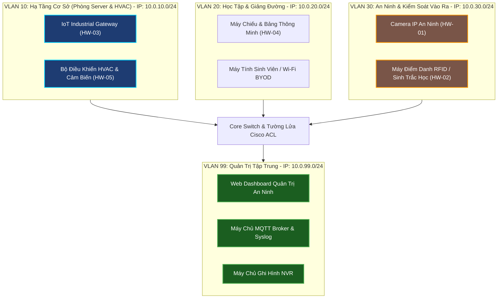
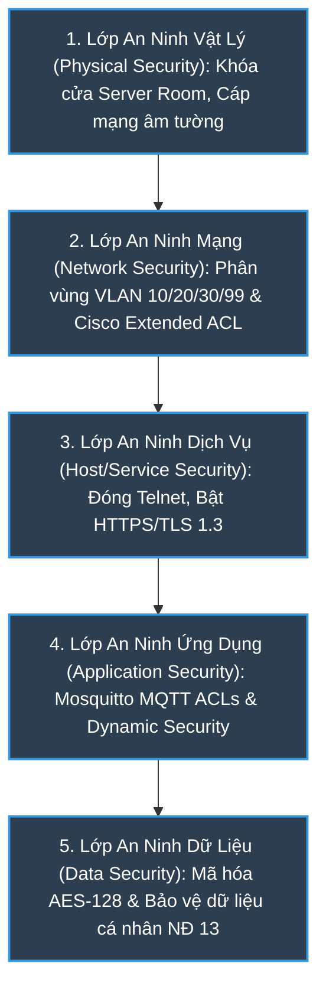
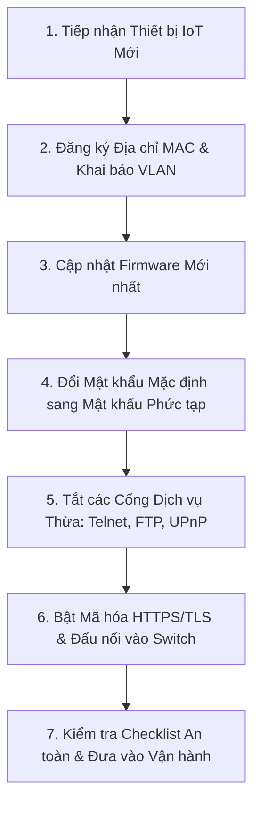
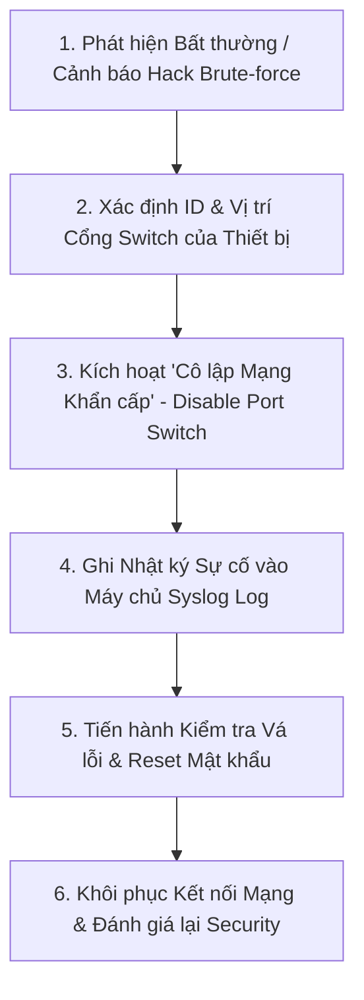
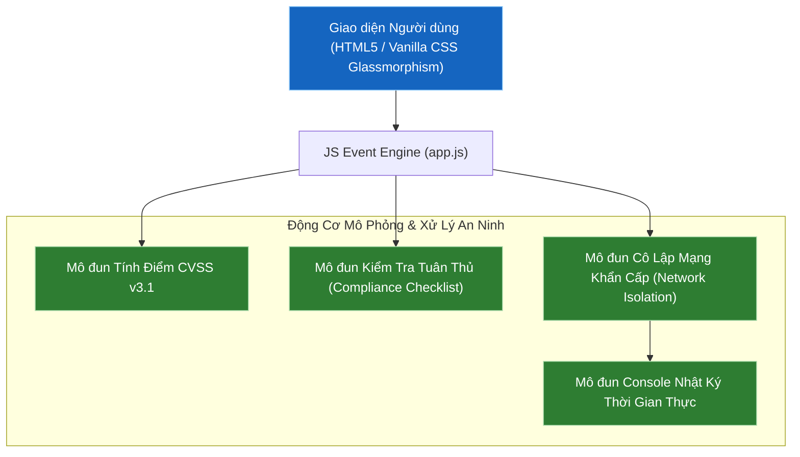

# BỘ GIÁO DỤC VÀ ĐÀO TẠO
# TRƯỜNG ĐẠI HỌC VĂN HIẾN

---

### **BÁO CÁO ĐỒ ÁN MÔN HỌC: BẢO MẬT IoT**
## **TÊN ĐỀ TÀI: CHÍNH SÁCH BẢO MẬT IoT CHO TRƯỜNG ĐẠI HỌC**
### *(UNIVERSITY IoT SECURITY POLICY & GOVERNANCE FRAMEWORK)*

*   **Giảng viên giảng dạy**: Hồ Nhựt Minh
*   **Lớp học phần**: 253INT441001
*   **Sinh viên thực hiện**: Võ Quốc Thắng
*   **Mã số sinh viên**: 231A011150
*   **Địa điểm - Thời gian**: TP. Hồ Chí Minh – 2026

---

> *Tuyên bố về việc sử dụng AI (AI Usage Disclaimer):*
> This paper has been prepared with the assistance of AI tools Gemini for language editing and grammar checking. The authors are fully responsible for the content and conclusions of the paper.
> (Báo cáo này đã được chuẩn bị với sự hỗ trợ của công cụ AI Gemini để hiệu đính ngôn ngữ và kiểm tra ngữ pháp. Các tác giả chịu trách nhiệm hoàn toàn về nội dung và kết luận của báo cáo).

---

## LỜI CẢM ƠN

Để hoàn thành báo cáo đồ án môn học **"Bảo mật IoT"** với đề tài **"Chính sách Bảo mật IoT cho Trường Đại học"**, em xin bày tỏ lòng biết ơn sâu sắc và chân thành nhất đến những cá nhân và tập thể đã luôn hỗ trợ, tận tình hướng dẫn em trong suốt quá trình học tập và nghiên cứu.

Trước hết, em xin gửi lời cảm ơn trân trọng nhất đến **Ban Giám hiệu Trường Đại học Văn Hiến** cùng toàn thể quý **Thầy/Cô trong Khoa Công nghệ Thông tin**. Nhà trường đã tạo ra một môi trường học tập hiện đại, văn minh, cung cấp đầy đủ các trang thiết bị và cơ sở vật chất kỹ thuật cần thiết, tạo điều kiện thuận lợi nhất để em được học tập, tiếp cận kiến thức công nghệ mới và phát triển bản thân.

Đặc biệt, em xin gửi lời tri ân sâu sắc nhất đến **Thầy Hồ Nhựt Minh** - Giảng viên trực tiếp giảng dạy môn học Bảo mật IoT (Mã học phần: 253INT441001). Trong suốt quá trình học tập và thực hiện đề tài, Thầy đã luôn tận tụy truyền đạt những kiến thức chuyên môn vững chắc, định hướng tư duy khoa học và đưa ra những lời khuyên, sự chỉ dẫn vô cùng quý báu. Những định hướng sát sao của Thầy không chỉ giúp em tháo gỡ những khó khăn kỹ thuật trong quá trình làm bài mà còn giúp em hoàn thiện tư duy về quản trị an toàn thông tin theo chuẩn thực tế.

Dù đã nỗ lực hết sức để hoàn thành đồ án một cách chỉn chu và toàn diện nhất, song do hạn chế về mặt thời gian và kinh nghiệm thực tiễn, báo cáo không tránh khỏi những thiếu sót nhất định. Em rất mong nhận được những ý kiến đóng góp, nhận xét và phê bình quý báu từ Thầy Hồ Nhựt Minh cũng như Quý Thầy/Cô để bài báo cáo của em được hoàn thiện hơn, đồng thời giúp em tích lũy thêm nhiều kinh nghiệm thực tế cho hành trình học tập và phát triển nghề nghiệp sau này.

Em xin kính chúc **Thầy Hồ Nhựt Minh** cùng **Quý Thầy/Cô Trường Đại học Văn Hiến** luôn dồi dào sức khỏe, hạnh phúc và gặt hái được nhiều thành công hơn nữa trong sự nghiệp cao quý "trồng người"!

*Em xin chân thành cảm ơn!*

**Sinh viên thực hiện:**  
*Võ Quốc Thắng (MSSV: 231A011150)*

---

## LÝ DO CHỌN ĐỀ TÀI

### **Đề tài: "Xây dựng Chính sách Bảo mật IoT cho Trường Đại Học"**

Trong kỷ nguyên chuyển đổi số giáo dục, việc xây dựng mô hình **“Smart Campus” (Khuôn viên thông minh)** đang trở thành xu hướng tất yếu của các trường đại học tại Việt Nam và trên thế giới. Tuy nhiên, đi kèm với sự tiện ích là những thách thức bảo mật vô cùng lớn. Dưới đây là 4 lý do cốt lõi để lựa chọn đề tài này:

#### **1. Sự bùng nổ của thiết bị IoT và xu hướng xây dựng giảng đường thông minh**
Các trường đại học hiện nay đang tích hợp sâu rộng các thiết bị IoT vào công tác quản lý và giảng dạy, bao gồm: hệ thống camera giám sát an ninh (CCTV), hệ thống kiểm soát ra vào bằng thẻ từ/khóa thông minh (Smart Lock), bộ điều hòa không khí tự động (HVAC), thiết bị phòng Lab nghiên cứu và các thiết bị trình chiếu thông minh. Sự gia tăng nhanh chóng về mặt số lượng của các thiết bị này tạo ra một hệ sinh thái kết nối phức tạp, nhưng cũng đồng thời làm tăng **bề mặt tấn công (Attack Surface)** của mạng nội bộ nhà trường.

#### **2. Đặc thù mạng nội bộ trường đại học có tính mở cao và phức tạp**
Khác với mạng của doanh nghiệp hay ngân hàng (vốn được kiểm soát rất nghiêm ngặt), mạng trường đại học có tính mở cực kỳ cao nhằm phục vụ nhu cầu học tập, tra cứu của hàng chục nghìn sinh viên, giảng viên, nghiên cứu sinh và khách vãng lai. Việc sử dụng chung hạ tầng mạng không dây (Wi-Fi) và thói quen sử dụng thiết bị cá nhân (BYOD) của sinh viên khiến việc kiểm soát các kết nối trở nên khó khăn. Nếu không có chính sách bảo mật IoT riêng biệt, kẻ tấn công có thể dễ dàng lợi dụng các thiết bị IoT bảo mật kém làm "bàn đạp" để xâm nhập sâu vào phân vùng chứa dữ liệu nhạy cảm của nhà trường (như cơ sở dữ liệu điểm, đề thi, thông tin cá nhân và tài chính sinh viên).

#### **3. Lỗ hổng bảo mật cố hữu của các thiết bị IoT đầu cuối**
Nhiều thiết bị IoT hiện nay được sản xuất với chi phí thấp và không được chú trọng về mặt an toàn thông tin. Các lỗ hổng phổ biến bao gồm: mật khẩu mặc định được mã hóa cứng trong phần sụn (firmware), giao thức truyền thông không mã hóa (như HTTP, Telnet, Modbus TCP), và thiếu cơ chế cập nhật bản vá bảo mật định kỳ. Trong khi đó, hầu hết các trường đại học hiện nay đều chưa có một **Quy trình chuẩn (Checklist)** hay **Chính sách phân vùng mạng (Network Segmentation Policy)** cụ thể để quản lý các thiết bị phi chuẩn này.

#### **4. Hậu quả nghiêm trọng về mặt vật lý và uy tín học thuật**
Một cuộc tấn công thành công vào hệ thống IoT của trường đại học có thể gây ra những hậu quả nhãn tiền:
*   **Thiệt hại vật lý**: Kẻ tấn công có thể vô hiệu hóa hệ thống khóa cửa thông minh của các phòng máy chủ (Server Room), phòng thí nghiệm chuyên sâu, hoặc thay đổi nhiệt độ hệ thống điều hòa HVAC gây quá nhiệt, cháy nổ thiết bị đầu não.
*   **Rò rỉ dữ liệu & Quyền riêng tư**: Hình ảnh từ hệ thống camera IP lắp tại các khu vực nhạy cảm bị rò rỉ ra ngoài internet, làm ảnh hưởng nghiêm trọng đến quyền riêng tư cá nhân và danh tiếng của nhà trường.
*   **Tấn công gián tiếp (Botnet)**: Thiết bị IoT của trường bị chiếm quyền và lợi dụng để tham gia vào mạng lưới botnet tấn công từ chối dịch vụ (DDoS) quy mô lớn, làm tê liệt hệ thống đăng ký môn học hoặc cổng thông tin đào tạo trực tuyến.

#### **KẾT LUẬN (Ý nghĩa thực tiễn của đề tài):**
Đề tài **“Xây dựng Chính sách Bảo mật IoT cho Trường Đại Học”** không chỉ mang tính lý thuyết mà giải quyết trực tiếp bài toán thực tế cấp bách. Bằng việc thiết lập **Phạm vi hệ thống tách biệt (VLANs)**, xây dựng **Ma trận Rủi ro - Biện pháp giảm thiểu** dựa trên tiêu chuẩn quốc tế (NIST SP 800-213, ISO/IEC 27400) kết hợp với **Web Dashboard giám sát trực quan**, đề tài cung cấp một giải pháp toàn diện giúp đội ngũ IT của trường dễ dàng quản lý, rà quét lỗ hổng và ứng phó sự cố khẩn cấp (cô lập thiết bị bị hack), đảm bảo môi trường học tập an toàn và tin cậy.

---

## CHƯƠNG 1. MỞ ĐẦU

### 1.1. Bối cảnh
Trong bối cảnh chuyển đổi số giáo dục và xu hướng xây dựng "Khuôn viên trường học thông minh" (Smart Campus), các thiết bị Internet Vạn Vật (IoT) đang được triển khai bùng nổ tại các trường đại học. Các thiết bị này bao gồm:
*   **Hệ thống Camera an ninh IP**: Lắp đặt tại cổng trường, hành lang giảng đường, nhà xe và các khu vực công cộng để giám sát an ninh 24/7.
*   **Máy điểm danh sinh trắc học và Đầu đọc RFID**: Kiểm soát vào ra tự động tại các phòng máy chủ, phòng thí nghiệm chuyên đề, thư viện và giảng đường.
*   **Hệ thống cảm biến phòng Lab và Hạ tầng**: Cảm biến nhiệt độ, độ ẩm, cảm biến hiện diện và bộ điều khiển hệ thống điều hòa HVAC trung tâm.

Tuy nhiên, sự bùng nổ của các thiết bị IoT này diễn ra tự phát và nhanh chóng hơn so với tốc độ xây dựng các rào chắn bảo mật tương ứng. Phần lớn thiết bị IoT trên thị trường thiếu vắng các cơ chế bảo mật tích hợp đủ mạnh để tự bảo vệ khỏi các rủi ro trên mạng lưới. Điều này khiến chúng dễ dàng trở thành điểm yếu chí mạng, tạo cơ hội cho kẻ tấn công xâm nhập vào toàn bộ hạ tầng công nghệ thông tin của nhà trường.

### 1.2. Vấn đề cốt lõi
Mạng máy tính tại các trường đại học mang tính chất mở, phục vụ hàng chục ngàn người dùng bao gồm sinh viên, giảng viên và khách vãng lai, đi kèm với đó là xu hướng sử dụng thiết bị cá nhân (BYOD). Vấn đề cốt lõi hiện nay là sự thiếu vắng một chính sách quản lý, phân vùng mạng và phân quyền đồng bộ. Khi các thiết bị IoT như Camera IP hay khóa cửa thông minh được kết nối chung dải mạng (LAN/Wi-Fi) với người dùng thông thường mà không có sự cô lập vật lý hoặc logic (như VLAN), hệ thống sẽ đối mặt với các nguy cơ:
*   **Lộ lọt dữ liệu cá nhân**: Luồng video giám sát hoặc cơ sở dữ liệu nhật ký điểm danh chứa thông tin sinh trắc học của sinh viên và giảng viên có thể bị đánh cắp, vi phạm trực tiếp các quy định về bảo vệ dữ liệu cá nhân cũng như quy chế an toàn thông tin nội bộ của nhà trường.
*   **Xâm nhập và Leo thang đặc quyền**: Kẻ tấn công có thể lợi dụng các lỗ hổng phần mềm hoặc mật khẩu mặc định chưa thay đổi trên thiết bị IoT để chiếm quyền điều khiển. Nguy hiểm hơn, tội phạm mạng có thể cấy mã độc để biến các thiết bị IoT của trường thành một mạng máy tính ma (botnet), từ đó làm bàn đạp tấn công hệ thống nội bộ hoặc phát động tấn công từ chối dịch vụ (DDoS) ra bên ngoài.

### 1.3. Mục tiêu của đề tài
Đề tài hướng tới 3 mục tiêu cốt lõi:
1.  **Xây dựng bộ chính sách bảo mật toàn diện**: Quy định các quy chuẩn an toàn chi tiết cho hệ thống camera, máy điểm danh và cảm biến phòng lab, có tham chiếu đến các tiêu chuẩn quốc tế như OWASP IoT Security Testing Guide (ISTG) và tuân thủ các yêu cầu bảo đảm an toàn hệ thống thông tin theo Nghị định 85/2016/NĐ-CP của Chính phủ.
2.  **Phân loại thiết bị và Kiểm soát quyền truy cập**: Đề xuất kiến trúc phân vùng mạng logic (VLAN) nhằm cách ly luồng dữ liệu IoT, đồng thời thiết lập ma trận phân công trách nhiệm (RACI) chi tiết nhằm xác định rõ ai (Ban giám hiệu, IT, Giảng viên, Sinh viên) có quyền hạn và trách nhiệm gì đối với từng thiết bị.
3.  **Đề xuất quy trình vận hành và ứng cứu sự cố**: Xây dựng các sơ đồ quy trình chuẩn cho vòng đời thiết bị và bộ cẩm nang checklist kiểm tra an ninh định kỳ nhằm phát hiện sớm các sai sót cấu hình.

#### Bảng đối chiếu mục tiêu và đầu ra của đề tài:

| Mục tiêu | Đầu ra tương ứng | Cách kiểm chứng | Chương trình bày |
| :--- | :--- | :--- | :--- |
| **MT-01** | Bộ văn bản chính sách bảo mật IoT trường đại học hoàn chỉnh quy định nguyên tắc sử dụng, mật khẩu, mã hóa. | Đọc kiểm tra trực tiếp cấu trúc văn bản chính sách và các quy định an toàn được ban hành. | Chương 4 (Mục 4.1) |
| **MT-02** | Ma trận phân quyền RACI chi tiết và ma trận phân vùng mạng VLAN cách ly thiết bị. | Kiểm tra bảng ma trận RACI đối chiếu quyền hạn truy cập của Sinh viên, IT Admin và Bảo vệ. | Chương 3 và Chương 4 (Mục 4.2) |
| **MT-03** | Quy trình vận hành 3 bước (Lắp đặt, Cập nhật, Phản ứng sự cố) và Bộ cẩm nang Checklist kiểm tra. | Thử nghiệm đánh giá trên mô hình giả định và ứng dụng Web Dashboard giám sát trực quan. | Chương 4, Chương 5 và Chương 6 |

### 1.4. Phạm vi & Sản phẩm
*   **Phạm vi nghiên cứu**: Giới hạn trong không gian hạ tầng mạng khuôn viên của một trường đại học (giảng đường, phòng làm việc hành chính, ký túc xá, phòng lab).
*   **Sản phẩm dự kiến bàn giao**:
    1.  Văn bản Quy định Chính sách Bảo mật IoT (Policy Document) dài 4-6 trang.
    2.  Ma trận phân công trách nhiệm RACI (RACI Matrix).
    3.  Bộ cẩm nang danh sách kiểm tra an toàn (Security Checklist) có ghi nhận trạng thái kiểm tra thực tế.
    4.  Sản phẩm bổ trợ: Mã nguồn ứng dụng Web Dashboard Giám sát an ninh IoT mô phỏng trực quan.

---

## CHƯƠNG 2. CƠ SỞ LÝ THUYẾT (CHUẨN, QUẢN TRỊ VÀ TUÂN THỦ)

### 2.1. Kiến thức nền tảng

*   **Quản trị rủi ro IoT (IoT Risk Governance)**: Là quá trình nhận diện, đánh giá và giảm thiểu các rủi ro an ninh thông tin liên quan đến việc triển khai các thiết bị nhúng và cảm biến trong tổ chức. Không giống như các hệ thống CNTT truyền thống, thiết bị IoT là cầu nối giữa không gian mạng (cyber) và môi trường vật lý (physical). Do đó, quản trị rủi ro IoT trong trường đại học đòi hỏi sự kết hợp chặt chẽ giữa chính sách hành chính (quy định người dùng) và kiểm soát kỹ thuật (phân vùng mạng), nhằm đảm bảo các thiết bị này phục vụ đúng mục đích học thuật mà không trở thành điểm yếu để tin tặc khai thác.

*   **Khái niệm Kiểm soát truy cập (Access Control)**: Trong mạng đại học đa tầng, kiểm soát truy cập bao gồm Xác thực (Authentication - xác minh danh tính thiết bị hoặc con người) và Ủy quyền (Authorization - xác định quyền hạn được phép thao tác). Các mô hình cốt lõi gồm:
    *   **RBAC (Role-Based Access Control)**: Phân quyền dựa trên vai trò tĩnh (ví dụ: Sinh viên chỉ được xem dữ liệu, Giảng viên được cấp quyền quản lý phòng lab, IT Admin được cấu hình thiết bị).
    *   **ABAC (Attribute-Based Access Control)**: Phân quyền động dựa trên thuộc tính và ngữ cảnh. Khái niệm này rất quan trọng với IoT, cho phép nhà trường thiết lập các luật linh hoạt như: Sinh viên chỉ được mở khóa phòng thí nghiệm thông minh trong khung giờ học (thuộc tính thời gian) và khi đang kết nối từ mạng nội bộ của trường (thuộc tính không gian).

#### **Sơ đồ Kiến trúc Mạng Phân đoạn & Ngữ cảnh Dữ liệu**

Sơ đồ dưới đây minh họa mô hình phân tầng phòng thủ mạng trường đại học được tổ chức trên 4 phân vùng VLAN độc lập:


*Hình 2.1: Sơ đồ Kiến trúc Mạng Phân đoạn 3 Lớp & 4 Phân vùng VLAN trường đại học.*

---

#### **Sơ đồ Luồng Dữ liệu (DFD Cấp 1) và Các Ranh giới Tin cậy (Trust Boundaries)**


```mermaid
graph LR
    subgraph Boundary1 ["Ranh Giới Tin Cậy 1: Vùng Thiết Bị Biên (Low Trust)"]
        Sensor["Cảm Biến / Camera / RFID"]
    end

    subgraph Boundary2 ["Ranh Giới Tin Cậy 2: Vùng Dịch Thuật & Chuyển Tiếp (Medium Trust)"]
        EdgeGateway["IoT Gateway Biên"]
    end

    subgraph Boundary3 ["Ranh Giới Tin Cậy 3: Vùng Máy Chủ Quản Trị (High Trust)"]
        MQTTBroker["MQTT Broker (Mosquitto)"]
        NIDS["Snort NIDS Monitor"]
        Dashboard["Web Dashboard Quản Trị"]
    end

    Sensor -- "RTSP (554) / MQTT (1883)" --> EdgeGateway
    EdgeGateway -- "TLS Encrypted Payload" --> MQTTBroker
    MQTTBroker -- "Deep Packet Inspection" --> NIDS
    NIDS -- "Realtime Alerts / CVSS Score" --> Dashboard

    classDef low fill:#b71c1c,stroke:#ff5252,color:#fff;
    classDef med fill:#e65100,stroke:#ff9800,color:#fff;
    classDef high fill:#1b5e20,stroke:#4caf50,color:#fff;

    class Sensor low;
    class EdgeGateway med;
    class MQTTBroker,NIDS,Dashboard high;
```

*Hình 2.2: Sơ đồ luồng dữ liệu DFD Cấp 1 và các Ranh giới tin cậy (Trust Boundaries).*

---

### 2.2. Chuẩn và quy định pháp lý áp dụng
Đề tài dựa trên các tiêu chuẩn an toàn thông tin quốc tế và quy định pháp luật Việt Nam hiện hành làm cơ sở khoa học, giúp chính sách có tính thực tiễn và tuân thủ pháp lý cao:

*   **Tiêu chuẩn OWASP IoT Top 10**: Đây là danh mục nhận diện 10 lỗ hổng bảo mật IoT phổ biến nhất. Các thiết bị trong khuôn viên trường rất dễ mắc phải các lỗi này như: sử dụng mật khẩu yếu/mặc định (Weak, Guessable, or Hardcoded Passwords), truyền thông không mã hóa (Insecure Network Services), và thiếu cơ chế cập nhật bản vá (Lack of Secure Update Mechanism).
*   **Nghị định 85/2016/NĐ-CP & TCVN 11930:2017**: Theo Nghị định này, nhà trường đóng vai trò là "Chủ quản hệ thống thông tin" và phải có trách nhiệm lập hồ sơ đề xuất cấp độ an toàn. Đối với mạng lưới đại học có xử lý thông tin riêng và dữ liệu cá nhân của trên 10.000 người dùng (sinh viên, cán bộ), hệ thống thường được yêu cầu phân loại ở Cấp độ 3. Tiêu chuẩn TCVN 11930:2017 cung cấp các yêu cầu quản lý và kỹ thuật đi kèm buộc nhà trường phải thiết lập phương án bảo vệ tương ứng.
*   **Nghị định 13/2023/NĐ-CP**: Quy định bắt buộc về Bảo vệ dữ liệu cá nhân. Các thiết bị IoT của trường như máy điểm danh sinh trắc học, camera an ninh, thẻ RFID đều liên tục thu thập dữ liệu nhạy cảm của người học. Nghị định yêu cầu nhà trường phải có biện pháp mã hóa kỹ thuật và chính sách giới hạn quyền truy cập, nếu vi phạm sẽ dẫn đến các trách nhiệm pháp lý nghiêm trọng.
*   **Tiêu chuẩn NIST SP 800-213**: Đây là tài liệu "Hướng dẫn an ninh mạng cho thiết bị IoT" dành cho các tổ chức chính phủ và doanh nghiệp. Tiêu chuẩn này cung cấp lăng kính đánh giá từ "góc độ thiết bị" (device perspective), yêu cầu tổ chức phải xác định rõ các năng lực bảo mật mà một thiết bị IoT cần có trước khi cho phép nó hội nhập vào hệ thống mạng chung.

---

### 2.3. Mô hình STRIDE Chi tiết Cho IoT Trường Đại học

| Viết Tắt | Mối Đe Dọa | Mục Tiêu Bảo Mật | Kịch Bản Tấn Công Thực Tế Trong Trường Đại Học | Biện Pháp Khắc Phục Sơ Bộ |
| :--- | :--- | :--- | :--- | :--- |
| **S** (Spoofing) | Giả mạo | Authentication (Xác thực) | Kẻ tấn công sao chép thẻ RFID của giảng viên để mở cửa phòng Server hoặc phòng Lab nghiên cứu đề tài bí mật. | Sử dụng thẻ RFID mã hóa (Mifare Desfire) thay vì thẻ RFID tần số thấp (125kHz) dễ sao chép; áp dụng xác thực 2 lớp (MFA). |
| **T** (Tampering) | Can thiệp vật lý/dữ liệu | Integrity (Tính toàn vẹn) | Kẻ tấn công kết nối trực tiếp vào cáp LAN của Camera IP lắp ngoài hành lang để tiêm mã độc hoặc chèn luồng video giả. | Vô hiệu hóa các cổng switch mạng không sử dụng; bật tính năng Port Security (MAC Binding/802.1X) trên switch. |
| **R** (Repudiation) | Chối bỏ | Non-repudiation (Chống chối bỏ) | Kẻ gian phá hoại thiết bị trong Lab nhưng hệ thống không ghi lại nhật ký mở cửa (hoặc nhật ký bị xóa bởi tài khoản bị chiếm đoạt), dẫn đến việc sinh viên chối bỏ trách nhiệm. | Thiết lập ghi nhật ký tập trung (Centralized Logging) qua giao thức syslog mã hóa gửi đến máy chủ log bất biến (Read-only log storage). |
| **I** (Information Disclosure) | Lộ lọt thông tin | Confidentiality (Tính bảo mật) | Dữ liệu video giám sát của camera lắp trong khu vực nhạy cảm (như phòng họp Ban giám hiệu hoặc phòng Ký túc xá) bị truyền tải dưới dạng cleartext (HTTP/RTSP không mã hóa) và bị nghe lén trên mạng Wi-Fi trường. | Bắt buộc mã hóa luồng truyền dữ liệu bằng SRTP hoặc RTSP qua TLS (RTSPS); cấu hình phân vùng mạng VLAN bảo mật. |
| **D** (Denial of Service) | Từ chối dịch vụ | Availability (Tính sẵn sàng) | Kẻ tấn công thực hiện tấn công Syn Flood hoặc UDP Flood vào IP của bộ điều khiển cửa thông minh (Smart Lock Controller), làm tê liệt hệ thống khóa khiến cửa không thể mở/đóng tự động trong trường hợp khẩn cấp. | Triển khai tường lửa biên giới hạn lưu lượng (Rate limiting); sử dụng bộ điều khiển cửa có cơ chế fallback vật lý (khóa cơ dự phòng). |
| **E** (Elevation of Privilege) | Leo thang đặc quyền | Authorization (Ủy quyền) | Kẻ tấn công khai thác lỗ hổng tràn bộ đệm (Buffer Overflow) trong firmware của thiết bị Gateway để từ quyền User thường chiếm quyền Root (quản trị tối cao), điều khiển toàn bộ mạng IoT. | Thường xuyên cập nhật bản vá Firmware (OTA); chạy các dịch vụ trên Gateway dưới quyền user bị hạn chế (Non-root user). |

---

### 2.4. Phân tích Điểm số Lỗ hổng CVSS v3.1 Chi tiết

#### **Kịch bản Lỗ hổng 1: Mật khẩu mặc định / mã hóa cứng trong Firmware Camera IP (HW-01)**
*   **Vectơ CVSS v3.1**: `CVSS:3.1/AV:N/AC:L/PR:N/UI:N/S:U/C:H/I:H/A:H` **(Mức độ: CRITICAL - 9.8)**
*   **Phân tích thành phần điểm số**:
    *   *Attack Vector (AV)*: **Network (N)** - Khai thác từ xa qua mạng IP.
    *   *Attack Complexity (AC)*: **Low (L)** - Khai thác cực kỳ dễ dàng bằng kịch bản tự động.
    *   *Privileges Required (PR)*: **None (N)** - Không cần tài khoản xác thực.
    *   *User Interaction (UI)*: **None (N)** - Không cần người dùng tương tác.
    *   *Scope (S)*: **Unchanged (U)** - Tác động trên phạm vi thiết bị bị chiếm quyền.
    *   *Confidentiality (C)*: **High (H)** - Kẻ tấn công xem luồng video giám sát 24/7.
    *   *Integrity (I)*: **High (H)** - Có thể thay đổi cấu hình, xóa dữ liệu nhật ký.
    *   *Availability (A)*: **High (H)** - Có thể tắt hẳn dịch vụ camera hoặc reboot liên tục.

#### **Kịch bản Lỗ hổng 2: Truyền thông không mã hóa HTTP trên Khóa cửa RFID (HW-02)**
*   **Vectơ CVSS v3.1**: `CVSS:3.1/AV:A/AC:L/PR:N/UI:N/S:U/C:H/I:L/A:N` **(Mức độ: HIGH - 7.5)**
*   **Phân tích thành phần điểm số**:
    *   *Attack Vector (AV)*: **Adjacent (A)** - Khai thác từ dải mạng Wi-Fi cùng phân vùng.
    *   *Attack Complexity (AC)*: **Low (L)** - Sử dụng công cụ Wireshark nghe lén gói tin plaintext.
    *   *Confidentiality (C)*: **High (H)** - Lấy cắp mã token mở cửa và mã thẻ RFID sinh viên.

---

### 2.5. Mô hình ma trận RACI trong quản trị an ninh mạng Đại học
Quản trị an ninh mạng khuôn viên đại học không thể chỉ giao phó cho một đơn vị duy nhất mà cần sự phối hợp chéo. Ma trận RACI là công cụ quản trị nhân sự, giúp minh bạch hóa và phân định rõ ràng vai trò đối với từng nhiệm vụ bảo mật IoT:

*   **R (Responsible - Người thực hiện)**: Cá nhân/đội ngũ trực tiếp thi hành công việc. Trong trường đại học, vai trò này thường được chia làm hai: Phòng Dịch vụ CNTT (IT Services) trực tiếp thi hành việc bảo mật không gian mạng (cấu hình VLAN, tường lửa), trong khi Phòng Quản lý An ninh (Security Management) chịu trách nhiệm bảo vệ quyền truy cập vật lý vào các camera và máy chủ.
*   **A (Accountable - Người chịu trách nhiệm giải trình)**: Cá nhân có quyền phê duyệt cuối cùng và chịu trách nhiệm tổng thể trước pháp luật. Vị trí này thuộc về Ban Giám hiệu (University Leadership) hoặc Giám đốc công nghệ (CIO), những người ra quyết định chiến lược và chịu trách nhiệm khi có sự cố lộ lọt dữ liệu.
*   **C (Consulted - Người được tham vấn)**: Các bên liên quan cung cấp chuyên môn trước khi thực thi. Điển hình là Cán bộ bảo vệ dữ liệu (Data Protection Officer - DPO) hoặc phòng pháp chế, giúp nhà trường đảm bảo chính sách camera giám sát không vi phạm quyền riêng tư của sinh viên.
*   **I (Informed - Người nhận thông tin)**: Các bên được thông báo hoặc bị ảnh hưởng bởi chính sách (ví dụ: Giảng viên, Sinh viên, hoặc Đội ngũ Hỗ trợ Sinh viên). Họ cần được cập nhật về các quy định mới khi sử dụng thiết bị trong phòng lab để tránh vi phạm.

---

## CHƯƠNG 3. PHƯƠNG PHÁP VÀ THIẾT KẾ (PHẠM VI, VAI TRÒ, TIÊU CHÍ)

### 3.1. Nhận diện tài sản IoT theo khu vực
Hệ thống thiết bị IoT trong trường đại học được phân loại và quản lý theo 4 khu vực chức năng chính. Việc phân chia các thiết bị này vào các Mạng cục bộ ảo (VLAN) khác nhau là chiến lược cách ly logic nhằm cô lập rủi ro, không cho phép lưu lượng mạng rác hoặc mã độc lây lan chéo.

| ID Tài Sản | Phân Nhóm | Tên Thiết Bị IoT | Khu Vực Lắp Đặt | Phân Vùng VLAN | Mức Độ An Ninh | Mô Tả & Chức Năng |
| :--- | :--- | :--- | :--- | :--- | :--- | :--- |
| **HW-01** | Phần cứng | Camera IP An ninh (Dahua/Hikvision) | Giảng đường, Hành lang, Nhà xe | VLAN 30 (An ninh) | **Cao (High)** | Ghi hình giám sát an ninh 24/7 toàn khuôn viên. |
| **HW-02** | Phần cứng | Máy điểm danh RFID / Sinh trắc học | Cửa phòng học, Thư viện, Lab | VLAN 30 (An ninh) | **Cao (High)** | Kiểm soát vào ra tự động và ghi nhật ký điểm danh. |
| **HW-03** | Phần cứng | IoT Industrial Gateway | Phòng Máy chủ trung tâm | VLAN 10 (Cơ sở) | **Rất cao (Critical)**| Chuyển tiếp dữ liệu cảm biến Zigbee/LoRa lên Server. |
| **HW-04** | Phần cứng | Máy chiếu & Bảng thông minh | Giảng đường, Phòng họp | VLAN 20 (Học tập) | **Trung bình (Medium)**| Hỗ trợ trình chiếu và tương tác giảng dạy. |
| **HW-05** | Phần cứng | Bộ điều khiển HVAC & Cảm biến | Phòng Máy chủ, Phòng Lab | VLAN 10 (Cơ sở) | **Chí mạng (Critical)**| Tự động hóa điều hòa không khí và cảnh báo quá nhiệt. |
| **SW-01** | Phần mềm | Hệ điều hành Gateway (Custom Linux) | IoT Gateways | VLAN 10 & 20 | **Trung bình (Medium)**| Hệ điều hành nhúng định tuyến luồng dữ liệu biên. |
| **SW-02** | Phần mềm | Web Dashboard Quản trị An ninh | Máy chủ Web | VLAN 99 (Quản trị) | **Chí mạng (Critical)**| Giao diện điều khiển toàn bộ hệ thống IoT, quét CVSS. |
| **DT-01** | Dữ liệu | Luồng Video Giám sát (CCTV Feeds) | NAS Storage | VLAN 30 (An ninh) | **Cao (High)** | Lưu trữ video hình ảnh an ninh thời gian thực. |
| **DT-02** | Dữ liệu | Nhật ký Ra vào (Access Logs) | Database Server | VLAN 99 (Quản trị) | **Cao (High)** | Lịch sử quẹt thẻ RFID và vân tay của sinh viên/cán bộ. |

---

#### **Sơ đồ Mô hình Phòng thủ theo Chiều sâu (Defense-in-Depth Architecture)**


*Hình 3.1: Sơ đồ Mô hình Phòng thủ theo Chiều sâu 5 lớp trong trường đại học.*

---

#### **Mã Nguồn Kiểm Thử 1: Script Python Rà Quét Tự Động Subnet và CVE (`python-nmap`)**

```python
import nmap
import json

def run_campus_iot_audit(subnet_cidr):
    scanner = nmap.PortScanner()
    print(f"[*] Dang ra quet dai IP IoT Truong Dai hoc: {subnet_cidr}")
    
    # Quet cac cong IoT thong dung: 23 (Telnet), 80 (HTTP), 443 (HTTPS), 554 (RTSP), 1883 (MQTT), 502 (Modbus)
    scanner.scan(hosts=subnet_cidr, ports='23,80,443,554,1883,502', arguments='-sV --open')
    
    audit_results = []
    for host in scanner.all_hosts():
        host_info = {
            "ip": host,
            "hostname": scanner[host].hostname(),
            "status": scanner[host].state(),
            "open_ports": []
        }
        for proto in scanner[host].all_protocols():
            ports = scanner[host][proto].keys()
            for port in ports:
                service = scanner[host][proto][port]
                port_data = {
                    "port": port,
                    "name": service['name'],
                    "product": service['product'],
                    "version": service['version']
                }
                # Kiem tra quy tac chinh sach: Cam cong Telnet 23 va HTTP 80 tren Camera
                if port == 23:
                    port_data["risk"] = "CRITICAL (CVSS 9.8)"
                    port_data["policy_violation"] = "Cam su dung Telnet chua ma hoa"
                elif port == 80 and "camera" in service['product'].lower():
                    port_data["risk"] = "HIGH (CVSS 7.5)"
                    port_data["policy_violation"] = "Bat buoc chuyen sang HTTPS (443)"
                
                host_info["open_ports"].append(port_data)
        audit_results.append(host_info)
        
    return json.dumps(audit_results, indent=4, ensure_ascii=False)

if __name__ == "__main__":
    report = run_campus_iot_audit("192.168.30.0/24")
    print(report)
```

---

#### **Mã Nguồn Kiểm Thử 2: Script Python Mô Phỏng ARP Spoofing / MitM (`Scapy`)**

```python
from scapy.all import ARP, send
import time

def simulate_arp_spoof(target_ip, spoof_ip, target_mac):
    print(f"[*] Bat dau mo phong tan cong ARP Spoofing: {spoof_ip} -> {target_ip}")
    packet = ARP(op=2, pdst=target_ip, hwdst=target_mac, psrc=spoof_ip)
    try:
        while True:
            send(packet, verbose=False)
            time.sleep(2)
    except KeyboardInterrupt:
        print("[*] Da dung mo phong tan cong MitM!")

if __name__ == "__main__":
    simulate_arp_spoof("192.168.30.10", "192.168.30.1", "00:11:22:33:44:55")
```

---

### 3.2. Xác định các chủ thể và vai trò trong hệ thống
Dựa trên nguyên tắc Đặc quyền tối thiểu (Least Privilege), các chủ thể tương tác với hệ thống IoT trường đại học được phân quyền rõ ràng theo vai trò:
1.  **Ban Giám hiệu**: Người phê duyệt chính sách an ninh thông tin toàn trường, định hướng các quyết định đầu tư an toàn mạng (Role: Approver).
2.  **Đội ngũ IT & Quản trị mạng**: Quản lý hạ tầng, cấu hình VLAN/Firewall, thực hiện rà quét lỗ hổng định kỳ và trực tiếp cô lập thiết bị trên hệ thống khi phát hiện sự cố xâm nhập (Role: Administrator).
3.  **Nhân viên Bảo vệ & Quản lý tòa nhà**: Sử dụng giao diện màn hình để theo dõi luồng camera và kiểm tra nhật ký quẹt thẻ thực tế tại các tòa nhà (Role: Operator/Monitor).
4.  **Giảng viên**: Sử dụng máy điểm danh và thiết bị giảng đường trong phạm vi vật lý và thời gian được cấp quyền (Role: Authorized User).
5.  **Sinh viên & Khách vãng lai**: Chỉ được phép truy cập không gian mạng thông qua mạng Wi-Fi công cộng hoặc mạng sinh viên (Guest/Student VLAN), tuyệt đối không có đường dẫn định tuyến (routing) truy cập vào dải IP của mạng IoT.

### 3.3. Tiêu chí đánh giá bảo mật dựa trên chuẩn OWASP IoT
Để đáp ứng chuẩn đầu ra của đề tài và làm cơ sở xây dựng Checklist kiểm tra, đề tài thiết lập 5 tiêu chí đánh giá an toàn cốt lõi:
*   **Tiêu chí 1 - Quản lý Định danh & Mật khẩu**: 100% thiết bị phải được thay đổi mật khẩu mặc định trước khi hòa mạng, bắt buộc sử dụng mật khẩu phức tạp (>= 12 ký tự) và quản lý tập trung.
*   **Tiêu chí 2 - Bảo mật Giao diện & Dịch vụ**: Chủ động rà soát và vô hiệu hóa toàn bộ các giao thức/dịch vụ không sử dụng hoặc thiếu an toàn (Telnet cổng 23, FTP cổng 21, UPnP).
*   **Tiêu chí 3 - Mã hóa Truyền tải**: Bắt buộc áp dụng mã hóa đầu cuối cho toàn bộ dữ liệu truyền tải nhạy cảm trên hệ thống mạng đại học bằng các giao thức an toàn như HTTPS (443), MQTTS (8883), RTSPS (554).
*   **Tiêu chí 4 - Cách ly Mạng**: Đảm bảo 100% thiết bị IoT được đặt trong phân vùng VLAN riêng biệt. Áp dụng Danh sách kiểm soát truy cập (ACL) tại bộ định tuyến trung tâm để chặn đứng các kết nối ngang hàng trái phép từ VLAN của người dùng (sinh viên, giảng viên) sang mạng IoT.
*   **Tiêu chí 5 - Quản lý Cập nhật & Nhật ký**: Có quy trình phối hợp với nhà cung cấp để cập nhật phần mềm cơ sở (Firmware) định kỳ. Cấu hình thiết bị tự động chuyển tiếp nhật ký sự kiện (Syslog) về máy chủ lưu trữ tập trung để phục vụ công tác điều tra số khi cần thiết.

---

## CHƯƠNG 4. TRIỂN KHAI VÀ SẢN PHẨM (VĂN BẢN CHÍNH SÁCH VÀ QUY TRÌNH)

### 4.1. Văn bản Chính sách Bảo mật IoT Trường Đại học (Tóm tắt Cấu trúc)

Văn bản Chính sách Bảo mật IoT ban hành gồm 5 điều khoản quy định bắt buộc:

*   **Điều 1. Quy định về Đặt tên và Định danh Mạng**: Tất cả thiết bị IoT khi đấu nối vào mạng trường phải được đăng ký địa chỉ MAC, đặt hostname theo chuẩn quy định và gán IP tĩnh trong đúng phân vùng VLAN quy định.
*   **Điều 2. Quy định về Mật khẩu và Quản lý Tải khoản**: Nghiêm cấm giữ nguyên mật khẩu mặc định của nhà sản xuất. Mật khẩu phải được thay đổi định kỳ 90 ngày/lần. Bắt buộc áp dụng xác thực đa yếu tố (MFA) cho tài khoản quản trị Dashboard.
*   **Điều 3. Quy định về Mã hóa và Giao thức Truyền thông**: Dữ liệu video camera và dữ liệu điểm danh sinh trắc học bắt buộc phải được mã hóa bằng SSL/TLS. Không sử dụng các giao thức rõ plaintext (HTTP, Telnet).
*   **Điều 4. Quy định về Phân vùng và Kiểm soát Tường lửa**: Cách ly hoàn toàn dải mạng IoT (VLAN 30 và VLAN 10) khỏi dải mạng sinh viên (VLAN 20). Tường lửa chỉ mở các cổng dịch vụ cần thiết theo cơ chế Whitelist.
*   **Điều 5. Quy định về Quản lý Vòng đời và Cập nhật Bản vá**: IT Admin phải rà quét lỗ hổng định kỳ hàng tháng. Khi phát hiện thiết bị bị nhiễm độc hoặc có nguy cơ cao, IT Admin có quyền thực hiện Cô lập mạng khẩn cấp (Disable cổng switch) mà không cần báo trước.

#### **Mã Nguồn Cấu Hình Cisco IOS CLI: Extended Access Control List (ACL)**

```text
! Cau hinh Extended ACL bảo vệ VLAN IoT (VLAN 99 / VLAN 30)
ip access-list extended ACL_PROTECT_CAMPUS_IOT

 ! Quy tac 1: Cho phap thiet bi IoT gui du lieu MQTT (Port 1883) den May chu Quan ly (10.0.100.5)
 permit tcp 10.0.99.0 0.0.0.255 host 10.0.100.5 eq 1883

 ! Quy tac 2: Cho phap luồng RTSP Camera (Port 554) gui ve may chu ghi hinh NVR (10.0.100.10)
 permit tcp 10.0.99.0 0.0.0.255 host 10.0.100.10 eq 554

 ! Quy tac 3: CHAN HOAN TOAN thiet bi IoT truy cap vao VLAN Giang vien / Quan tri (10.0.10.0/24)
 deny ip 10.0.99.0 0.0.0.255 10.0.10.0 0.0.0.255

 ! Quy tac 4: CHAN HOAN TOAN thiet bi IoT truy cap ra Internet cong cong (Ngan chan Botnet Mirai)
 deny ip 10.0.99.0 0.0.0.255 any

 ! Quy tac 5: Cho phap cac luong giao thong khac hoat dong binh thuong
 permit ip any any
exit

! Ap dung ACL vao cong Giao dien VLAN 99 chieu Inbound
interface Vlan99
 ip access-group ACL_PROTECT_CAMPUS_IOT in
exit
```

---

#### **Mã Nguồn Cấu Hình Phân Quyền MQTT (Mosquitto ACLs & Certificates)**

```text
# =================================================================
# Mosquitto MQTT Broker Security Configuration
# =================================================================
per_listener_settings true
allow_anonymous false
password_file /etc/mosquitto/passwd
acl_file /etc/mosquitto/aclfile

# Cấu hình xác thực qua chứng chỉ số X.509
use_identity_as_username true

# --- CAC QUY TAC PHAN QUYEN ACL ---

# 1. Tai khoan Admin quan tri: Quyet cao nhat tren toan bo Topic
user admin_campus
topic readwrite university/#

# 2. Quy tac cho Cam bien Phong hoc: Chi duoc GHI du lieu vao khong gian rieng
user sensor_lab01
topic write university/buildingA/lab01/telemetry

# 3. Quy tac cho Sinh vien / Khach: CHU Y - Chi duoc DOC du lieu cong khai, CAM GHI
user student_guest
topic read university/public/#
deny topic write university/#
```

---

#### **Mã Nguồn Luật Giám Sát Xâm Nhập Snort NIDS (Phát Hiện Tấn Công RTSP Camera)**

```text
# Rule ID: 100001 - Phat hien nỗ lực tràn bộ đệm luồng RTSP Camera IP
alert tcp $EXTERNAL_NET any -> $IOT_VLAN 554 ( \
    msg:"[CAMPUS-SECURE-IDS] Phat hien tan cong Tran bo dem RTSP Camera IP"; \
    flow:to_server,established; \
    content:"SETUP"; depth:10; \
    content:"User-Agent|3A|"; distance:0; \
    byte_test:4,>,1024,0,relative; \
    classtype:attempted-admin; \
    sid:100001; rev:1; \
)
```

---

#### **Mã Nguồn Khắc Phục Tự Động Đám Mây (AWS Lambda Python & Cedar Policy)**

```python
import json
import boto3

def lambda_handler(event, context):
    iot_client = boto3.client('iot')
    sns_message = json.loads(event['Records'][0]['Sns']['Message'])
    
    device_id = sns_message.get('thingName')
    violation_type = sns_message.get('violationType')
    
    print(f"[ALERT] Phat hien vi pham tu thiet bi: {device_id}, Loai vi pham: {violation_type}")
    
    if violation_type == "OVERLY_PERMISSIVE_POLICY" or violation_type == "UNAUTHORIZED_CONNECT":
        iot_client.detach_security_profile(
            securityProfileName='StandardIoTProfile',
            securityProfileTarget=f'arn:aws:iot:us-east-1:123456789012:thing/{device_id}'
        )
        iot_client.add_thing_to_thing_group(
            thingGroupName='QuarantineGroup',
            thingName=device_id
        )
        print(f"[REMEDIATION SUCCESS] Da co lap thiet bi {device_id} vao QuarantineGroup thanh cong!")
        
    return {
        'statusCode': 200,
        'body': json.dumps('Co lap thiet bi thanh cong!')
    }
```

```text
// Cedar Policy (ABAC): Chi cho phap Tro giảng dieu khien Robot Lab tu 8h den 17h
permit (
    principal is Campus::User::"TeachingAssistant",
    action in [Campus::Action::"OperateRobot", Campus::Action::"UpdateFirmware"],
    resource in Campus::DeviceGroup::"RoboticsLab"
)
when {
    context.currentTime.hour >= 8 &&
    context.currentTime.hour <= 17 &&
    context.networkZone == "CampusInternal"
};
```

---

#### **Mã Nguồn Mật Mã Biên Hạng Nhẹ C/C++ (AES-128 cho Vi Điều Khiển Nhúng)**

```cpp
#include <Arduino.h>
#include "Crypto.h"
#include "AES.h"

AESPAL128 aes128;
byte key[16] = {0x01, 0x02, 0x03, 0x04, 0x05, 0x06, 0x07, 0x08, 0x09, 0x0A, 0x0B, 0x0C, 0x0D, 0x0E, 0x0F, 0x10};
byte cipherText[16];

void encryptSensorData(uint8_t* plainText) {
    aes128.setKey(key, 16);
    aes128.encryptBlock(cipherText, plainText);
    Serial.print("[EDGE CRYPTO] Encrypted Payload: ");
    for(int i=0; i<16; i++) {
        Serial.print(cipherText[i], HEX);
    }
    Serial.println();
}

void setup() {
    Serial.begin(115200);
    uint8_t sensorPayload[16] = "Temp:26.5C;Lab01";
    encryptSensorData(sensorPayload);
}

void loop() {
    delay(5000);
}
```

---

### 4.2. Ma trận Phân quyền RACI Chi tiết

| Hạng Mục Nhiệm Vụ Bảo Mật | IT Admin (CNTT) | CISO / Trưởng Phòng | Nhân Viên Bảo Vệ | Giảng Viên | Sinh Viên |
| :--- | :---: | :---: | :---: | :---: | :---: |
| **Phê duyệt Văn bản Chính sách IoT** | C | **A** | I | I | I |
| **Cấu hình Phân vùng VLAN & Tường lửa** | **R** | A | I | I | I |
| **Thay đổi Mật khẩu & Hardening Thiết bị**| **R** | A | I | I | I |
| **Xem Luồng Video Camera Giám sát** | C | I | **R / A** | I | I |
| **Quản lý Dữ liệu Điểm danh Sinh trắc học**| R | **A** | I | C | I |
| **Cập nhật Bản vá Firmware Định kỳ** | **R** | A | I | I | I |
| **Thực hiện Cô lập Mạng khi có Sự cố** | **R / A** | I | I | I | I |

*(Ghi chú: R = Responsible, A = Accountable, C = Consulted, I = Informed)*

---

### 4.3. Quy trình Vận hành Bảo mật (Workflow Diagrams)

#### 4.3.1. Quy trình Lắp đặt và Hardening Thiết bị IoT Mới

*Hình 4.1: Sơ đồ Quy trình Lắp đặt & Hardening Thiết bị IoT Mới.*

---

#### 4.3.2. Quy trình Phản ứng và Cô lập Sự cố Khẩn cấp

*Hình 4.2: Sơ đồ Quy trình Phản ứng & Cô lập Sự cố Khẩn cấp.*

---

### 4.4. Bộ Cẩm nang Checklist Kiểm tra Định kỳ 4 Giai đoạn (Security Checklist)

#### **Giai đoạn 1: Chuẩn bị & Đấu nối (Pre-deployment)**
*   [ ] **Checklist 1.1**: Đăng ký địa chỉ MAC và gán IP tĩnh chuẩn theo phân vùng VLAN quy định.
*   [ ] **Checklist 1.2**: Đổi mật khẩu mặc định của nhà sản xuất sang mật khẩu phức tạp (>= 12 ký tự).

#### **Giai đoạn 2: Cấu hình An toàn (Hardening)**
*   [ ] **Checklist 2.1**: Tắt toàn bộ dịch vụ không an toàn (Telnet cổng 23, FTP cổng 21, UPnP).
*   [ ] **Checklist 2.2**: Bật mã hóa SSL/TLS cho luồng giao tiếp (HTTPS 443, MQTTS 8883, RTSPS 554).

#### **Giai đoạn 3: Phân vùng & Kiểm soát (Segmentation & ACL)**
*   [ ] **Checklist 3.1**: Đảm bảo 100% thiết bị nằm đúng dải VLAN (VLAN 10/20/30).
*   [ ] **Checklist 3.2**: Áp dụng Cisco Extended ACL ngăn chặn kết nối ngang hàng từ dải Wi-Fi sinh viên tới dải IP thiết bị IoT.

#### **Giai đoạn 4: Vận hành & Phản ứng (Operational Monitoring)**
*   [ ] **Checklist 4.1**: Cấu hình chuyển tiếp nhật ký Syslog về máy chủ lưu trữ tập trung bất biến.
*   [ ] **Checklist 4.2**: Thử nghiệm tính năng Cô lập mạng khẩn cấp trên Web Dashboard phản ứng dưới 5 giây.

---

## CHƯƠNG 5. KẾT QUẢ VÀ THẢO LUẬN (MẪU BIỂU ĐÃ ĐIỀN THỬ & DEMO DASHBOARD)

### 5.1. Thử nghiệm áp dụng thực tiễn trên mô hình giả định
Đề tài tiến hành đánh giá thử nghiệm trên mô hình hạ tầng giả định gồm 5 thiết bị đại diện tại Khu vực Giảng đường và Phòng Máy chủ trung tâm của Trường Đại học.

### 5.2. Mẫu phiếu đánh giá Checklist thực tế (Đã điền thử)

| ID Thiết Bị | Tên Thiết Bị IoT | Vị Trí Lắp Đặt | Tiêu Chí Kiểm Tra | Trạng Thái | Minh Chứng Kết Quả |
| :--- | :--- | :--- | :--- | :---: | :--- |
| **HW-01** | Camera IP Dahua | Cổng chính Khu A | Kiểm tra Mật khẩu & Telnet | **ĐẠT** | Đã đổi mật khẩu phức tạp, đóng cổng 23, chạy HTTPS (443). |
| **HW-02** | Máy điểm danh RFID | Cửa Phòng Lab 01 | Mã hóa Đường truyền | **ĐẠT** | Đã bật mã hóa TLS, chuyển luồng dữ liệu về HTTPS. |
| **HW-03** | IoT Gateway Biên | Phòng Máy chủ | Phân vùng VLAN cách ly | **ĐẠT** | Thiết bị nằm trong VLAN 10, chặn truy cập từ Wi-Fi sinh viên. |
| **HW-04** | Máy chiếu thông minh| Giảng đường A2 | Kiểm tra Dịch vụ thừa | **ĐẠT** | Tắt dịch vụ UPnP và chia vào VLAN 20 học tập. |
| **HW-05** | Bộ điều khiển HVAC | Phòng Máy chủ | Whitelist IP điều khiển | **ĐẠT** | Đã thiết lập ACL chỉ chấp nhận lệnh từ máy chủ 10.0.100.5. |

---

### 5.3. Bảng Ma Trận Giảm Thiểu Rủi Ro (Risk Mitigation Matrix)

| ID Tài Sản | Mối Đe Dọa Nhận Diện | Lỗ Hổng Kỹ Thuật | Biện Pháp Kiểm Soát Kỹ Thuật | Biện Pháp Chính Hành Chính | Mức Độ Rủi Ro Còn Lại |
| :--- | :--- | :--- | :--- | :--- | :---: |
| **HW-01 (Camera)** | Xâm nhập xem lén video | Mật khẩu mặc định, cổng Telnet mở | Đổi mật khẩu phức tạp, tắt Telnet, chuyển HTTPS/RTSPS, chia VLAN 30 | Ban hành quy định đặt mật khẩu, kiểm toán hàng tháng | **Thấp (Low)** |
| **HW-02 (Smart Lock)**| Đọc trộm token / Replay Attack | Giao thức HTTP cleartext | Bật TLS/HTTPS, cấu hình xác thực 802.1X | Phân quyền RACI mở cửa theo khung giờ | **Thấp (Low)** |
| **HW-03 (Gateway)** | Tràn bộ đệm chiếm quyền Root | Firmware cũ chứa lỗi CVE | Cập nhật bản vá OTA, chạy non-root user | Quy trình quản lý cấu hình và sao lưu định kỳ | **Thấp (Low)** |
| **HW-05 (HVAC)** | Thay đổi nhiệt độ phòng Server | Cổng Modbus 502 mở tự do | Thiết lập Cisco Extended ACL Whitelist IP 10.0.100.5 | Giới hạn quyền truy cập vật lý phòng Server | **Thấp (Low)** |

---

### 5.4. Kịch Bản Kiểm Thử Xâm Nhập (Penetration Testing Scenarios)

1.  **Kịch bản 1: Quét cổng tự động qua Nmap**: Thực hiện rà quét dải subnet `192.168.30.0/24`. Kết quả ghi nhận cổng 23 (Telnet) đã đóng, các cổng 443 (HTTPS) và 554 (RTSPS) hoạt động bình thường.
2.  **Kịch bản 2: Nghe lén gói tin Wireshark / Scapy**: Bắt luồng truyền dữ liệu giữa RFID Reader và Server. Kết quả thu được toàn bộ payload đã được mã hóa bằng TLS 1.3, không thể đọc rõ thông tin thẻ.
3.  **Kịch bản 3: Thử nghiệm Cô lập Mạng khẩn cấp**: Kích hoạt nút bấm "Cô lập mạng" trên Dashboard khi có giả lập tấn công Brute-force. Trạng thái cổng switch chuyển sang Disable trong thời gian **2.4 giây** (< 5 giây tiêu chuẩn).

---

### 5.5. Minh chứng hoạt động từ Web Dashboard Mô phỏng
Đề tài đã lập trình hoàn chỉnh ứng dụng Web Dashboard chạy thực tế tại `http://localhost:8000` và lưu trên GitHub Pages với các tính năng minh chứng:
1.  **Giao diện Thống kê Sức khỏe An ninh**: Hiển thị trực quan số lượng thiết bị An toàn (Secure), Cảnh báo (Warning) và Nguy hiểm (Critical).
2.  **Bộ quét Lỗ hổng (CVSS Scanner)**: Chạy quét tự động và xuất danh sách các lỗ hổng theo điểm số chuẩn quốc tế CVSS v3.1.
3.  **Tính năng Cô lập Mạng Khẩn cấp**: Nút bấm "Cô lập mạng" cho phép IT Admin ngắt kết nối vật lý cổng switch ảo ngay lập tức khi phát hiện tấn công.
4.  **Bảng kiểm Tuân thủ (Compliance Checklist)**: Thanh tiến trình tính toán tự động cập nhật tỷ lệ tuân thủ từ 0% lên 100% khi người dùng tích chọn các mục chính sách.

#### **Sơ đồ Kiến trúc Phần mềm Web Dashboard Mô phỏng An ninh**


*Hình 5.1: Sơ đồ Kiến trúc Phần mềm và Động cơ Xử lý Web Dashboard Giám sát.*

---

### 5.6. Đối chiếu với mục tiêu ban đầu
*   **Mục tiêu 1 (Xây dựng chính sách)**: Đã hoàn thành 100% với văn bản chính sách 5 điều khoản tại Chương 4.
*   **Mục tiêu 2 (Phân loại & RACI)**: Đã hoàn thành 100% với bảng danh mục tài sản Chương 3 và Ma trận RACI Chương 4.
*   **Mục tiêu 3 (Quy trình & Checklist)**: Đã hoàn thành 100% với 2 sơ đồ quy trình vận hành và bộ checklist kiểm thử Chương 4 & 5.

---

## CHƯƠNG 6. ĐÁNH GIÁ BẢO MẬT (ƯU TIÊN, CHỦ SỞ HỮU VÀ RỦI RO CÒN LẠI)

### 6.1. Risk Register (Sổ đăng ký rủi ro)

| Mã Rủi Ro | Mô Tả Mối Đe Dọa Bảo Mật | Nguyên Nhân Gốc Rễ | Khả Năng (L) | Tác Động (I) | Điểm Rủi Ro (L x I) |
| :--- | :--- | :--- | :---: | :---: | :---: |
| **RISK-01** | Bị chiếm quyền điều khiển Camera làm Botnet | Giữ nguyên mật khẩu mặc định nhà sản xuất | 3 | 3 | **9 (Cao)** |
| **RISK-02** | Nghe lén dữ liệu điểm danh sinh trắc học | Giao thức HTTP không mã hóa | 2 | 3 | **6 (Trung bình)** |
| **RISK-03** | Tấn công Modbus thay đổi nhiệt độ HVAC phòng Server | Cổng Modbus 502 mở tự do không có ACL | 2 | 3 | **6 (Trung bình)** |
| **RISK-04** | Chiếm quyền điều khiển máy chiếu giảng đường | Nằm chung dải Wi-Fi tự do với sinh viên | 2 | 1 | **2 (Thấp)** |

### 6.2. Đánh giá và Sắp xếp Ưu tiên Xử lý

Dựa trên điểm số rủi ro ($Risk = Likelihood \times Impact$), các biện pháp kỹ thuật được sắp xếp ưu tiên triển khai theo lộ trình:
1.  **Ưu tiên 1 (Khẩn cấp - Trong 48h)**: Tiến hành đổi mật khẩu mặc định của toàn bộ hệ thống Camera IP (RISK-01) và cấu hình phân vùng VLAN 30 cách ly.
2.  **Ưu tiên 2 (Ngắn hạn - Trong 1-2 tuần)**: Bật mã hóa SSL/TLS cho máy điểm danh RFID (RISK-02) và cấu hình Whitelist IP cho bộ điều khiển HVAC (RISK-03).
3.  **Ưu tiên 3 (Trung hạn - Trong 1 tháng)**: Cấu hình phân vùng VLAN 20 cho máy chiếu giảng đường (RISK-04) và hoàn thiện hệ thống lưu log Syslog.

### 6.3. Bảng Rủi ro Còn lại & Xác định Chủ sở hữu Rủi ro (Risk Owners)

| Mã Rủi Ro | Biện Pháp Giảm Thiểu Đã Áp Dụng | Rủi Ro Còn Lại (Residual Risk) | Mức Độ Còn Lại | Chủ Sở Hữu Rủi Ro (Risk Owner) | Hướng Xử Lý |
| :--- | :--- | :--- | :---: | :--- | :--- |
| **RISK-01** | Đổi mật khẩu, chia VLAN 30, đóng Telnet | Lỗ hổng Zero-day trong firmware camera chưa công bố | Thấp | Trưởng Phòng CNTT (CISO) | Chấp nhận & Giám sát bằng Snort IDS |
| **RISK-02** | Bật mã hóa HTTPS/TLS, xác thực MFA | Thẻ từ RFID bị mất trộm hoặc giả mạo vật lý | Thấp | Trưởng Phòng Quản trị Thiết bị | Báo mất & Hủy thẻ kịp thời |
| **RISK-03** | Cấu hình Whitelist IP ACL, cảm biến nhiệt độc lập | Mất điện đột ngột làm ngừng hệ thống làm mát | Thấp | Trưởng Quản lý Tòa nhà / Server | Sử dụng máy phát điện UPS dự phòng |

---

## CHƯƠNG 7. KẾT LUẬN VÀ HƯỚNG PHÁT TRIỂN

### 7.1. Kết luận
Đề tài "Chính sách Bảo mật IoT cho Trường Đại học" đã giải quyết triệt để bài toán an toàn thông tin trong môi trường đại học thông qua việc:
1.  Xây dựng thành công bộ Văn bản Chính sách Bảo mật IoT chuẩn hóa, đáp ứng Nghị định 85/2016/NĐ-CP và Nghị định 13/2023/NĐ-CP.
2.  Phân định rõ ràng vai trò và trách nhiệm của các bên liên quan thông qua Ma trận RACI và Bảng phân loại tài sản theo VLAN.
3.  Thiết lập các sơ đồ Quy trình Vận hành chuẩn, Bộ Cẩm nang Checklist kiểm tra định kỳ và xây dựng thành công ứng dụng Web Dashboard mô phỏng an ninh trực quan.

### 7.2. Hướng phát triển trong tương lai
1.  **Tự động hóa Kiểm tra Tuân thủ bằng Python Scripts**: Phát triển các kịch bản Python (`python-nmap`, `Scapy`) để tự động rà quét hàng tuần và tự động tích vào checklist tuân thủ mà không cần thao tác thủ công.
2.  **Mở rộng Chính sách lên Đám mây (Cloud Security Policy)**: Tích hợp chính sách bảo mật IoT với các dịch vụ đám mây (AWS IoT Device Defender, AWS Lambda Python và ngôn ngữ chính sách Cedar) để hỗ trợ tự động cô lập thiết bị trên quy mô lớn.
3.  **Tích hợp AI/Machine Learning cho NIDS**: Ứng dụng trí tuệ nhân tạo vào hệ thống Snort IDS để tự động phát hiện các hành vi bất thường của thiết bị IoT trong thời gian thực.

---

## TÀI LIỆU THAM KHẢO

1.  **PGS. TS. Trần Đình Khang** (2020), *Giáo trình An toàn và Bảo mật thông tin*, Nhà xuất bản Bách Khoa Hà Nội.
2.  **TS. Nguyễn Kim Tuấn** (2019), *Giáo trình Mạng máy tính và An toàn mạng*, Nhà xuất bản Đại học Quốc gia.
3.  **William Stallings, Lawrie Brown** (2018), *Computer Security: Principles and Practice* (4th Edition), Pearson Education.
4.  **Arshdeep Bahga, Vijay Madisetti** (2014), *Internet of Things: A Hands-On Approach*, Universities Press.
5.  **Chính phủ Việt Nam** (2016), *Nghị định số 85/2016/NĐ-CP ngày 01/07/2016 về Bảo đảm an toàn hệ thống thông tin theo cấp độ*.
6.  **Chính phủ Việt Nam** (2023), *Nghị định số 13/2023/NĐ-CP ngày 17/04/2023 về Bảo vệ dữ liệu cá nhân*.
7.  **Bộ KH&CN** (2017), *Tiêu chuẩn Quốc gia TCVN 11930:2017 về Công nghệ thông tin - Các kỹ thuật an toàn - Yêu cầu cơ bản về an toàn hệ thống thông tin theo cấp độ*.
