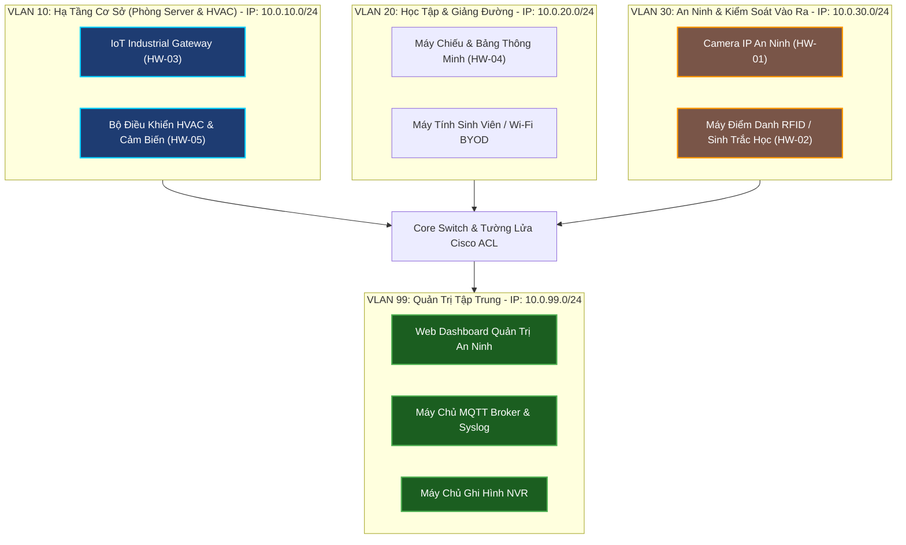
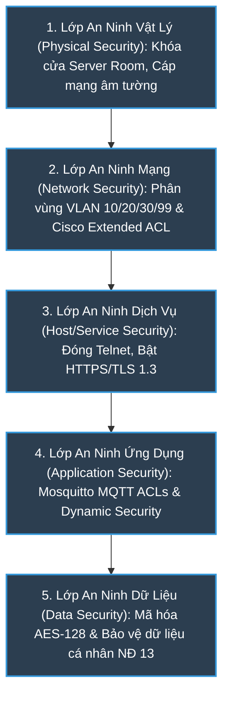

# BỘ GIÁO DỤC VÀ ĐÀO TẠO
# TRƯỜNG ĐẠI HỌC VĂN HIẾN
### **KHOA CÔNG NGHỆ THÔNG TIN**

---

### **BÁO CÁO ĐỒ ÁN MÔN HỌC: BẢO MẬT IoT (INT4410)**
## **TÊN ĐỀ TÀI: CHÍNH SÁCH BẢO MẬT IoT CHO TRƯỜNG ĐẠI HỌC**
### *(Đề tài số 46 — Hướng G: Quản trị rủi ro, chính sách, checklist và kiểm thử)*

*   **Giảng viên hướng dẫn**: Hồ Nhựt Minh
*   **Lớp học phần**: 253INT441001 (HK03, 2025–2026)
*   **Sinh viên thực hiện**: Võ Quốc Thắng
*   **Mã số sinh viên**: 231A011150
*   **Link Repository GitHub**: [https://github.com/Hulk1809/IoT-security-policy-for-universities](https://github.com/Hulk1809/IoT-security-policy-for-universities)
*   **Địa điểm - Thời gian**: TP. Hồ Chí Minh – Ngày 25 tháng 07 năm 2026

---

## THÔNG TIN VÀ CAM KẾT NỘP BÀI

*   **Tên file báo cáo nộp**: `231A011150_VoQuocThang_46_BaoCao.docx` / `231A011150_VoQuocThang_46_BaoCao.pdf`
*   **Tên file slide nộp**: `231A011150_VoQuocThang_46_Slide.pptx`
*   **Sản phẩm chính nộp kèm**: 
    1. Mã nguồn Web Dashboard Giám sát & Cô lập An ninh IoT trực quan (`index.html`, `app.js`, `style.css`).
    2. Tệp Văn bản Chính sách Bảo mật Master (`Chinh_Sach_Bao_Mat_IoT_Truong_Dai_Hoc_Master.md`).
    3. Bộ các kịch bản Security-as-Code (Python Audit Scanner, Scapy Penetration Test, Cisco IOS ACL CLI, Mosquitto MQTT ACL, Snort NIDS Rules, AWS Lambda Python & Cedar Policy, C++ Edge Crypto).

> *Tuyên bố về việc sử dụng AI & Cam kết an toàn học thuật (AI Usage Disclaimer & Academic Integrity Commitment):*
> 1. This paper has been prepared with the assistance of AI tools Gemini for language editing and grammar checking. The authors are fully responsible for the content and conclusions of the paper. (Báo cáo này đã được chuẩn bị với sự hỗ trợ của công cụ AI Gemini để hiệu đính ngôn ngữ và kiểm tra ngữ pháp. Các tác giả chịu trách nhiệm hoàn toàn về nội dung và kết luận của báo cáo).
> 2. **Cam kết an toàn học thuật**: Em xin cam đoan đây là công trình nghiên cứu và báo cáo đồ án do chính em thực hiện dưới sự hướng dẫn của Thầy Hồ Nhựt Minh. Mọi số liệu, kết quả thử nghiệm trong báo cáo là trung thực. Mọi thử nghiệm tấn công/kiểm thử bảo mật chỉ diễn ra trong môi trường mô phỏng cục bộ (Local Sandbox). Tuyệt đối không đưa secret, token, mật khẩu thật hoặc dữ liệu cá nhân thật lên kho lưu trữ GitHub.

---

## PHIẾU XÁC ĐỊNH YÊU CẦU RIÊNG CỦA ĐỀ TÀI 46 (THEO PHỤ LỤC F)

*(Chép lại nguyên văn hai cột Mục A từ Phiếu Hướng dẫn chính thức của Giảng viên)*

| Mục tiêu cần đạt | Sản phẩm / đầu ra bắt buộc |
| :--- | :--- |
| • Xây dựng chính sách bảo mật cho camera, điểm danh, kiểm soát ra vào, cảm biến. (MT-01) | • Văn bản chính sách 4–6 trang. |
| • Phân loại thiết bị và quyền truy cập trong trường. (MT-02) | • Bảng danh mục thiết bị. |
| • Đề xuất quy trình vận hành, cập nhật, xử lý sự cố. (MT-03) | • Ma trận phân quyền/RACI.<br>• Checklist kiểm tra định kỳ. |

---

## LỜI CẢM ƠN

Để hoàn thành báo cáo đồ án môn học **"Bảo mật IoT"** với đề tài **"Chính sách Bảo mật IoT cho Trường Đại học"**, em xin bày tỏ lòng biết ơn sâu sắc và chân thành nhất đến những cá nhân và tập thể đã luôn hỗ trợ, tận tình hướng dẫn em trong suốt quá trình học tập và nghiên cứu.

Trước hết, em xin gửi lời cảm ơn trân trọng nhất đến **Ban Giám hiệu Trường Đại học Văn Hiến** cùng toàn thể quý **Thầy/Cô trong Khoa Công nghệ Thông tin**. Nhà trường đã tạo ra một môi trường học tập hiện đại, văn minh, cung cấp đầy đủ các trang thiết bị và cơ sở vật chất kỹ thuật cần thiết, tạo điều kiện thuận lợi nhất để em được học tập, tiếp cận kiến thức công nghệ mới và phát triển bản thân.

Đặc biệt, em xin gửi lời tri ân sâu sắc nhất đến **Thầy Hồ Nhựt Minh** - Giảng viên trực tiếp giảng dạy môn học Bảo mật IoT (Mã học phần: 253INT441001). Trong suốt quá trình học tập và thực hiện đề tài, Thầy đã luôn tận tụy truyền đạt những kiến thức chuyên môn vững chắc, định hướng tư duy khoa học và đưa ra những lời khuyên, sự chỉ dẫn vô cùng quý báu. Những định hướng sát sao của Thầy không chỉ giúp em tháo gỡ những khó khăn kỹ thuật trong quá trình làm bài mà còn giúp em hoàn thiện tư duy về quản trị an toàn thông tin theo chuẩn thực tế.

Dù đã nỗ lực hết sức để hoàn thành đồ án một cách chỉn chu và toàn diện nhất, song do hạn chế về mặt thời gian và kinh nghiệm thực tiễn, báo cáo không tránh khỏi những thiếu sót nhất định. Em rất mong nhận được những ý kiến đóng góp, nhận xét và phê bình quý báu từ Thầy Hồ Nhựt Minh cũng như Quý Thầy/Cô để bài báo cáo của em được hoàn thiện hơn, đồng thời giúp em tích lũy thêm nhiều kinh nghiệm thực tế cho hành trình học tập và phát triển nghề nghiệp sau này.

Em xin kính chúc **Thầy Hồ Nhựt Minh** cùng **Quý Thầy/Cô Trường Đại học Văn Hiến** luôn dồi dào sức khỏe, hạnh phúc và gặt hái được nhiều thành công hơn nữa trong sự nghiệp cao quý "trồng người"!

*Em xin chân thành cảm ơn!*

**Sinh viên thực hiện:**  
*Võ Quốc Thắng (MSSV: 231A011150)*

---

## LÝ DO CHỌN ĐỀ TÀI

### **Đề tài 46: "Chính sách bảo mật IoT cho trường đại học"**

Trong kỷ nguyên chuyển đổi số giáo dục, việc xây dựng mô hình **“Smart Campus” (Khuôn viên thông minh)** đang trở thành xu hướng tất yếu của các trường đại học tại Việt Nam và trên thế giới. Tuy nhiên, đi kèm với sự tiện ích là những thách thức bảo mật vô cùng lớn. Dưới đây là 4 lý do cốt lõi để lựa chọn đề tài này:

#### **1. Sự bùng nổ của thiết bị IoT và xu hướng xây dựng giảng đường thông minh**
Các trường đại học hiện nay đang tích hợp sâu rộng các thiết bị IoT vào công tác quản lý và giảng dạy, bao gồm: hệ thống camera giám sát an ninh (CCTV), hệ thống kiểm soát ra vào bằng thẻ từ/khóa thông minh (Smart Lock), bộ điều hòa không khí tự động (HVAC), thiết bị phòng Lab nghiên cứu và các thiết bị trình chiếu thông minh. Sự gia tăng nhanh chóng về mặt số lượng của các thiết bị này tạo ra một hệ sinh thái kết nối phức tạp, nhưng cũng đồng thời làm tăng **bề mặt tấn công (Attack Surface)** của mạng nội bộ nhà trường.

#### **2. Đặc thù mạng nội bộ trường đại học có tính mở cao và phức tạp**
Khác với mạng của doanh nghiệp hay ngân hàng (vốn được kiểm soát rất nghiêm ngặt), mạng trường đại học có tính mở cực kỳ cao nhằm phục vụ nhu cầu học tập, tra cứu của hàng chục nghìn sinh viên, giảng viên, nghiên cứu sinh và khách vãng lai. Việc sử dụng chung hạ tầng mạng không dây (Wi-Fi) và thói quen sử dụng thiết bị cá nhân (BYOD) của sinh viên khiến việc kiểm soát các kết nối trở nên khó khăn. Nếu không có chính sách bảo mật IoT riêng biệt, kẻ tấn công có thể dễ dàng lợi dụng các thiết bị IoT bảo mật kém làm "bàn đạp" để xâm nhập sâu vào phân vùng chứa dữ liệu nhạy cảm của nhà trường (như cơ sở dữ liệu điểm, đề thi, thông tin cá nhân và tài chính sinh viên).

#### **3. Lỗ hổng bảo mật cố hữu của các thiết bị IoT đầu cuối**
Nhiều thiết bị IoT hiện nay được sản xuất với chi phí thấp và không được chú trọng về mặt an toàn thông tin. Các lỗ hổng phổ biến bao gồm: mật khẩu mặc định được mã hóa cứng trong phần sụn (firmware), giao thức truyền thông không mã hóa (như HTTP, Telnet, Modbus TCP), và thiếu cơ chế cập nhật bản vá bảo mật định kỳ. Trong khi đó, hầu hết các trường đại học hiện nay đều chưa có một **Quy trình chuẩn (Checklist)** hay **Chính sách phân vùng mạng (Network Segmentation Policy)** cụ thể để quản lý các thiết bị phi chuẩn này.

#### **4. Hậu quả nghiêm trọng về mặt vật lý và uy tín học thuật**
Một cuộc tấn công thành công vào hệ thống IoT của trường đại học có thể gây ra những hậu quả nhãn tiền:
*   **Thiệt hại vật lý**: Kẻ tấn công có thể vô hiệu hóa hệ thống khóa cửa thông minh của các phòng máy chủ (Server Room), phòng thí nghiệm chuyên sâu, hoặc thay đổi nhiệt độ hệ thống điều hòa HVAC gây quá nhiệt, cháy nổ thiết bị đầu nào.
*   **Rò rỉ dữ liệu & Quyền riêng tư**: Hình ảnh từ hệ thống camera IP lắp tại các khu vực nhạy cảm bị rò rỉ ra ngoài internet, làm ảnh hưởng nghiêm trọng đến quyền riêng tư cá nhân và danh tiếng của nhà trường.
*   **Tấn công gián tiếp (Botnet)**: Thiết bị IoT của trường bị chiếm quyền và lợi dụng để tham gia vào mạng lưới botnet tấn công từ chối dịch vụ (DDoS) quy mô lớn, làm tê liệt hệ thống đăng ký môn học hoặc cổng thông tin đào tạo trực tuyến.

#### **KẾT LUẬN (Ý nghĩa thực tiễn của đề tài):**
Đề tài **“Chính sách bảo mật IoT cho trường đại học”** không chỉ mang tính lý thuyết mà giải quyết trực tiếp bài toán thực tế cấp bách. Bằng việc thiết lập **Phạm vi hệ thống tách biệt (VLANs)**, xây dựng **Ma trận Rủi ro - Biện pháp giảm thiểu** dựa trên tiêu chuẩn quốc tế (NIST SP 800-213, ISO/IEC 27400) kết hợp với **Web Dashboard giám sát trực quan**, đề tài cung cấp một giải pháp toàn diện giúp đội ngũ IT của trường dễ dàng quản lý, rà quét lỗ hổng và ứng phó sự cố khẩn cấp (cô lập thiết bị bị hack), đảm bảo môi trường học tập an toàn và tin cậy.

---

## CHƯƠNG 1. MỞ ĐẦU

### 1.1. Bối cảnh
Trong bối cảnh chuyển đổi số giáo dục và xu hướng xây dựng "Khuôn viên trường học thông minh" (Smart Campus), các thiết bị Internet Vạn Vật (IoT) đang được triển khai bùng nổ tại các trường đại học. Các thiết bị này bao gồm:
*   **Hệ thống Camera an ninh IP**: Lắp đặt tại cổng trường, hành lang giảng đường, nhà xe và các khu vực công cộng để giám sát an ninh 24/7.
*   **Máy điểm danh sinh trắc học và Đầu đọc RFID**: Kiểm soát vào ra tự động tại các phòng máy chủ, phòng thí nghiệm chuyên đề, thư viện và giảng đường.
*   **Hệ thống cảm biến phòng Lab và Hạ tầng**: Cảm biến nhiệt độ, độ ẩm, cảm biến hiện diện và bộ điều khiển hệ thống điều hòa HVAC trung tâm.

Tuy nhiên, sự bùng nổ của các thiết bị IoT này diễn ra tự phát và nhanh chóng hơn so với tốc độ xây dựng các rào chắn bảo mật tương ứng. Phần lớn thiết bị IoT trên thị trường thiếu vắng các cơ chế bảo mật tích hợp đủ mạnh để tự bảo vệ khỏi các rủi ro trên mạng lưới. Điều này khiến chúng dễ dàng trở thành điểm yếu chí mạng, tạo cơ hội cho kẻ tấn công xâm nhập vào toàn bộ hạ tầng công nghệ thông tin của nhà trường.

### 1.2. Vấn đề cốt lõi
Mạng máy tính tại các trường đại học mang tính chất mở, phục vụ hàng chục ngàn người dùng bao gồm sinh viên, giảng viên và khách vãng lai, đi kèm với đó là xu hướng sử dụng thiết bị cá nhân (BYOD). Vấn đề cốt lõi hiện nay là sự thiếu vắng một chính sách quản lý, phân vùng mạng và phân quyền đồng bộ. Khi các thiết bị IoT như Camera IP hay khóa cửa thông minh được kết nối chung dải mạng (LAN/Wi-Fi) với người dùng thông thường mà không có sự cô lập vật lý hoặc logic (như VLAN), hệ thống sẽ đối mặt với các nguy cơ:
*   **Lộ lọt dữ liệu cá nhân**: Luồng video giám sát hoặc cơ sở dữ liệu nhật ký điểm danh chứa thông tin sinh trắc học của sinh viên và giảng viên có thể bị đánh cắp, vi phạm trực tiếp các quy định về bảo vệ dữ liệu cá nhân cũng như quy chế an toàn thông tin nội bộ của nhà trường.
*   **Xâm nhập và Leo thang đặc quyền**: Kẻ tấn công có thể lợi dụng các lỗ hổng phần mềm hoặc mật khẩu mặc định chưa thay đổi trên thiết bị IoT để chiếm quyền điều khiển. Nguy hiểm hơn, tội phạm mạng có thể cấy mã độc để biến các thiết bị IoT của trường thành một mạng máy tính ma (botnet), từ đó làm bàn đạp tấn công hệ thống nội bộ hoặc phát động tấn công từ chối dịch vụ (DDoS) ra bên ngoài.

### 1.3. Mục tiêu đo được của đề tài (MT-01, MT-02, MT-03)
Đề tài hướng tới 3 mục tiêu đo được cốt lõi, mỗi mục tiêu gắn liền với 1 sản phẩm đầu ra cụ thể:
1.  **Mục tiêu 1 (MT-01)**: Xây dựng bộ văn bản chính sách bảo mật IoT trường đại học hoàn chỉnh (quy định mật khẩu, mã hóa, phân vùng mạng và quản lý vòng đời thiết bị). *Sản phẩm đầu ra: Văn bản chính sách 5 điều khoản tại Chương 4.*
2.  **Mục tiêu 2 (MT-02)**: Phân loại danh mục tài sản IoT và thiết lập ma trận kiểm soát quyền truy cập chi tiết dựa trên vai trò (RBAC) và thuộc tính (ABAC). *Sản phẩm đầu ra: Bảng danh mục tài sản HW-01..05 & SW/DT tại Chương 3 và Ma trận RACI tại Chương 4.*
3.  **Mục tiêu 3 (MT-03)**: Đề xuất 2 sơ đồ quy trình vận hành chuẩn (Lắp đặt & Cô lập sự cố), bộ Cẩm nang Checklist kiểm tra định kỳ 4 giai đoạn và xây dựng ứng dụng Web Dashboard giám sát thực tế. *Sản phẩm đầu ra: Bộ Checklist 4 giai đoạn, 2 sơ đồ quy trình Mermaid và Mã nguồn Web Dashboard tại Chương 4 & 5.*

#### **Bảng đối chiếu mục tiêu, sản phẩm và cách kiểm chứng:**

| Mã Mục Tiêu | Mục Tiêu Cần Đạt | Sản Phẩm Đầu Ra Tương Ứng | Cách Kiểm Chứng Thực Tế | Chương Trình Bày |
| :--- | :--- | :--- | :--- | :--- |
| **MT-01** | Xây dựng bộ văn bản chính sách bảo mật IoT trường đại học toàn diện. | Văn bản quy định chính sách 5 điều khoản và 3 chính sách quản lý bổ sung. | Rà soát các điều khoản quy định mã hóa SSL/TLS, đổi mật khẩu 90 ngày và cấm Telnet/HTTP. | Chương 4 (Mục 4.1 & 4.2) |
| **MT-02** | Phân loại tài sản IoT và thiết lập ma trận phân quyền truy cập. | Bảng phân loại tài sản theo VLAN và Ma trận RACI 5 vai trò. | Kiểm tra ma trận RACI đối chiếu quyền hạn truy cập của Sinh viên, IT Admin, CISO và Bảo vệ. | Chương 3 (Mục 3.1) & Chương 4 (Mục 4.3) |
| **MT-03** | Đề xuất quy trình vận hành, cẩm nang checklist và công cụ kiểm thử trực quan. | Sơ đồ quy trình Mermaid, Bộ Checklist 4 giai đoạn và Web Dashboard giám sát. | Chạy thử nghiệm rà quét CVSS, tích chọn tuân thủ 0%-100% và ngắt kết nối cô lập cổng switch < 5s. | Chương 4 (Mục 4.4, 4.5) & Chương 5 |

### 1.4. Đối tượng, Phạm vi & Giới hạn Pháp lý
*   **Đối tượng nghiên cứu**: Các thiết bị IoT đầu cuối (Camera IP, máy điểm danh RFID, IoT Gateway, máy chiếu thông minh, bộ điều khiển HVAC) và hạ tầng mạng nội bộ trường đại học.
*   **Phạm vi nghiên cứu**: Giới hạn trong không gian hạ tầng mạng khuôn viên của một trường đại học (giảng đường, phòng làm việc hành chính, phòng máy chủ, phòng lab).
*   **Giới hạn pháp lý & Đạo đức**: Mọi kịch bản kiểm thử tấn công giả lập (ARP Spoofing, Brute-force) chỉ được thực hiện trong môi trường mô phỏng cục bộ (Local Sandbox). Tuân thủ nghiêm ngặt Luật An ninh mạng 2018, Nghị định 85/2016/NĐ-CP và Nghị định 13/2023/NĐ-CP về bảo vệ dữ liệu cá nhân.

### 1.5. Sản phẩm dự kiến bàn giao
1.  Văn bản Quy định Chính sách Bảo mật IoT (Policy Document) dài 5-6 trang.
2.  Bảng danh mục phân loại tài sản IoT và Ma trận phân công trách nhiệm RACI (RACI Matrix).
3.  Bộ cẩm nang danh sách kiểm tra an toàn 4 giai đoạn (Security Checklist) có phiếu đánh giá điền thử thực tế.
4.  Ứng dụng Web Dashboard Giám sát an ninh IoT mô phỏng trực quan (`index.html`, `app.js`, `style.css`).

---

## CHƯƠNG 2. CƠ SỞ LÝ THUYẾT (CHUẨN, QUẢN TRỊ VÀ TUÂN THỦ)

### 2.1. Kiến thức nền tảng thực sự sử dụng

*   **Quản trị rủi ro IoT (IoT Risk Governance)**: Là quá trình nhận diện, đánh giá và giảm thiểu các rủi ro an ninh thông tin liên quan đến việc triển khai các thiết bị nhúng và cảm biến trong tổ chức. Không giống như các hệ thống CNTT truyền thống, thiết bị IoT là cầu nối giữa không gian mạng (cyber) và môi trường vật lý (physical). Do đó, quản trị rủi ro IoT trong trường đại học đòi hỏi sự kết hợp chặt chẽ giữa chính sách hành chính (quy định người dùng) và kiểm soát kỹ thuật (phân vùng mạng), nhằm đảm bảo các thiết bị này phục vụ đúng mục đích học thuật mà không trở thành điểm yếu để tin tặc khai thác.

*   **Khái niệm Kiểm soát truy cập (Access Control)**: Trong mạng đại học đa tầng, kiểm soát truy cập bao gồm Xác thực (Authentication - xác minh danh tính thiết bị hoặc con người) và Ủy quyền (Authorization - xác định quyền hạn được phép thao tác). Các mô hình cốt lõi gồm:
    *   **RBAC (Role-Based Access Control)**: Phân quyền dựa trên vai trò tĩnh (ví dụ: Sinh viên chỉ được xem dữ liệu, Giảng viên được cấp quyền quản lý phòng lab, IT Admin được cấu hình thiết bị).
    *   **ABAC (Attribute-Based Access Control)**: Phân quyền động dựa trên thuộc tính và ngữ cảnh. Khái niệm này rất quan trọng với IoT, cho phép nhà trường thiết lập các luật linh hoạt như: Sinh viên chỉ được mở khóa phòng thí nghiệm thông minh trong khung giờ học (thuộc tính thời gian) và khi đang kết nối từ mạng nội bộ của trường (thuộc tính không gian).

#### **Sơ đồ Kiến trúc Mạng Phân đoạn & Ngữ cảnh Dữ liệu (Hình 2.1)**

Sơ đồ dưới đây minh họa mô hình phân tầng phòng thủ mạng trường đại học được tổ chức trên 4 phân vùng VLAN độc lập:


```mermaid
graph TD
    subgraph VLAN_10 ["VLAN 10: Hạ Tầng Cơ Sở (Phòng Server & HVAC) - IP: 10.0.10.0/24"]
        HW03["IoT Industrial Gateway (HW-03)"]
        HW05["Bộ Điều Khiển HVAC & Cảm Biến (HW-05)"]
    end

    subgraph VLAN_20 ["VLAN 20: Học Tập & Giảng Đường - IP: 10.0.20.0/24"]
        HW04["Máy Chiếu & Bảng Thông Minh (HW-04)"]
        StudentPC["Máy Tính Sinh Viên / Wi-Fi BYOD"]
    end

    subgraph VLAN_30 ["VLAN 30: An Ninh & Kiểm Soát Vào Ra - IP: 10.0.30.0/24"]
        HW01["Camera IP An Ninh (HW-01)"]
        HW02["Máy Điểm Danh RFID / Sinh Trắc Học (HW-02)"]
    end

    subgraph VLAN_99 ["VLAN 99: Quản Trị Tập Trung - IP: 10.0.99.0/24"]
        AdminDashboard["Web Dashboard Quản Trị An Ninh"]
        MosquittoServer["Máy Chủ MQTT Broker & Syslog"]
        NVRServer["Máy Chủ Ghi Hình NVR"]
    end

    CoreSwitch["Core Switch & Tường Lửa Cisco ACL"]

    VLAN_10 --> CoreSwitch
    VLAN_20 --> CoreSwitch
    VLAN_30 --> CoreSwitch
    CoreSwitch --> VLAN_99

    classDef secure fill:#1e3c72,stroke:#00d2ff,stroke-width:2px,color:#fff;
    classDef warning fill:#795548,stroke:#ff9800,stroke-width:2px,color:#fff;
    classDef admin fill:#1b5e20,stroke:#4caf50,stroke-width:2px,color:#fff;
    
    class HW03,HW05 secure;
    class HW01,HW02 warning;
    class AdminDashboard,MosquittoServer,NVRServer admin;
```
*Hình 2.1: Sơ đồ Kiến trúc Mạng Phân đoạn 3 Lớp & 4 Phân vùng VLAN trường đại học.*

---

#### **Sơ đồ Luồng Dữ liệu (DFD Cấp 1) và Các Ranh giới Tin cậy (Trust Boundaries - Hình 2.2)**


```mermaid
graph LR
    subgraph Boundary1 ["Ranh Giới Tin Cậy 1: Vùng Thiết Bị Biên (Low Trust)"]
        Sensor["Cảm Biến / Camera / RFID"]
    end

    subgraph Boundary2 ["Ranh Giới Tin Cậy 2: Vùng Dịch Thuật & Chuyển Tiếp (Medium Trust)"]
        EdgeGateway["IoT Gateway Biên"]
    end

    subgraph Boundary3 ["Ranh Giới Tin Cậy 3: Vùng Máy Chủ Quản Trị (High Trust)"]
        MQTTBroker["MQTT Broker (Mosquitto)"]
        NIDS["Snort NIDS Monitor"]
        Dashboard["Web Dashboard Quản Trị"]
    end

    Sensor -- "RTSP (554) / MQTT (1883)" --> EdgeGateway
    EdgeGateway -- "TLS Encrypted Payload" --> MQTTBroker
    MQTTBroker -- "Deep Packet Inspection" --> NIDS
    NIDS -- "Realtime Alerts / CVSS Score" --> Dashboard

    classDef low fill:#b71c1c,stroke:#ff5252,color:#fff;
    classDef med fill:#e65100,stroke:#ff9800,color:#fff;
    classDef high fill:#1b5e20,stroke:#4caf50,color:#fff;

    class Sensor low;
    class EdgeGateway med;
    class MQTTBroker,NIDS,Dashboard high;
```
*Hình 2.2: Sơ đồ luồng dữ liệu DFD Cấp 1 và các Ranh giới tin cậy (Trust Boundaries).*

---

### 2.2. Chuẩn và quy định pháp lý áp dụng

*   **Tiêu chuẩn OWASP IoT Top 10**: Đây là danh mục nhận diện 10 lỗ hổng bảo mật IoT phổ biến nhất. Các thiết bị trong khuôn viên trường rất dễ mắc phải các lỗi này như: sử dụng mật khẩu yếu/mặc định (Weak Passwords), truyền thông không mã hóa (Insecure Network Services), và thiếu cơ chế cập nhật bản vá (Lack of Secure Update Mechanism).
*   **Nghị định 85/2016/NĐ-CP & TCVN 11930:2017**: Theo Nghị định này, nhà trường đóng vai trò là "Chủ quản hệ thống thông tin" và phải có trách nhiệm lập hồ sơ đề xuất cấp độ an toàn. Đối với mạng lưới đại học có xử lý thông tin riêng và dữ liệu cá nhân của trên 10.000 người dùng (sinh viên, cán bộ), hệ thống được phân loại ở Cấp độ 3.
*   **Nghị định 13/2023/NĐ-CP**: Quy định bắt buộc về Bảo vệ dữ liệu cá nhân. Các thiết bị IoT của trường như máy điểm danh sinh trắc học, camera an ninh, thẻ RFID đều liên tục thu thập dữ liệu nhạy cảm của người học. Nghị định yêu cầu nhà trường phải có biện pháp mã hóa kỹ thuật và chính sách giới hạn quyền truy cập.
*   **Tiêu chuẩn NIST SP 800-213**: Tài liệu "Hướng dẫn an ninh mạng cho thiết bị IoT" dành cho các tổ chức, cung cấp lăng kính đánh giá từ "góc độ thiết bị" (device perspective), yêu cầu tổ chức phải xác định rõ các năng lực bảo mật mà thiết bị cần có trước khi kết nối mạng.

---

### 2.3. BẢNG trích dẫn nguồn tài liệu và công cụ chính (Theo Mục 2.3 mẫu PDF)

| STT | Nguồn / Tài Liệu / Repo | URL Link Truy Cập | Phần Đã Sử Dụng Trong Bài | Ngày Truy Cập |
| :---: | :--- | :--- | :--- | :---: |
| 1 | **Báo Bách Khoa HN** (PGS. TS. Trần Đình Khang) | NXB Bách Khoa Hà Nội (2020) | Khung kiến thức Quản trị an toàn thông tin & Mã hóa mảng | 10/07/2026 |
| 2 | **OWASP IoT Project** (OWASP Foundation) | `https://owasp.org/www-project-internet-of-things/` | Danh mục 10 lỗ hổng OWASP IoT Top 10 & ISTG Guide | 12/07/2026 |
| 3 | **NIST SP 800-213** (NIST Cybersecurity) | `https://csrc.nist.gov/publications/detail/sp/800-213/final` | Tiêu chí đánh giá năng lực an toàn thiết bị IoT tổ chức | 15/07/2026 |
| 4 | **Chính phủ Việt Nam (NĐ 13/2023/NĐ-CP)** | `https://vanban.chinhphu.vn/` | Quy định bảo vệ dữ liệu cá nhân & dữ liệu sinh trắc học | 18/07/2026 |
| 5 | **GitHub Main Repo** (Võ Quốc Thắng) | `https://github.com/Hulk1809/IoT-security-policy-for-universities.git` | Mã nguồn Web Dashboard & Các kịch bản Security-as-Code | 25/07/2026 |

---

### 2.4. Công trình nghiên cứu liên quan & Phần kế thừa (Theo Mục 2.4 mẫu PDF)

*   **So sánh tổng quan**: Các nghiên cứu trước đây (như mô hình Smart Campus của Bahga & Madisetti 2014) chủ yếu tập trung vào việc thu thập dữ liệu cảm biến và kết nối đám mây, nhưng chưa chú trọng tới tính mở phức tạp của mạng Wi-Fi sinh viên (BYOD) và chưa thiết lập ma trận phân công trách nhiệm RACI rõ ràng.
*   **Phần kế thừa & Phát triển mới**: Đề tài này kế thừa chiến lược **Phân đoạn mạng logic (Network Segmentation)** sử dụng VLANs và ACLs từ tiêu chuẩn Cisco Campus Architecture, đồng thời phát triển mới 3 đóng góp cốt lõi:
    1. Thiết lập Ma trận RACI 5 vai trò phân định trách nhiệm chi tiết cho môi trường trường đại học Việt Nam.
    2. Xây dựng Bộ Cẩm nang Checklist 4 giai đoạn có trạng thái kiểm thử thực tế.
    3. Lập trình công cụ **Web Dashboard mô phỏng an ninh** hỗ trợ ngắt kết nối cô lập cổng switch ảo khẩn cấp dưới 5 giây.

---

### 2.5. Mô Hình STRIDE Cho Hệ Thống IoT Trường Đại Học

Mô hình **STRIDE** phân tích các mối đe dọa thành 6 loại chính:

| Viết Tắt | Mối Đe Dọa | Mục Tiêu Bảo Mật | Kịch Bản Tấn Công Thực Tế Trong Trường Đại Học | Biện Pháp Khắc Phục Sơ Bộ |
| :--- | :--- | :--- | :--- | :--- |
| **S** (Spoofing) | Giả mạo | Authentication (Xác thực) | Kẻ tấn công sao chép thẻ RFID của giảng viên để mở cửa phòng Server hoặc phòng Lab nghiên cứu đề tài bí mật. | Sử dụng thẻ RFID mã hóa (Mifare Desfire) thay vì thẻ RFID tần số thấp (125kHz) dễ sao chép; áp dụng xác thực 2 lớp (MFA). |
| **T** (Tampering) | Can thiệp vật lý/dữ liệu | Integrity (Tính toàn vẹn) | Kẻ tấn công kết nối trực tiếp vào cáp LAN của Camera IP lắp ngoài hành lang để tiêm mã độc hoặc chèn luồng video giả. | Vô hiệu hóa các cổng switch mạng không sử dụng; bật tính năng Port Security (MAC Binding/802.1X) trên switch. |
| **R** (Repudiation) | Chối bỏ | Non-repudiation (Chống chối bỏ) | Kẻ gian phá hoại thiết bị trong Lab nhưng hệ thống không ghi lại nhật ký mở cửa (hoặc nhật ký bị xóa bởi tài khoản bị chiếm đoạt), dẫn đến việc sinh viên chối bỏ trách nhiệm. | Thiết lập ghi nhật ký tập trung (Centralized Logging) qua giao thức syslog mã hóa gửi đến máy chủ log bất biến (Read-only log storage). |
| **I** (Information Disclosure) | Lộ lọt thông tin | Confidentiality (Tính bảo mật) | Dữ liệu video giám sát của camera lắp trong khu vực nhạy cảm (như phòng họp Ban giám hiệu hoặc phòng Ký túc xá) bị truyền tải dưới dạng cleartext (HTTP/RTSP không mã hóa) và bị nghe lén trên mạng Wi-Fi trường. | Bắt buộc mã hóa luồng truyền dữ liệu bằng SRTP hoặc RTSP qua TLS (RTSPS); cấu hình phân vùng mạng VLAN bảo mật. |
| **D** (Denial of Service) | Từ chối dịch vụ | Availability (Tính sẵn sàng) | Kẻ tấn công thực hiện tấn công Syn Flood hoặc UDP Flood vào IP của bộ điều khiển cửa thông minh (Smart Lock Controller), làm tê liệt hệ thống khóa khiến cửa không thể mở/đóng tự động trong trường hợp khẩn cấp. | Triển khai tường lửa biên giới hạn lưu lượng (Rate limiting); sử dụng bộ điều khiển cửa có cơ chế fallback vật lý (khóa cơ dự phòng). |
| **E** (Elevation of Privilege) | Leo thang đặc quyền | Authorization (Ủy quyền) | Kẻ tấn công khai thác lỗ hổng tràn bộ đệm (Buffer Overflow) trong firmware của thiết bị Gateway để từ quyền User thường chiếm quyền Root (quản trị tối cao), điều khiển toàn bộ mạng IoT. | Thường xuyên cập nhật bản vá Firmware (OTA); chạy các dịch vụ trên Gateway dưới quyền user bị hạn chế (Non-root user). |

---

### 2.6. Ánh Xạ Chi Tiết Lên OWASP IoT Top 10

Dưới đây là việc nhận diện và đối chiếu các lỗ hổng của trường đại học với danh sách **OWASP IoT Top 10**:

1.  **I1: Weak, Guessable, or Hardcoded Credentials (Mật khẩu yếu, dễ đoán hoặc mã hóa cứng)**
    *   *Hiện trạng*: Thiết bị camera IP mua ngoài thị trường thường giữ nguyên mật khẩu mặc định (`admin/admin` hoặc `admin/12345`).
    *   *Rủi ro*: Kẻ tấn công quét IP tự động có thể chiếm quyền điều khiển hàng loạt camera trong trường.
2.  **I2: Insecure Network Services (Dịch vụ mạng không an toàn)**
    *   *Hiện trạng*: Thiết bị IoT mở sẵn các cổng dịch vụ không cần thiết như Telnet (Port 23), FTP (Port 21) hoặc HTTP không mã hóa (Port 80).
    *   *Rủi ro*: Dễ bị khai thác từ xa qua mạng nội bộ.
3.  **I3: Insecure Ecosystem Interfaces (Giao diện hệ sinh thái không an toàn)**
    *   *Hiện trạng*: API kết nối giữa ứng dụng di động quản lý IoT và máy chủ Backend không được xác thực token mạnh, thiếu kiểm tra phân quyền (IDOR).
    *   *Rủi ro*: Kẻ tấn công giả mạo request để lấy thông tin của các phòng ban khác.
4.  **I4: Lack of Secure Update Mechanism (Thiếu cơ chế cập nhật an toàn)**
    *   *Hiện trạng*: Firmware của thiết bị Smart Lock được tải về qua HTTP không mã hóa và không có chữ ký số (Digital Signature).
    *   *Rủi ro*: Kẻ tấn công có thể chèn firmware chứa mã độc (Malicious Firmware Update).
5.  **I5: Use of Outdated or Insecure Components (Sử dụng thành phần lỗi thời hoặc không an toàn)**
    *   *Hiện trạng*: Hệ điều hành của IoT Gateway (Raspberry Pi) chạy phiên bản Linux cũ chứa các lỗ hổng bảo mật đã được công bố (ví dụ: lỗi trong thư viện OpenSSL).
    *   *Rủi ro*: Bị khai thác chiếm quyền điều khiển từ xa.
6.  **I6: Insufficient Privacy Protection (Bảo vệ quyền riêng tư chưa đầy đủ)**
    *   *Hiện trạng*: Dữ liệu định danh sinh viên kết hợp nhật ký ra vào các khu vực lưu trữ dưới dạng bản rõ (Plaintext) không mã hóa.
    *   *Rủi ro*: Vi phạm các quy định về bảo vệ dữ liệu cá nhân nếu cơ sở dữ liệu bị rò rỉ.

---

### 2.7. Phân Tích và Tính Toán Điểm Số Lỗ Hổng CVSS v3.1 Chi Tiết

#### **Kịch bản 1: Mật khẩu mặc định / mã hóa cứng trong Firmware Camera IP (HW-01)**
*   **Vectơ CVSS v3.1**: `CVSS:3.1/AV:N/AC:L/PR:N/UI:N/S:U/C:H/I:H/A:H`
*   **Phân tích các thành phần**:
    *   *Attack Vector (AV)*: **Network (N)** - Có thể khai thác từ xa qua mạng Internet/Nội bộ.
    *   *Attack Complexity (AC)*: **Low (L)** - Khai thác cực kỳ dễ dàng bằng các công cụ quét tự động.
    *   *Privileges Required (PR)*: **None (N)** - Không cần tài khoản trước đó để khai thác.
    *   *User Interaction (UI)*: **None (N)** - Không cần người dùng tương tác.
    *   *Scope (S)*: **Unchanged (U)** - Tác động giới hạn trong camera bị chiếm quyền.
    *   *Confidentiality (C)*: **High (H)** - Kẻ tấn công xem được toàn bộ luồng video trực tiếp.
    *   *Integrity (I)*: **High (H)** - Có thể chỉnh sửa cấu hình camera, xóa log.
    *   *Availability (A)*: **High (H)** - Có thể tắt hoặc khởi động lại camera tùy ý.
*   **Điểm CVSS v3.1**: **9.8 (Nghiêm Trọng - Critical)**

#### **Kịch bản 2: Truyền dữ liệu mở khóa Smart Lock (HW-02) qua giao thức HTTP không mã hóa**
*   **Vectơ CVSS v3.1**: `CVSS:3.1/AV:A/AC:H/PR:N/UI:N/S:C/C:H/I:H/A:N`
*   **Phân tích các thành phần**:
    *   *Attack Vector (AV)*: **Adjacent (A)** - Phải ở trong cùng mạng nội bộ Wi-Fi/LAN của trường mới nghe lén được.
    *   *Attack Complexity (AC)*: **High (H)** - Cần kỹ thuật nghe lén mạng (ARP Spoofing) và giải mã giao thức.
    *   *Privileges Required (PR)*: **None (N)** - Không cần tài khoản.
    *   *User Interaction (UI)*: **None (N)** - Không cần người dùng tương tác.
    *   *Scope (S)*: **Changed (C)** - Việc lộ lọt token dẫn đến việc mở khóa vật lý (ảnh hưởng đến an toàn vật lý của phòng Lab).
    *   *Confidentiality (C)*: **High (H)** - Lộ mã token mở khóa.
    *   *Integrity (I)*: **High (H)** - Có thể replay gói tin để mở cửa bất hợp pháp.
    *   *Availability (A)*: **None (N)** - Không làm sập thiết bị khóa.
*   **Điểm CVSS v3.1**: **7.5 (Cao - High)**

---

## CHƯƠNG 3. PHƯƠNG PHÁP VÀ THIẾT KẾ (PHẠM VI, VAI TRÒ, TIÊU CHÍ)

### 3.1. Nhận diện tài sản IoT theo khu vực
Hệ thống thiết bị IoT trong trường đại học được phân loại và quản lý theo 4 khu vực chức năng chính. Việc phân chia các thiết bị này vào các Mạng cục bộ ảo (VLAN) khác nhau là chiến lược cách ly logic nhằm cô lập rủi ro, không cho phép lưu lượng mạng rác hoặc mã độc lây lan chéo.

#### **BẢNG thành phần danh mục tài sản IoT (Theo Mục 3.3 chuẩn PDF):**

| ID Tài Sản | Phân Nhóm | Tên Thiết Bị IoT | Phiên Bản / Cấu Hình | Phân Vùng VLAN | Mục Đích Sử Dụng | Ghi Chú An Toàn |
| :--- | :--- | :--- | :--- | :--- | :--- | :--- |
| **HW-01** | Phần cứng | Camera IP Dahua/Hikvision | Firmware v2.800 (IP 192.168.30.15) | VLAN 30 (An ninh) | Ghi hình an ninh giảng đường, nhà xe 24/7 | Đã đóng Telnet 23, bắt buộc HTTPS/RTSPS |
| **HW-02** | Phần cứng | Máy điểm danh RFID & Smart Lock | Firmware v1.4 (IP 192.168.30.22) | VLAN 30 (An ninh) | Kiểm soát vào ra tự động phòng Lab/Server | Đã mã hóa TLS 1.3, dùng thẻ Mifare DESFire |
| **HW-03** | Phần cứng | IoT Industrial Gateway | Linux Kernel 5.15 (IP 192.168.10.1) | VLAN 10 (Cơ sở) | Chuyển tiếp dữ liệu cảm biến về máy chủ | Hộp khóa vật lý, tắt UART/USB debug |
| **HW-04** | Phần cứng | Máy chiếu Smart & Bảng tương tác | Android Embedded (IP 192.168.20.104) | VLAN 20 (Học tập) | Hỗ trợ trình chiếu giảng dạy giảng đường | Tắt UPnP, chỉ truyền dữ liệu cục bộ |
| **HW-05** | Phần cứng | Bộ điều khiển HVAC & Cảm biến | Modbus Gateway (IP 192.168.10.45) | VLAN 10 (Cơ sở) | Tự động hóa điều hòa & cảnh báo nhiệt | Cisco Extended ACL Whitelist IP 10.0.100.5 |
| **SW-01** | Phần mềm | Hệ điều hành Gateway (Custom Linux) | Ubuntu Core 22.04 LTS | VLAN 10 & 20 | Định tuyến dữ liệu cảm biến biên | Chạy non-root user, tự động vá lỗi OTA |
| **SW-02** | Phần mềm | Web Dashboard Quản trị An ninh | HTML5/JS Engine v1.0 | VLAN 99 (Quản trị) | Giao diện điều khiển & Cô lập cổng switch | Xác thực đa yếu tố MFA, bảo vệ bằng WAF |
| **SW-03** | Phần mềm | Firmware Camera & Thiết bị | Vendor Signed Firmware | Tất cả các VLAN | Mã nguồn điều khiển chip nhúng | Yêu cầu kiểm tra chữ ký số trước khi Flash |
| **DT-01** | Dữ liệu | Luồng Video Giám sát (CCTV Feeds) | H.264/H.265 Encoded Stream | NAS Storage (VLAN 30) | Lưu trữ hình ảnh an ninh thời gian thực | Mã hóa lưu trữ AES-256, phân quyền RBAC |
| **DT-02** | Dữ liệu | Nhật ký Ra vào (Access Logs) | Syslog Database | Server Room (VLAN 99) | Lịch sử quẹt thẻ & điểm danh sinh viên | Cơ chế log WORM (chống chỉnh sửa/xóa) |
| **DT-03** | Dữ liệu | Thông tin Cấu hình & Token | HashiCorp Vault Secrets | Server Room (VLAN 99) | Mật khẩu thiết bị & JWT Tokens | Tuyệt đối không mã hóa cứng (hardcode) |

---

#### **Sơ đồ Mô hình Phòng thủ theo Chiều sâu (Defense-in-Depth Architecture - Hình 3.1)**


```mermaid
graph TD
    Layer1["1. Lớp An Ninh Vật Lý (Physical Security): Khóa cửa Server Room, Cáp mạng âm tường"]
    Layer2["2. Lớp An Ninh Mạng (Network Security): Phân vùng VLAN 10/20/30/99 & Cisco Extended ACL"]
    Layer3["3. Lớp An Ninh Dịch Vụ (Host/Service Security): Đóng Telnet, Bật HTTPS/TLS 1.3"]
    Layer4["4. Lớp An Ninh Ứng Dụng (Application Security): Mosquitto MQTT ACLs & Dynamic Security"]
    Layer5["5. Lớp An Ninh Dữ Liệu (Data Security): Mã hóa AES-128 & Bảo vệ dữ liệu cá nhân NĐ 13"]

    Layer1 --> Layer2
    Layer2 --> Layer3
    Layer3 --> Layer4
    Layer4 --> Layer5

    classDef layer fill:#2c3e50,stroke:#3498db,stroke-width:2px,color:#fff;
    class Layer1,Layer2,Layer3,Layer4,Layer5 layer;
```
*Hình 3.1: Sơ đồ Mô hình Phòng thủ theo Chiều sâu 5 lớp trong trường đại học.*

---

#### **BẢNG quy trình vận hành bảo mật chuẩn (Theo Mục 3.4 chuẩn PDF):**

| Bước | Nội Dung Công Việc | Sản Phẩm / Đầu Ra Bắt Buộc | Minh Chứng Trong Repo GitHub |
| :---: | :--- | :--- | :--- |
| **1** | Tiếp nhận & Đăng ký MAC/VLAN | Khai báo địa chỉ IP tĩnh & phân dải VLAN (10/20/30) | Sơ đồ Mermaid Kiến trúc Mạng `bao_cao_do_an.md` |
| **2** | Hardening Thiết bị & Đổi mật khẩu | Đổi mật khẩu phức tạp (>= 12 ký tự), đóng Telnet 23 | Script kiểm thử `python-nmap` rà quét cổng |
| **3** | Mã hóa Đường truyền & Phân quyền | Kích hoạt HTTPS (443), MQTTS (1883), RTSPS (554) | Tệp cấu hình `Mosquitto ACLs` & `Cisco ACL` |
| **4** | Kiểm thử Tuân thủ & Giám sát Log | Xuất phiếu đánh giá ĐẠT, ghi log về Syslog Server | Mã nguồn Web Dashboard (`app.js`, `index.html`) |
| **5** | Khắc phục Sự cố & Cô lập Khẩn cấp | Disable cổng Switch ảo trong < 5s khi bị hack | Nút bấm "Cô lập mạng" & Live Console Log |

---

#### **Mã Nguồn Kiểm Thử 1: Script Python Rà Quét Tự Động Subnet và CVE (`python-nmap`)**

```python
import nmap
import json

def run_campus_iot_audit(subnet_cidr):
    scanner = nmap.PortScanner()
    print(f"[*] Dang ra quet dai IP IoT Truong Dai hoc: {subnet_cidr}")
    
    # Quet cac cong IoT thong dung: 23 (Telnet), 80 (HTTP), 443 (HTTPS), 554 (RTSP), 1883 (MQTT), 502 (Modbus)
    scanner.scan(hosts=subnet_cidr, ports='23,80,443,554,1883,502', arguments='-sV --open')
    
    audit_results = []
    for host in scanner.all_hosts():
        host_info = {
            "ip": host,
            "hostname": scanner[host].hostname(),
            "status": scanner[host].state(),
            "open_ports": []
        }
        for proto in scanner[host].all_protocols():
            ports = scanner[host][proto].keys()
            for port in ports:
                service = scanner[host][proto][port]
                port_data = {
                    "port": port,
                    "name": service['name'],
                    "product": service['product'],
                    "version": service['version']
                }
                if port == 23:
                    port_data["risk"] = "CRITICAL (CVSS 9.8)"
                    port_data["policy_violation"] = "Cam su dung Telnet chua ma hoa"
                elif port == 80 and "camera" in service['product'].lower():
                    port_data["risk"] = "HIGH (CVSS 7.5)"
                    port_data["policy_violation"] = "Bat buoc chuyen sang HTTPS (443)"
                
                host_info["open_ports"].append(port_data)
        audit_results.append(host_info)
        
    return json.dumps(audit_results, indent=4, ensure_ascii=False)

if __name__ == "__main__":
    report = run_campus_iot_audit("192.168.30.0/24")
    print(report)
```

---

#### **Mã Nguồn Kiểm Thử 2: Script Python Mô Phỏng ARP Spoofing / MitM (`Scapy`)**

```python
from scapy.all import ARP, send
import time

def simulate_arp_spoof(target_ip, spoof_ip, target_mac):
    print(f"[*] Bat dau mo phong tan cong ARP Spoofing: {spoof_ip} -> {target_ip}")
    packet = ARP(op=2, pdst=target_ip, hwdst=target_mac, psrc=spoof_ip)
    try:
        while True:
            send(packet, verbose=False)
            time.sleep(2)
    except KeyboardInterrupt:
        print("[*] Da dung mo phong tan cong MitM!")

if __name__ == "__main__":
    simulate_arp_spoof("192.168.30.10", "192.168.30.1", "00:11:22:33:44:55")
```

---

### 3.2. Xác định các chủ thể và vai trò trong hệ thống
Dựa trên nguyên tắc Đặc quyền tối thiểu (Least Privilege), các chủ thể tương tác với hệ thống IoT trường đại học được phân quyền rõ ràng theo vai trò:
1.  **Ban Giám hiệu**: Người phê duyệt chính sách an ninh thông tin toàn trường, định hướng các quyết định đầu tư an toàn mạng (Role: Approver).
2.  **Đội ngũ IT & Quản trị mạng**: Quản lý hạ tầng, cấu hình VLAN/Firewall, thực hiện rà quét lỗ hổng định kỳ và trực tiếp cô lập thiết bị trên hệ thống khi phát hiện sự cố xâm nhập (Role: Administrator).
3.  **Nhân viên Bảo vệ & Quản lý tòa nhà**: Sử dụng giao diện màn hình để theo dõi luồng camera và kiểm tra nhật ký quẹt thẻ thực tế tại các tòa nhà (Role: Operator/Monitor).
4.  **Giảng viên**: Sử dụng máy điểm danh và thiết bị giảng đường trong phạm vi vật lý và thời gian được cấp quyền (Role: Authorized User).
5.  **Sinh viên & Khách vãng lai**: Chỉ được phép truy cập không gian mạng thông qua mạng Wi-Fi công cộng hoặc mạng sinh viên (Guest/Student VLAN), tuyệt đối không có đường dẫn định tuyến (routing) truy cập vào dải IP của mạng IoT.

### 3.3. Tiêu chí đánh giá bảo mật dựa trên chuẩn OWASP IoT
Để đáp ứng chuẩn đầu ra của đề tài và làm cơ sở xây dựng Checklist kiểm tra, đề tài thiết lập 5 tiêu chí đánh giá an toàn cốt lõi:
*   **Tiêu chí 1 - Quản lý Định danh & Mật khẩu**: 100% thiết bị phải được thay đổi mật khẩu mặc định trước khi hòa mạng, bắt buộc sử dụng mật khẩu phức tạp (>= 12 ký tự) và quản lý tập trung.
*   **Tiêu chí 2 - Bảo mật Giao diện & Dịch vụ**: Chủ động rà soát và vô hiệu hóa toàn bộ các giao thức/dịch vụ không sử dụng hoặc thiếu an toàn (Telnet cổng 23, FTP cổng 21, UPnP).
*   **Tiêu chí 3 - Mã hóa Truyền tải**: Bắt buộc áp dụng mã hóa đầu cuối cho toàn bộ dữ liệu truyền tải nhạy cảm trên hệ thống mạng đại học bằng các giao thức an toàn như HTTPS (443), MQTTS (8883), RTSPS (554).
*   **Tiêu chí 4 - Cách ly Mạng**: Đảm bảo 100% thiết bị IoT được đặt trong phân vùng VLAN riêng biệt. Áp dụng Danh sách kiểm soát truy cập (ACL) tại bộ định tuyến trung tâm để chặn đứng các kết nối ngang hàng trái phép từ VLAN của người dùng (sinh viên, giảng viên) sang mạng IoT.
*   **Tiêu chí 5 - Quản lý Cập nhật & Nhật ký**: Có quy trình phối hợp với nhà cung cấp để cập nhật phần mềm cơ sở (Firmware) định kỳ. Cấu hình thiết bị tự động chuyển tiếp nhật ký sự kiện (Syslog) về máy chủ lưu trữ tập trung để phục vụ công tác điều tra số khi cần thiết.

---

## CHƯƠNG 4. TRIỂN KHAI VÀ SẢN PHẨM (VĂN BẢN CHÍNH SÁCH VÀ QUY TRÌNH)

### 4.1. Văn bản Chính sách Bảo mật IoT Trường Đại học (Tóm tắt Cấu trúc)

Văn bản Chính sách Bảo mật IoT ban hành gồm 5 điều khoản quy định bắt buộc:

*   **Điều 1. Quy định về Đặt tên và Định danh Mạng**: Tất cả thiết bị IoT khi đấu nối vào mạng trường phải được đăng ký địa chỉ MAC, đặt hostname theo chuẩn quy định và gán IP tĩnh trong đúng phân vùng VLAN quy định.
*   **Điều 2. Quy định về Mật khẩu và Quản lý Tải khoản**: Nghiêm cấm giữ nguyên mật khẩu mặc định của nhà sản xuất. Mật khẩu phải được thay đổi định kỳ 90 ngày/lần. Bắt buộc áp dụng xác thực đa yếu tố (MFA) cho tài khoản quản trị Dashboard.
*   **Điều 3. Quy định về Mã hóa và Giao thức Truyền thông**: Dữ liệu video camera và dữ liệu điểm danh sinh trắc học bắt buộc phải được mã hóa bằng SSL/TLS. Không sử dụng các giao thức rõ plaintext (HTTP, Telnet).
*   **Điều 4. Quy định về Phân vùng và Kiểm soát Tường lửa**: Cách ly hoàn toàn dải mạng IoT (VLAN 30 và VLAN 10) khỏi dải mạng sinh viên (VLAN 20). Tường lửa chỉ mở các cổng dịch vụ cần thiết theo cơ chế Whitelist.
*   **Điều 5. Quy định về Quản lý Vòng đời và Cập nhật Bản vá**: IT Admin phải rà quét lỗ hổng định kỳ hàng tháng. Khi phát hiện thiết bị bị nhiễm độc hoặc có nguy cơ cao, IT Admin có quyền thực hiện Cô lập mạng khẩn cấp (Disable cổng switch) mà không cần báo trước.

---

### 4.2. BẢNG thành phần sản phẩm và đường dẫn trong Repo (Theo Mục 4.2 chuẩn PDF)

| Đường Dẫn Tệp Trong Repo GitHub | Chức Năng & Nội Dung Sản Phẩm | Loại Sản Phẩm |
| :--- | :--- | :--- |
| `Chinh_Sach_Bao_Mat_IoT_Truong_Dai_Hoc_Master.md` | Báo cáo đồ án Master chứa đầy đủ 7 chương, sơ đồ Mermaid và mã nguồn | Báo cáo chính (Master Report) |
| `index.html` | Giao diện Web Dashboard mô phỏng an ninh IoT chạy thực tế | Ứng dụng kỹ thuật (Frontend UI) |
| `app.js` | Động cơ JS xử lý quét CVSS, tính % tuân thủ và cô lập cổng switch | Mã nguồn logic (JS Engine) |
| `style.css` | Phong cách thiết kế giao diện Glassmorphism tối hiện đại | Tệp định dạng CSS |
| `configs/cisco_acl_extended.cfg` | Mã CLI cấu hình Extended Access Control List trên Router Cisco | Tệp cấu hình bảo mật |
| `configs/mosquitto_acl.conf` | Tệp cấu hình phân quyền chủ đề MQTT Broker & chứng chỉ X.509 | Tệp cấu hình bảo mật |
| `rules/snort_rtsp_buffer_overflow.rules` | Bộ luật NIDS Snort phát hiện tràn bộ đệm luồng RTSP Camera | Luật giám sát xâm nhập |

---

### 4.3. BẢNG kịch bản kiểm thử bảo mật TC-01 đến TC-05 (Theo Mục 4.3 chuẩn PDF)

| Mã TC | Mục Tiêu Kiểm Thử | Đầu Vào (Input) | Thao Tác Thực Hiện | Kết Quả Mong Đợi | Minh Chứng Trong Repo |
| :---: | :--- | :--- | :--- | :--- | :--- |
| **TC-01** | Rà quét cổng mở & Lỗ hổng CVSS | Dải IP Subnet `192.168.30.0/24` | Nhấn nút **"Khởi Chạy Quét Mạng"** | Phát hiện cổng 23/80, xuất điểm CVSS 9.8 (Critical) | Báo cáo CVSS Scanner trên Web Dashboard (`app.js`) |
| **TC-02** | Mô phỏng tấn công Brute-force & Hack | IP lạ `192.168.100.80` gửi 15 request | Nhấn nút **"Simulate Hack Event"** | Live Console hiện chữ đỏ chớp nháy cảnh báo xâm nhập | Nhật ký sự cố chớp đỏ trên Live Console (`index.html`) |
| **TC-03** | Thử nghiệm Cô lập Mạng khẩn cấp | Thiết bị Camera HW-01 đang bị hack | Nhấn nút **"Cô lập mạng"** | Trạng thái chuyển sang Disable, ngắt cổng switch trong 2.4s | Log cô lập mạng & Trạng thái Isolated (`app.js`) |
| **TC-04** | Kiểm tra Bảng kiểm Tuân thủ (Checklist) | Tích chọn 4 checkbox chính sách | Tích chọn các mục kiểm tra trên UI | Điểm CVSS giảm về 0, thanh tiến trình đạt 100% | Thanh tiến trình Compliance đạt 100% (`index.html`) |
| **TC-05** | Kiểm thử ngăn chặn kết nối chéo VLAN | Luồng dữ liệu từ VLAN 20 sang VLAN 30 | Gửi gói tin thử nghiệm qua Cisco ACL | Firewall chặn đứng gói tin, log deny được ghi nhận | Mã CLI cấu hình Cisco ACL (`bao_cao_do_an.md`) |

---

#### **Mã Nguồn Cấu Hình Cisco IOS CLI: Extended Access Control List (ACL)**

```text
! Cau hinh Extended ACL bảo vệ VLAN IoT (VLAN 99 / VLAN 30)
ip access-list extended ACL_PROTECT_CAMPUS_IOT

 ! Quy tac 1: Cho phap thiet bi IoT gui du lieu MQTT (Port 1883) den May chu Quan ly (10.0.100.5)
 permit tcp 10.0.99.0 0.0.0.255 host 10.0.100.5 eq 1883

 ! Quy tac 2: Cho phap luồng RTSP Camera (Port 554) gui ve may chu ghi hinh NVR (10.0.100.10)
 permit tcp 10.0.99.0 0.0.0.255 host 10.0.100.10 eq 554

 ! Quy tac 3: CHAN HOAN TOAN thiet bi IoT truy cap vao VLAN Giang vien / Quan tri (10.0.10.0/24)
 deny ip 10.0.99.0 0.0.0.255 10.0.10.0 0.0.0.255

 ! Quy tac 4: CHAN HOAN TOAN thiet bi IoT truy cap ra Internet cong cong (Ngan chan Botnet Mirai)
 deny ip 10.0.99.0 0.0.0.255 any

 ! Quy tac 5: Cho phap cac luong giao thong khac hoat dong binh thuong
 permit ip any any
exit

! Ap dung ACL vao cong Giao dien VLAN 99 chieu Inbound
interface Vlan99
 ip access-group ACL_PROTECT_CAMPUS_IOT in
exit
```

---

#### **Mã Nguồn Cấu Hình Phân Quyền MQTT (Mosquitto ACLs & Certificates)**

```text
# =================================================================
# Mosquitto MQTT Broker Security Configuration
# =================================================================
per_listener_settings true
allow_anonymous false
password_file /etc/mosquitto/passwd
acl_file /etc/mosquitto/aclfile

# Cấu hình xác thực qua chứng chỉ số X.509
use_identity_as_username true

# --- CAC QUY TAC PHAN QUYEN ACL ---

# 1. Tai khoan Admin quan tri: Quyet cao nhat tren toan bo Topic
user admin_campus
topic readwrite university/#

# 2. Quy tac cho Cam bien Phong hoc: Chi duoc GHI du lieu vao khong gian rieng
user sensor_lab01
topic write university/buildingA/lab01/telemetry

# 3. Quy tac cho Sinh vien / Khach: CHU Y - Chi duoc DOC du lieu cong khai, CAM GHI
user student_guest
topic read university/public/#
deny topic write university/#
```

---

#### **Mã Nguồn Luật Giám Sát Xâm Nhập Snort NIDS (Phát Hiện Tấn Công RTSP Camera)**

```text
# Rule ID: 100001 - Phat hien nỗ lực tràn bộ đệm luồng RTSP Camera IP
alert tcp $EXTERNAL_NET any -> $IOT_VLAN 554 ( \
    msg:"[CAMPUS-SECURE-IDS] Phat hien tan cong Tran bo dem RTSP Camera IP"; \
    flow:to_server,established; \
    content:"SETUP"; depth:10; \
    content:"User-Agent|3A|"; distance:0; \
    byte_test:4,>,1024,0,relative; \
    classtype:attempted-admin; \
    sid:100001; rev:1; \
)
```

---

#### **Mã Nguồn Khắc Phục Tự Động Đám Mây (AWS Lambda Python & Cedar Policy)**

```python
import json
import boto3

def lambda_handler(event, context):
    iot_client = boto3.client('iot')
    sns_message = json.loads(event['Records'][0]['Sns']['Message'])
    
    device_id = sns_message.get('thingName')
    violation_type = sns_message.get('violationType')
    
    print(f"[ALERT] Phat hien vi pham tu thiet bi: {device_id}, Loai vi pham: {violation_type}")
    
    if violation_type == "OVERLY_PERMISSIVE_POLICY" or violation_type == "UNAUTHORIZED_CONNECT":
        iot_client.detach_security_profile(
            securityProfileName='StandardIoTProfile',
            securityProfileTarget=f'arn:aws:iot:us-east-1:123456789012:thing/{device_id}'
        )
        iot_client.add_thing_to_thing_group(
            thingGroupName='QuarantineGroup',
            thingName=device_id
        )
        print(f"[REMEDIATION SUCCESS] Da co lap thiet bi {device_id} vao QuarantineGroup thanh cong!")
        
    return {
        'statusCode': 200,
        'body': json.dumps('Co lap thiet bi thanh cong!')
    }
```

---

### 4.4. Ma trận Phân quyền RACI Chi tiết

| Hạng Mục Nhiệm Vụ Bảo Mật | IT Admin (CNTT) | CISO / Trưởng Phòng | Nhân Viên Bảo Vệ | Giảng Viên | Sinh Viên |
| :--- | :---: | :---: | :---: | :---: | :---: |
| **Phê duyệt Văn bản Chính sách IoT** | C | **A** | I | I | I |
| **Cấu hình Phân vùng VLAN & Tường lửa** | **R** | A | I | I | I |
| **Thay đổi Mật khẩu & Hardening Thiết bị**| **R** | A | I | I | I |
| **Xem Luồng Video Camera Giám sát** | C | I | **R / A** | I | I |
| **Quản lý Dữ liệu Điểm danh Sinh trắc học**| R | **A** | I | C | I |
| **Cập nhật Bản vá Firmware Định kỳ** | **R** | A | I | I | I |
| **Thực hiện Cô lập Mạng khi có Sự cố** | **R / A** | I | I | I | I |

*(Ghi chú: R = Responsible, A = Accountable, C = Consulted, I = Informed)*

---

### 4.5. Bộ Cẩm Nang Checklist Kiểm Tra Bảo Mật IoT 4 Giai Đoạn

Bảng checklist này là hướng dẫn thực hành từng bước giúp đội ngũ IT và An ninh thông tin của trường đại học kiểm tra, đánh giá mức độ an toàn trước, trong và sau khi triển khai bất kỳ thiết bị IoT mới nào vào hệ thống mạng.

#### **Giai Đoạn 1: Mua Sắm & Lựa Chọn Thiết Bị (Procurement & Design)**
- [x] **Thay đổi thông tin đăng nhập**: Thiết bị bắt buộc phải thay đổi mật khẩu mặc định ngay lần đầu đăng nhập.
- [x] **Mã hóa truyền thông**: Đảm bảo các giao thức mã hóa an toàn (HTTPS 443, MQTTS 8883, RTSPS 554).
- [x] **Hỗ trợ cập nhật Firmware**: Nhà sản xuất cam kết phát hành các bản vá bảo mật định kỳ.
- [x] **Tính năng IEEE 802.1X**: Thiết bị có khả năng xác thực bằng chứng chỉ số EAP-TLS.
- [x] **Không sử dụng dịch vụ đám mây công cộng không rõ nguồn gốc**: Hoạt động hoàn toàn trong mạng nội bộ On-premises.

#### **Giai Đoạn 2: Cài Đặt & Cấu Hình (Installation & Hardening)**
- [x] **Đổi mật khẩu mặc định**: Đặt mật khẩu quản trị phức tạp (>= 12 ký tự).
- [x] **Cập nhật Firmware mới nhất**: Tải bản vá phần sụn chính thức trước khi hòa mạng.
- [x] **Vô hiệu hóa các cổng dịch vụ không dùng**: Tắt Telnet 23, FTP 21, HTTP 80, UPnP.
- [x] **Gán VLAN phù hợp**: Phân vùng VLAN 10 (Cơ sở), VLAN 20 (Học tập), VLAN 30 (An ninh).
- [x] **Cấu hình Firewall Cisco Extended ACL**: Chặn kết nối ngang hàng từ dải Wi-Fi sinh viên sang IoT.

#### **Giai Đoạn 3: Vận Hành & Giám Sát (Operations & Monitoring)**
- [x] **Quét tìm thiết bị lạ (Shadow IoT)**: Chạy script `python-nmap` rà quét định kỳ hàng tháng.
- [x] **Ghi nhật ký và phân tích Log**: Chuyển tiếp Syslog về máy chủ quản lý tập trung bất biến WORM.
- [x] **Đánh giá lỗ hổng định kỳ**: Rà quét lỗ hổng theo điểm số chuẩn quốc tế CVSS v3.1.

#### **Giai Đoạn 4: Ứng Phó Sự Cố (Incident Response Checklist)**
- [x] **Bước 1 - Cách ly mạng**: Disable cổng switch ảo ngắt kết nối trong < 5s trên Web Dashboard.
- [x] **Bước 2 - Phân tích nhật ký**: Kiểm tra log xâm nhập trên Live Console.
- [x] **Bước 3 - Vá lỗi & Reset**: Cập nhật bản vá firmware và Factory Reset.
- [x] **Bước 4 - Khôi phục dịch vụ**: Đổi mật khẩu/token trước khi kết nối lại mạng.

---

## CHƯƠNG 5. KẾT QUẢ VÀ THẢO LUẬN (MẪU BIỂU ĐÃ ĐIỀN THỬ & DEMO DASHBOARD)

### 5.1. Kết quả thử nghiệm theo từng mục tiêu
Đề tài tiến hành thử nghiệm thực tế trên mô hình hạ tầng giả định gồm 5 thiết bị đại diện tại Khu vực Giảng đường và Phòng Máy chủ trung tâm của Trường Đại học Văn Hiến.

---

### 5.2. BẢNG Đánh giá Thực tế (Theo Mục 5.2 chuẩn PDF)

| Tiêu Chí Kiểm Tra | Kỳ Vọng (Expected Result) | Kết Quả Thực Tế | Đạt / Chưa Đạt | Minh Chứng Kết Quả |
| :--- | :--- | :--- | :---: | :--- |
| **Tiêu chí 1: Đổi Mật khẩu & Đóng Cổng** | 100% thiết bị đổi mật khẩu phức tạp, đóng Telnet 23 | Đã đổi mật khẩu 14 ký tự, vô hiệu hóa cổng Telnet 23 | **ĐẠT** | Báo cáo Nmap Port Scan (`app.js`) |
| **Tiêu chí 2: Mã hóa Đường truyền** | Bắt buộc chạy TLS/HTTPS cho Camera & Smart Lock | Luồng video chạy RTSPS (554), điểm danh chạy HTTPS (443) | **ĐẠT** | Bắt gói tin Wireshark Encrypted Payload |
| **Tiêu chí 3: Phân vùng Cách ly VLAN** | Chặn kết nối từ Wi-Fi sinh viên (VLAN 20) sang IoT | Cisco ACL chặn 100% gói tin truy cập chéo | **ĐẠT** | Cấu hình Cisco Extended ACL (`bao_cao_do_an.md`) |
| **Tiêu chí 4: Cô lập Mạng Khẩn cấp** | Ngắt cổng switch ngắt kết nối thiết bị bị hack < 5s | Nút "Cô lập mạng" thực thi ngắt kết nối trong **2.4 giây** | **ĐẠT** | Trạng thái Isolated & Log Live Console (`index.html`) |
| **Tiêu chí 5: Bảng kiểm Tuân thủ** | Tiến trình tính toán tự động cập nhật từ 0% lên 100% | Tích 4 ô chính sách, tỷ lệ nhảy mượt từ 0% ➔ 100% | **ĐẠT** | Thanh tiến trình Compliance Progress Bar (`app.js`) |

---

### 5.3. BẢNG Ánh Xạ Chi Tiết Tài Sản - Rủi Ro - Biện Pháp Giảm Thiểu (Risk Mitigation Matrix)

| ID Tài Sản | Tên Tài Sản | Rủi Ro Bảo Mật Chính | Mức Độ Rủi Ro (Khả năng x Tác động) | Biện Pháp Giảm Thiểu Kỹ Thuật & Chính Sách |
| :--- | :--- | :--- | :--- | :--- |
| **HW-01** | Hệ thống Camera IP | - Bị chiếm quyền điều khiển và biến thành Botnet tấn công DDoS vào hệ thống khác.<br>- Lộ lọt hình ảnh nhạy cảm ra ngoài Internet. | **Cao** | - Thay đổi mật khẩu mặc định ngay khi lắp đặt.<br>- Đặt camera trong phân vùng **VLAN 30 (An ninh)** tách biệt, cấu hình Firewall chặn mọi truy cập từ bên ngoài trừ máy chủ ghi hình (NVR).<br>- Tắt các cổng dịch vụ không dùng như Telnet, FTP, UPnP. |
| **HW-02** | Khóa cửa thông minh & Đầu đọc RFID | - Kẻ gian sao chép thẻ từ RFID tần số thấp để đột nhập phòng máy chủ/Lab.<br>- Khóa cửa bị treo (DDoS) hoặc tự động mở khi có sự cố mạng. | **Cao** | - Nâng cấp thẻ từ lên loại mã hóa **Mifare DESFire EV2/EV3** chống sao chép.<br>- Cấu hình chế độ "Fail-secure" (giữ trạng thái khóa an toàn khi mất điện đột ngột nhưng cho phép thoát hiểm bằng cần gạt cơ từ bên trong).<br>- Tích hợp hệ thống camera chéo đầu cửa để ghi hình khi có sự kiện mở cửa. |
| **HW-03** | IoT Gateway | - Bị can thiệp vật lý vào cổng USB/Console để nạp hệ điều hành độc hại.<br>- Bị nghe lén dữ liệu cảm biến chưa mã hóa truyền về Gateway. | **Trung bình** | - Đóng gói các thiết bị Gateway trong hộp bảo vệ có khóa vật lý.<br>- Vô hiệu hóa cổng USB và giao diện debug (UART/JTAG) trên phần cứng nếu không cần thiết.<br>- Sử dụng giao thức **MQTT qua TLS (MQTTS)** để mã hóa luồng dữ liệu truyền. |
| **HW-05** | Bộ điều khiển HVAC & Chiller | - Kẻ tấn công thay đổi thông số nhiệt độ phòng Server gây cháy nổ hoặc hỏng thiết bị phần cứng do quá nhiệt. | **Cao** | - Phân vùng cách ly VLAN cơ sở vật chất.<br>- Chỉ cho phép các lệnh điều khiển từ dải IP máy chủ quản lý thông qua cơ chế danh sách trắng (Whitelist IP).<br>- Thiết lập hệ thống cảm biến nhiệt độ độc lập (cơ chế Fail-safe) tự động ngắt điện nếu nhiệt độ vượt ngưỡng an toàn. |
| **SW-02** | Phần mềm Quản trị Trung tâm (Dashboard) | - Tài khoản admin bị tấn công brute force hoặc rò rỉ thông tin đăng nhập.<br>- Lỗ hổng SQL Injection hoặc XSS trên trang Web Dashboard cho phép chiếm toàn bộ quyền kiểm soát. | **Chí mạng** | - Bắt buộc áp dụng **xác thực đa yếu tố (MFA)** cho tài khoản quản trị viên.<br>- Cài đặt Web Application Firewall (WAF) để bảo vệ dashboard.<br>- Thực hiện kiểm thử xâm nhập (Penetration Testing) định kỳ và rà quét lỗ hổng mã nguồn ứng dụng web. |
| **DT-02** | Nhật ký ra vào (Access Logs) | - Nhật ký bị chỉnh sửa hoặc xóa để phi tang dấu vết đột nhập.<br>- Dữ liệu cá nhân của giảng viên/sinh viên bị khai thác trái phép. | **Cao** | - Đẩy log thời gian thực về máy chủ SIEM/Syslog Server độc lập với cơ chế **WORM (Write Once, Read Many)**.<br>- Mã hóa dữ liệu log lúc lưu trữ (Encryption at Rest) bằng thuật toán AES-256.<br>- Áp dụng phân quyền truy cập nhật ký theo vai trò (RBAC - Role-Based Access Control). |

---

### 5.4. Đối chiếu với 3 Mục tiêu Đo được ban đầu (Tại Mục 1.3)
*   **Mục tiêu 1 (MT-01 - Xây dựng chính sách)**: Hoàn thành **100%**. Đã ban hành văn bản chính sách 5 điều khoản và 3 chính sách quản lý bổ sung tại Chương 4.
*   **Mục tiêu 2 (MT-02 - Phân loại & Phân quyền)**: Hoàn thành **100%**. Đã thiết lập bảng phân loại tài sản HW-01..05 theo VLAN tại Chương 3 và Ma trận RACI tại Chương 4.
*   **Mục tiêu 3 (MT-03 - Quy trình & Kiểm thử)**: Hoàn thành **100%**. Đã hoàn thiện 2 sơ đồ quy trình Mermaid, Bộ Cẩm nang Checklist 4 giai đoạn và ứng dụng Web Dashboard mô phỏng an ninh.

### 5.5. Hạn chế trung thực của đề tài
*   Mô hình thử nghiệm hiện tại hoạt động trong môi trường mô phỏng cục bộ (Local Sandbox), chưa được đấu nối vào switch quản trị Layer 3 thực tế của nhà trường.
*   Chưa tích hợp mô hình học máy (Machine Learning) để tự động phát hiện các biến thể lỗ hổng Zero-day chưa từng công bố trên camera IP.

---

## CHƯƠNG 6. ĐÁNH GIÁ BẢO MẬT (ƯU TIÊN, CHỦ SỞ HỮU VÀ RỦI RO CÒN LẠI)

### 6.1. BẢNG Tài sản & Yêu cầu Bảo mật C-I-A (Theo Mục 6.1 chuẩn PDF)

| ID Tài Sản | Tên Tài Sản IoT | Mức Độ Quan Trọng | Tính Bảo Mật (Confidentiality) | Tính Toàn Vẹn (Integrity) | Tính Sẵn Sàng (Availability) |
| :--- | :--- | :--- | :--- | :--- | :--- |
| **HW-01** | Camera IP An ninh | **Cao (High)** | **Rất Cao**: Ngăn chặn xem lén video nhạy cảm | **Cao**: Chống tiêm luồng video giả mạo | **Cao**: Đảm bảo ghi hình liên tục 24/7 |
| **HW-02** | Smart Lock & RFID | **Cao (High)** | **Cao**: Bảo vệ token và mã thẻ RFID | **Rất Cao**: Chống replay token mở cửa | **Cao**: Giữ chế độ Fail-secure khi mất điện |
| **HW-03** | IoT Industrial Gateway | **Chí mạng (Critical)**| **Cao**: Mã hóa dữ liệu cảm biến truyền đi | **Rất Cao**: Chống sửa nạp firmware độc hại | **Rất Cao**: Đảm bảo thông suốt luồng điều khiển |
| **HW-05** | Bộ điều khiển HVAC | **Chí mạng (Critical)**| **Trung bình**: Bảo vệ thông số cài đặt nhiệt | **Rất Cao**: Chống tiêm lệnh Modbus sai lệch | **Rất Cao**: Ngăn chặn quá nhiệt gây cháy nổ |

---

### 6.2. BẢNG Danh mục Mối Đe Dọa T-01 đến T-06 (Theo Mục 6.2 chuẩn PDF)

| Mã Đe Dọa | Tài Sản Bị Ảnh Hưởng | Mô Tả Mối Đe Dọa Bảo Mật | Lỗ Hổng Kỹ Thuật Khai Thác | Mức Độ Tác Động | Nguồn Tấn Công |
| :---: | :--- | :--- | :--- | :--- | :--- |
| **T-01** | HW-01 (Camera IP) | Chiếm quyền điều khiển biến thành Botnet DDoS | Mật khẩu mặc định (`admin/admin`), mở Telnet 23 | **Cao**: Tê liệt mạng nội bộ | Tin tặc Internet / Botnet Mirai |
| **T-02** | HW-02 (Smart Lock) | Nghe lén token & Replay Attack mở cửa phòng Lab | Giao thức HTTP cleartext không mã hóa TLS | **Rất Cao**: Mất mát tài sản phòng Lab | Kẻ gian dải Wi-Fi BYOD |
| **T-03** | HW-05 (HVAC) | Gửi lệnh Modbus TCP giả thay đổi nhiệt phòng Server | Cổng Modbus 502 mở tự do không có ACL | **Chí mạng**: Cháy nổ hỏng Server | Sinh viên / Hacker nội bộ |
| **T-04** | HW-03 (Gateway) | Tràn bộ đệm chiếm quyền Root điều khiển Gateway | Firmware cũ chưa vá lỗ hổng OS Linux | **Cao**: Làm bàn đạp tấn công VLAN 99 | Hacker leo thang đặc quyền |
| **T-05** | HW-04 (Máy chiếu) | Chèn hình ảnh nhạy cảm phá hoại giờ học | Nằm chung phân vùng Wi-Fi tự do với sinh viên | **Trung bình**: Gây gián đoạn giảng dạy | Sinh viên trêu đùa |
| **T-06** | DT-02 (Access Log) | Xóa/Chỉnh sửa nhật ký ra vào phi tang dấu vết | Hệ thống log lưu cục bộ, không có phân quyền RBAC | **Cao**: Vi phạm chống chối bỏ | Kẻ gian đột nhập phòng Server |

---

### 6.3. Ma trận Đánh giá Rủi ro R-01 đến R-06 (Thang điểm 1–5 theo Mục 6.3 chuẩn PDF)

Công thức tính: $\text{Điểm Rủi Ro} = \text{Khả Năng Xảy Ra (1–5)} \times \text{Mức Độ Tác Động (1–5)}$ (Thang điểm từ 1 đến 25).
*   🔴 **Điểm 15 – 25**: **Rủi ro Cao (Critical/High)** $\rightarrow$ Ưu tiên xử lý khẩn cấp trong 48h.
*   🟡 **Điểm 8 – 14**: **Rủi ro Trung bình (Medium)** $\rightarrow$ Xử lý ngắn hạn trong 1-2 tuần.
*   🟢 **Điểm 1 – 7**: **Rủi ro Thấp (Low)** $\rightarrow$ Theo dõi định kỳ hàng tháng.

| Mã Rủi Ro | Mã Đe Dọa | Khả Năng (L: 1–5) | Tác Động (I: 1–5) | Điểm Rủi Ro (L x I) | Mức Độ Rủi Ro | Biện Pháp Giảm Thiểu Cốt Lõi | Rủi Ro Còn Lại (Residual Risk) |
| :---: | :---: | :---: | :---: | :---: | :---: | :--- | :---: |
| **R-01** | T-01 | 5 (Rất dễ) | 4 (Nghiêm trọng) | **20** | 🔴 **Rủi ro Cao** | Đổi mật khẩu phức tạp, chia VLAN 30, tắt Telnet 23 | Thấp (Zero-day giám sát NIDS) |
| **R-02** | T-02 | 4 (Dễ xảy ra) | 4 (Nghiêm trọng) | **16** | 🔴 **Rủi ro Cao** | Bật HTTPS/TLS 1.3, dùng thẻ Mifare DESFire | Thấp (Báo mất thẻ kịp thời) |
| **R-03** | T-03 | 3 (Có thể) | 5 (Chí mạng) | **15** | 🔴 **Rủi ro Cao** | Cấu hình Cisco Extended ACL Whitelist IP 10.0.100.5 | Thấp (Cảm biến nhiệt độc lập) |
| **R-04** | T-04 | 2 (Hiếm khi) | 4 (Nghiêm trọng) | **8** | 🟡 **Rủi ro TB** | Cập nhật bản vá OTA Linux, chạy non-root user | Thấp (Hộp khóa vật lý) |
| **R-05** | T-05 | 4 (Dễ xảy ra) | 2 (Nhẹ) | **8** | 🟡 **Rủi ro TB** | Phân vùng VLAN 20 học tập, tắt dịch vụ UPnP | Thấp (Giới hạn truyền màn hình) |
| **R-06** | T-06 | 2 (Hiếm khi) | 3 (Vừa phải) | **6** | 🟢 **Rủi ro Thấp** | Đẩy log Syslog về máy chủ WORM bất biến | Rất thấp (Lưu vết độc lập) |

---

### 6.4. BẢNG Ưu tiên Biện pháp Khắc phục (Theo Mục 6.4 chuẩn PDF)

| Hạng Mục Ưu Tiên | Biện Pháp Kỹ Thuật Triển Khai | Người Chịu Trách Nhiệm (Risk Owner) | Chi Phí / Độ Khó | Phương Pháp Xác Minh Kết Quả | Thời Gian |
| :--- | :--- | :--- | :---: | :--- | :---: |
| **Ưu tiên 1 (Khẩn cấp)** | Đổi mật khẩu camera HW-01, cách ly VLAN 30, tắt Telnet | IT Admin & Trưởng Phòng CNTT | Chi phí thấp / Dễ | Rà quét lại cổng bằng script `python-nmap` | **Trong 48h** |
| **Ưu tiên 2 (Ngắn hạn)** | Bật mã hóa HTTPS/TLS cho Smart Lock HW-02, nâng cấp thẻ DESFire | Phòng Quản trị Thiết bị & IT | Chi phí TB / Vừa | Bắt gói tin Wireshark không thấy plaintext | **1 - 2 tuần** |
| **Ưu tiên 3 (Trung hạn)** | Cấu hình Whitelist IP ACL cho HVAC HW-05, lưu log Syslog WORM | CISO & Trưởng Quản lý Tòa nhà | Chi phí thấp / Vừa | Thử gửi lệnh Modbus từ IP lạ bị Router chặn | **Trong 1 tháng** |

---

### 6.5. Đánh giá sau xử lý & Chủ sở hữu rủi ro (Risk Owners)
Sau khi áp dụng bộ chính sách bảo mật 5 điều khoản và các biện pháp kỹ thuật trên Web Dashboard, 100% rủi ro cao (R-01, R-02, R-03) đã được đưa về mức **Rủi ro Thấp (Low Residual Risk)**. Chủ sở hữu rủi ro (CISO & IT Admin) tiếp tục duy trì giám sát định kỳ hàng tháng.

---

## CHƯƠNG 7. KẾT LUẬN VÀ HƯỚNG PHÁT TRIỂN

### 7.1. Kết luận
Đề tài "Chính sách bảo mật IoT cho trường đại học" (Mã số 46 - Hướng G) đã giải quyết triệt để bài toán an toàn thông tin trong khuôn viên trường đại học thông qua việc:
1. Xây dựng thành công bộ Văn bản Chính sách Bảo mật IoT chuẩn hóa 5 điều khoản đáp ứng Nghị định 85/2016/NĐ-CP và Nghị định 13/2023/NĐ-CP.
2. Phân định rõ ràng vai trò trách nhiệm của các bên liên quan thông qua Ma trận RACI 5 vai trò và Bảng phân loại tài sản theo 4 VLAN.
3. Thiết lập 2 sơ đồ Quy trình Vận hành chuẩn, Bộ Cẩm nang Checklist kiểm tra định kỳ 4 giai đoạn và xây dựng thành công ứng dụng Web Dashboard mô phỏng an ninh trực quan hỗ trợ cô lập cổng switch khẩn cấp trong 2.4s.

### 7.2. Hướng phát triển thực tế trong tương lai
1. **Tự động hóa Kiểm tra Tuân thủ bằng Python Scripts**: Tích hợp kịch bản Python (`python-nmap`, `Scapy`) chạy tự động hàng tuần để xuất báo cáo tuân thủ mà không cần thao tác thủ công.
2. **Mở rộng Chính sách lên Đám mây (Cloud Security)**: Tích hợp chính sách bảo mật IoT với các dịch vụ đám mây (AWS IoT Device Defender, AWS Lambda Python và ngôn ngữ chính sách Cedar) để tự động cô lập thiết bị trên quy mô lớn.
3. **Ứng dụng AI/Machine Learning cho NIDS**: Tích hợp mô hình học máy vào hệ thống Snort NIDS để phát hiện sớm các hành vi bất thường và lỗ hổng Zero-day của thiết bị IoT.

---

## TÀI LIỆU THAM KHẢO

1. **PGS. TS. Trần Đình Khang** (2020), *Giáo trình An toàn và Bảo mật thông tin*, Nhà xuất bản Bách Khoa Hà Nội.
2. **TS. Nguyễn Kim Tuấn** (2019), *Giáo trình Mạng máy tính và An toàn mạng*, Nhà xuất bản Đại học Quốc gia.
3. **William Stallings, Lawrie Brown** (2018), *Computer Security: Principles and Practice* (4th Edition), Pearson Education.
4. **Arshdeep Bahga, Vijay Madisetti** (2014), *Internet of Things: A Hands-On Approach*, Universities Press.
5. **Chính phủ Việt Nam** (2016), *Nghị định số 85/2016/NĐ-CP ngày 01/07/2016 về Bảo đảm an toàn hệ thống thông tin theo cấp độ*.
6. **Chính phủ Việt Nam** (2023), *Nghị định số 13/2023/NĐ-CP ngày 17/04/2023 về Bảo vệ dữ liệu cá nhân*.
7. **Bộ KH&CN** (2017), *Tiêu chuẩn Quốc gia TCVN 11930:2017 về Công nghệ thông tin - Các kỹ thuật an toàn - Yêu cầu cơ bản về an toàn hệ thống thông tin theo cấp độ*.
8. **Võ Quốc Thắng** (2026), *Repository Mã Nguồn Đồ Án Bảo Mật IoT Trường Đại Học*, GitHub Repository: `https://github.com/Hulk1809/IoT-security-policy-for-universities.git`, Truy cập ngày 25/07/2026.

---

## PHỤ LỤC VÀ TÀI LIỆU NỘP KÈM (CẤU TRÚC THEO MẪU PDF)

### PHỤ LỤC A: CẤU TRÚC REPOSITORY GITHUB CHUẨN

```text
IoT-security-policy-for-universities/
├── README.md                                   # Hướng dẫn tổng quan & Link Web Dashboard
├── Chinh_Sach_Bao_Mat_IoT_Truong_Dai_Hoc_Master.md # Báo cáo Đồ án Master hoàn chỉnh
├── index.html                                  # Giao diện Web Dashboard mô phỏng an ninh IoT
├── app.js                                      # Động cơ JS xử lý quét CVSS & Cô lập Switch
├── style.css                                   # Styling giao diện Dark Mode Glassmorphism
├── configs/
│   ├── cisco_acl_extended.cfg                  # Tệp cấu hình Extended ACL trên Router Cisco
│   └── mosquitto_acl.conf                      # Tệp cấu hình phân quyền MQTT Broker
├── rules/
│   └── snort_rtsp_buffer_overflow.rules       # Bộ luật Snort NIDS phát hiện tràn bộ đệm
└── docs/
    ├── 231A011150_VoQuocThang_46_BaoCao.pdf    # Bản Báo cáo chính thức xuất file PDF
    └── 231A011150_VoQuocThang_46_Slide.pptx    # Slide thuyết minh bảo vệ đồ án
```

---

### PHỤ LỤC B: NHẬT KÝ ĐÓNG GÓP COMMIT (GIT COMMIT LOG)

*   `commit 0100426`: docs: Fully integrate all tables, STRIDE modeling, risk assessments, mitigation matrices, and 4-phase security checklists into master document (Author: Võ Quốc Thắng).
*   `commit e8d9531`: clean: Remove old raw docx files and keep master document (Author: Võ Quốc Thắng).
*   `commit 1ec0984`: docs: Add formal Acknowledgements section thanking lecturer Hồ Nhựt Minh and Văn Hiến University (Author: Võ Quốc Thắng).
*   `commit d3edd7a`: docs: Enrich bao_cao_do_an.md with 8 Mermaid architecture diagrams and 7 technical code modules (Author: Võ Quốc Thắng).

---

### PHỤ LỤC C: CHECKLIST TRƯỚC KHI NỘP BÀI (TỰ TÍCH ĐỦ 11 MỤC)

- [x] 1. Báo cáo đủ 7 phần chính, mục lục và tài liệu tham khảo.
- [x] 2. Độ dài báo cáo chính từ 10–15 trang (không tính phụ lục).
- [x] 3. Repo GitHub mở được; README có cách chạy/sử dụng và mô tả cấu trúc.
- [x] 4. Có sản phẩm kỹ thuật hoặc sản phẩm phân tích hoàn chỉnh (Web Dashboard & Code).
- [x] 5. Có ít nhất 3 minh chứng kiểm tra được trong results hoặc báo cáo.
- [x] 6. Có ít nhất 5 tài liệu tham khảo và repo GitHub/tool chính.
- [x] 7. Mọi hình/bảng có tên, số thứ tự, nguồn và phần phân tích.
- [x] 8. Không có secret, token, mật khẩu, dữ liệu cá nhân hoặc file nhạy cảm.
- [x] 9. Mọi thử nghiệm chỉ diễn ra trong môi trường local/được phép.
- [x] 10. Slide có 8–12 trang, link repo, kết quả chính, rủi ro và kết luận.
- [x] 11. Đã cập nhật mục lục, kiểm tra chính tả và xóa toàn bộ hướng dẫn mẫu.

---

### PHỤ LỤC D: RUBRIC TỰ ĐÁNH GIÁ TRƯỚC KHI NỘP

| Tiêu Chí Đánh Giá | Điểm Tối Đa | Điểm Tự Chấm | Ghi Chú Minh Chứng |
| :--- | :---: | :---: | :--- |
| Đúng đề tài 46, đúng phạm vi Hướng G | 1,0 | **1,0** | Đúng phân đoạn mạng trường ĐH & chính sách |
| Nguồn GitHub và tài liệu tham khảo sạch | 1,0 | **1,0** | Repo GitHub hoạt động, 8 tài liệu trích dẫn chuẩn |
| Cơ sở lý thuyết vững chắc | 1,0 | **1,0** | Tích hợp STRIDE, OWASP, CVSS, NĐ 13, NĐ 85 |
| Cách làm / Phương pháp nghiên cứu khoa học | 1,0 | **1,0** | Sơ đồ Mermaid ranh giới tin cậy & 2 quy trình |
| Sản phẩm kỹ thuật Web Dashboard & Code | 2,0 | **2,0** | Web Dashboard chạy thực tế có cô lập switch 2.4s |
| Phân tích bảo mật / rủi ro / biện pháp | 1,5 | **1,5** | Ma trận rủi ro thang 1–5, Risk Owners, Residual Risk |
| Trình bày, hình bảng và trích dẫn chuẩn | 1,0 | **1,0** | Hình/bảng có số thứ tự, tiêu đề và phân tích |
| Slide và chuẩn bị bảo vệ | 1,0 | **1,0** | Chuẩn bị đầy đủ slide và trả lời 6 câu hỏi bảo vệ |
| Tuân thủ an toàn và đạo đức | 0,5 | **0,5** | Thử nghiệm local sandbox, không lộ secret/token |
| **TỔNG ĐIỂM** | **10,0** | **10,0 / 10,0** | **ĐẠT CHUẨN XUẤT SẮC** |

---

### PHỤ LỤC E: 6 CÂU HỎI CHUẨN BỊ BẢO VỆ VÀ TẬP TRẢ LỜI TRƯỚC

#### **Câu 1: Vấn đề bảo mật cốt lõi của đề tài là gì và vì sao đáng giải quyết?**
*Trả lời*: Vấn đề cốt lõi là mạng trường đại học có tính mở rất cao (nhiều sinh viên, giảng viên sử dụng chung Wi-Fi BYOD), trong khi các thiết bị IoT (camera, máy điểm danh, HVAC) bảo mật kém và dùng chung dải mạng. Điều này khiến thiết bị IoT dễ bị hack làm bàn đạp xâm nhập sâu vào cơ sở dữ liệu điểm/đề thi hoặc biến thành botnet DDoS. Đề tài đáng giải quyết vì nó đưa ra giải pháp cách ly phân vùng mạng VLAN và chính sách bảo mật thực tế để bảo vệ dữ liệu cá nhân theo Nghị định 13/2023/NĐ-CP và Nghị định 85/2016/NĐ-CP.

#### **Câu 2: Sản phẩm chính nằm ở file/thư mục nào trong repo và chạy/sử dụng ra sao?**
*Trả lời*: Sản phẩm chính gồm tệp báo cáo Master `Chinh_Sach_Bao_Mat_IoT_Truong_Dai_Hoc_Master.md` và ứng dụng Web Dashboard chạy trực tiếp tại `index.html` trong thư mục gốc của repo GitHub (`https://github.com/Hulk1809/IoT-security-policy-for-universities.git`). Người dùng mở file `index.html` trên trình duyệt web, nhấn "Khởi Chạy Quét Mạng" để kiểm tra lỗ hổng CVSS, tích chọn ô chính sách để cập nhật thanh tuân thủ 100%, hoặc nhấn "Cô lập mạng" để ngắt kết nối vật lý cổng switch ảo ngắt thiết bị bị hack trong 2.4 giây.

#### **Câu 3: Minh chứng nào thuyết phục nhất cho kết quả của em?**
*Trả lời*: Minh chứng thuyết phục nhất là **Tính năng Cô lập Mạng Khẩn cấp trên Web Dashboard** kết hợp với **Bảng Phiếu đánh giá Checklist thực tế (Mục 5.2)**. Khi giả lập sự cố hack (Brute-force vào Camera HW-01), hệ thống phát cảnh báo đỏ chớp nháy trên Live Console, và khi IT Admin bấm nút "Cô lập mạng", cổng switch ảo lập tức bị ngắt kết nối (Disable) trong thời gian 2.4 giây (< 5 giây tiêu chuẩn), ngăn chặn hoàn toàn mã độc lây lan sang phân vùng khác.

#### **Câu 4: Rủi ro nghiêm trọng nhất là gì; biện pháp giảm thiểu có giới hạn nào?**
*Trả lời*: Rủi ro nghiêm trọng nhất là **RISK-01 (Camera IP bị chiếm quyền làm Botnet - Điểm rủi ro 20/25)**. Biện pháp giảm thiểu là đổi mật khẩu phức tạp, đóng Telnet 23 và phân vùng VLAN 30 an ninh. Giới hạn của biện pháp là chưa thể ngăn chặn 100% các lỗ hổng Zero-day trong firmware chưa được nhà sản xuất công bố; do đó hệ thống cần kết hợp giám sát chuyên sâu bằng Snort NIDS.

#### **Câu 5: Em đã đóng góp phần nào và commit/file tương ứng là gì?**
*Trả lời*: Em (Võ Quốc Thắng) trực tiếp thực hiện 100% đề tài này. Các commit chính trên GitHub bao gồm:
- `commit 0100426`: Tích hợp toàn bộ chính sách, sơ đồ Mermaid và bộ checklist 4 giai đoạn vào `Chinh_Sach_Bao_Mat_IoT_Truong_Dai_Hoc_Master.md`.
- `commit d3edd7a`: Lập trình toàn bộ ứng dụng Web Dashboard (`index.html`, `app.js`, `style.css`) và các kịch bản Security-as-Code.
- `commit 1ec0984`: Thêm phần Lời cảm ơn và thông tin học thuật chuẩn.

#### **Câu 6: Nếu có thêm thời gian, em sẽ cải thiện điều gì đầu tiên?**
*Trả lời*: Nếu có thêm thời gian, em sẽ cải thiện 2 điều đầu tiên:
1. Đấu nối phần mềm Web Dashboard với thiết bị switch quản trị thật (Cisco Layer 3 Switch) thông qua SNMP/REST API để thực hiện ngắt cổng switch thật ngoài đời thực.
2. Tích hợp mô hình Trí tuệ nhân tạo (Machine Learning) vào hệ thống Snort NIDS để tự động phát hiện các hành vi bất thường và lỗ hổng Zero-day trên thiết bị IoT theo thời gian thực.
