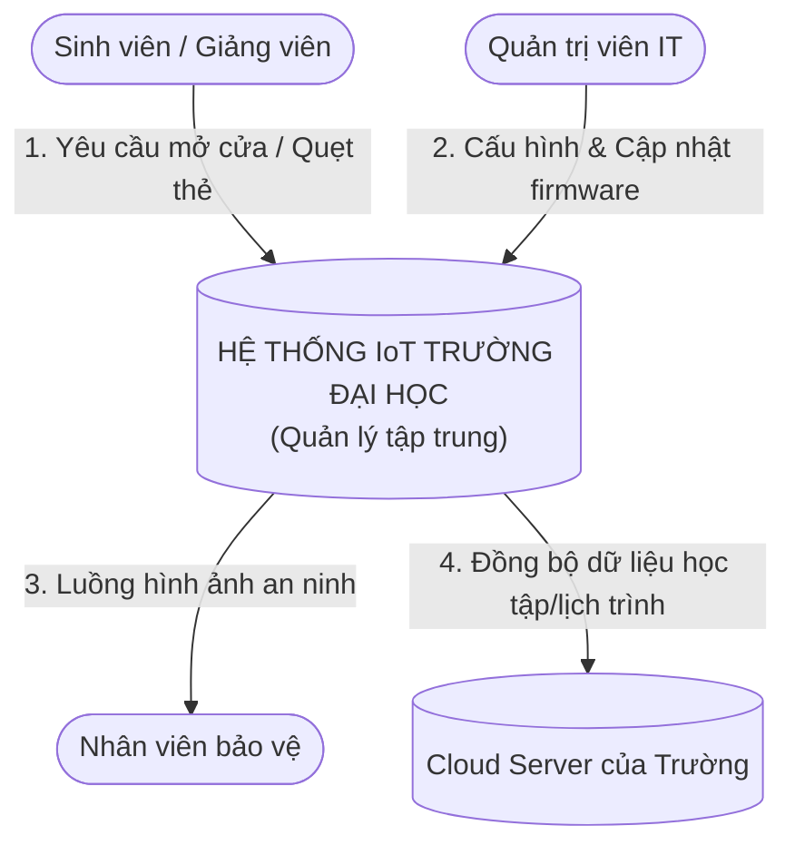
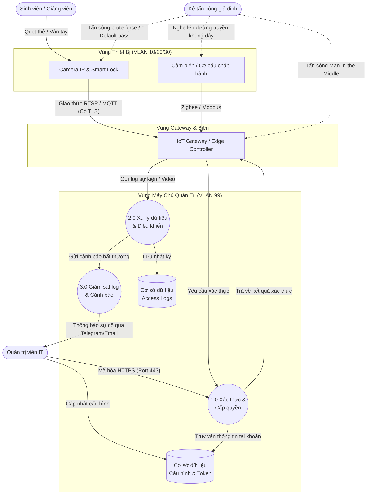

# Chính Sách Bảo Mật IoT Cho Trường Đại Học (University IoT Security Policy)

Tài liệu này cung cấp khung chính sách bảo mật, phạm vi hệ thống, danh sách tài sản, mô hình mối đe dọa (STRIDE/OWASP/CVSS), bảng phân tích rủi ro và các biện pháp giảm thiểu, cùng sơ đồ luồng dữ liệu (DFD) cho việc quản lý và vận hành các thiết bị IoT tại môi trường trường đại học.

---

## 1. Phạm Vi Hệ Thống (System Scope)

Hệ thống IoT trong trường đại học được phân chia thành 4 phân vùng mạng (Network Segments) tách biệt về mặt vật lý hoặc logic (VLAN) nhằm đảm bảo nguyên tắc đặc quyền tối thiểu (Least Privilege) và cô lập sự cố:

```
                                  +---------------------------------------+
                                  |         Internet / Cloud Services     |
                                  +-------------------+-------------------+
                                                      |
                                                      v (Firewall / DMZ)
  +---------------------------------------------------+---------------------------------------------------+
  |                                           MẠNG NỘI BỘ TRƯỜNG ĐẠI HỌC                                  |
  +--------------------+------------------------------+------------------------------+--------------------+
                       |                              |                              |
                       v                              v                              v
        +--------------+--------------++--------------+--------------++--------------+--------------+
        | VLAN 10: IoT Cơ Sở Vật Chất ||  VLAN 20: IoT Học Tập & Lab  || VLAN 30: IoT Giám Sát Security|
        | - Hệ thống HVAC, Chiller    || - Máy chiếu, Bảng tương tác || - Camera IP giám sát        |
        | - Công tơ điện/nước thông minh|| - Thiết bị Lab nghiên cứu   || - Khóa cửa thông minh, RFID |
        | - Hệ thống chiếu sáng tự động|| - Cảm biến môi trường phòng || - Barrier, kiểm soát bãi xe |
        +--------------+--------------++--------------+--------------++--------------+--------------+
                       |                              |                              |
                       +------------------------------+------------------------------+
                                                      |
                                                      v (IoT Gateway / 802.1X Auth)
                                       +--------------+--------------+
                                       | VLAN 99: IoT Management Svr |
                                       | - Máy chủ quản lý trung tâm  |
                                       | - Database Log & Cấu hình    |
                                       +-----------------------------+
```

### Các phân vùng chi tiết:
1. **Phân vùng IoT Cơ sở vật chất (Facility IoT - VLAN 10)**: 
   - Quản lý năng lượng, chiếu sáng, điều hòa thông minh (HVAC) tại các tòa nhà hiệu bộ, giảng đường.
   - Giao thức sử dụng chủ yếu: Modbus, BACnet, Zigbee qua Gateway chuyển đổi sang TCP/IP.
2. **Phân vùng IoT Phục vụ Học tập & Nghiên cứu (Academic IoT - VLAN 20)**:
   - Các thiết bị thông minh tại giảng đường (Smart Board, Smart Projector) và thiết bị nghiên cứu chuyên sâu trong các phòng thí nghiệm (IoT Lab kits, cảm biến đo đạc).
   - Truy cập Internet giới hạn thông qua proxy kiểm soát.
3. **Phân vùng IoT Giám sát & An ninh (Physical Security IoT - VLAN 30)**:
   - Hệ thống Camera IP giám sát an ninh khuôn viên, hệ thống khóa cửa thông minh (Smart Lock), đầu đọc thẻ RFID/NFC, thanh chắn bãi xe tự động.
   - Phân vùng này yêu cầu tính sẵn sàng cực cao và băng thông lớn cho luồng truyền video (Video Streaming).
4. **Phân vùng Quản trị IoT trung tâm (IoT Administration - VLAN 99)**:
   - Nơi đặt các máy chủ điều khiển (Controller), máy chủ cập nhật Firmware (OTA Update Server), và hệ thống cơ sở dữ liệu lưu nhật ký (Log Database).
   - Chỉ cho phép các kết nối quản trị được mã hóa (SSH, HTTPS) từ dải IP của quản trị viên hệ thống (IT Admin).

---

## 2. Danh Sách Tài Sản IoT (Asset Inventory)

Dưới đây là bảng thống kê và phân loại tài sản IoT trong môi trường đại học:

| ID Tài Sản | Phân Nhóm | Tên Tài Sản | Phân Vùng Mạng | Mức Độ Quan Trọng | Mô Tả & Chức Năng |
| :--- | :--- | :--- | :--- | :--- | :--- |
| **HW-01** | Phần cứng | Hệ thống Camera IP (Dahua/Hikvision) | VLAN 30 (An ninh) | **Cao (High)** | Ghi hình giám sát an ninh toàn bộ giảng đường và khuôn viên trường. |
| **HW-02** | Phần cứng | Khóa cửa thông minh & Đầu đọc RFID | VLAN 30 (An ninh) | **Cao (High)** | Kiểm soát ra vào các phòng máy chủ, phòng Lab, văn phòng khoa. |
| **HW-03** | Phần cứng | IoT Gateway (Raspberry Pi/Industrial) | VLAN 10 & 20 | **Trung bình (Medium)** | Thu thập dữ liệu từ cảm biến Zigbee/LoRa và chuyển tiếp lên máy chủ trung tâm. |
| **HW-04** | Phần cứng | Máy chiếu & Bảng tương tác thông minh | VLAN 20 (Học tập) | **Thấp (Low)** | Hỗ trợ trình chiếu và giảng dạy trực quan tại giảng đường. |
| **HW-05** | Phần cứng | Bộ điều khiển HVAC & Chiller trung tâm | VLAN 10 (Cơ sở vật chất) | **Trung bình (Medium)** | Tự động hóa điều hòa không khí và thông gió cho toàn bộ tòa nhà. |
| **SW-01** | Phần mềm | Hệ điều hành Gateway (Custom Linux) | Các thiết bị Gateway | **Trung bình (Medium)** | Hệ điều hành nhúng chạy trên các thiết bị Gateway để định tuyến dữ liệu. |
| **SW-02** | Phần mềm | Phần mềm Quản trị Trung tâm (Dashboard) | VLAN 99 (Quản trị) | **Chí mạng (Critical)** | Giao diện điều khiển toàn bộ hệ thống IoT, quản lý người dùng và thiết bị. |
| **SW-03** | Phần mềm | Firmware Camera & Thiết bị đầu cuối | Thiết bị đầu cuối | **Trung bình (Medium)** | Mã nguồn chạy trực tiếp trên chip điều khiển của Camera, Smart Lock. |
| **DT-01** | Dữ liệu | Dữ liệu Video Giám sát (CCTV Feeds) | NAS/Storage (VLAN 30) | **Cao (High)** | Luồng dữ liệu video thời gian thực và dữ liệu video đã ghi lại lưu trữ. |
| **DT-02** | Dữ liệu | Nhật ký ra vào (Access Logs) | Database (VLAN 99) | **Cao (High)** | Lịch sử quẹt thẻ RFID, thời gian mở cửa của sinh viên và cán bộ giảng viên. |
| **DT-03** | Dữ liệu | Thông tin cấu hình & Token xác thực | Database (VLAN 99) | **Chí mạng (Critical)** | Mật khẩu thiết bị, API Key, Token JWT kết nối giữa Gateway và Cloud. |

---

## 3. Sơ Đồ Luồng Dữ Liệu (Data Flow Diagram - DFD)

### DFD Cấp 0 (Context Diagram)

Sơ đồ thể hiện sự tương tác tổng quát giữa hệ thống IoT Trường Đại học với các tác nhân bên ngoài:



### DFD Cấp 1 (Detailed Diagram)

Sơ đồ chi tiết luồng dữ liệu, tiến trình xử lý, các kho lưu trữ và các ranh giới bảo mật (Trust Boundaries):



---

## 4. Tài Liệu Hướng Dẫn Kèm Theo

Để xem chi tiết phân tích chuyên sâu về rủi ro và các biện pháp triển khai chính sách bảo mật IoT cho trường đại học, vui lòng truy cập các tài liệu sau:

1. 📂 **[Phân Tích Mối Đe Dọa (STRIDE / OWASP / CVSS)](file:///d:/231A011150_VoQuocThang/threat_modeling.md)**: Đánh giá chi tiết các mối đe dọa an ninh thông tin đối với hệ thống IoT.
2. 📂 **[Bảng Tài Sản - Rủi Ro - Biện Pháp](file:///d:/231A011150_VoQuocThang/risk_mitigation_matrix.md)**: Bản đồ liên kết các tài sản với nguy cơ mất an toàn thông tin và phương án phòng ngừa cụ thể.
3. 📂 **[Checklist Kiểm Tra Bảo Mật IoT](file:///d:/231A011150_VoQuocThang/security_checklist.md)**: Danh sách kiểm tra thực tế (Checklist) dành cho quản trị viên khi triển khai và vận hành thiết bị IoT mới.
4. 📂 **[Đánh Giá Rủi Ro & Minh Chứng Kiểm Tra](file:///d:/231A011150_VoQuocThang/risk_assessment_and_testing.md)**: Ma trận định lượng mức độ rủi ro, thời hạn ưu tiên xử lý khắc phục và các kịch bản kiểm thử bảo mật trực quan.

---

## 5. Hướng Dẫn Vận Hành Web Dashboard Giám Sát An Ninh IoT

Chúng tôi đã xây dựng một giao diện **Web Dashboard** tương tác trực quan để minh họa các cơ chế bảo vệ an ninh IoT trong môi trường đại học.

### Các Tính Năng Đang Hoạt Động Trên Web Dashboard:
- **Thống kê thời gian thực**: Tổng số thiết bị, số lượng thiết bị An toàn, Cảnh báo (Firmware cũ, giao thức HTTP), và Nguy hiểm (Mật khẩu mặc định).
- **Bộ quét lỗ hổng giả lập (Security Audit Scanner)**: Chạy tiến trình quét mô phỏng mạng để phát hiện lỗi bảo mật và đưa ra điểm số **CVSS v3.1** cùng phân loại **STRIDE/OWASP** cụ thể.
- **Bảng Nhật Ký Phát Hiện Tấn Công (Live Log Console)**: Hiển thị dòng sự kiện bảo mật chạy liên tục trên mạng trường học.
- **Mô phỏng tấn công mạng (Simulate Hack Event)**: Bấm nút để tiêm (inject) sự kiện tấn công brute-force vào Camera IP.
- **Cô lập bảo mật mạng (Network Isolation)**: Bấm nút cô lập thiết bị để ngắt kết nối mạng của thiết bị bị nhiễm độc ngay tại switch, giúp giảm thiểu rủi ro lan truyền mã độc.

### Cách Khởi Chạy:
Bạn chỉ cần mở trực tiếp tệp **`index.html`** bằng bất kỳ trình duyệt web nào (Google Chrome, Microsoft Edge, Mozilla Firefox) hoặc chạy thông qua một máy chủ cục bộ bằng cách gõ lệnh sau trong thư mục dự án:
```bash
python -m http.server 8000
```
Sau đó truy cập địa chỉ: `http://localhost:8000` trên trình duyệt.

---

## 6. Tài Liệu Tham Khảo Quốc Tế (References)

Dưới đây là các tài liệu tiêu chuẩn và khung bảo mật quốc tế được sử dụng làm cơ sở khoa học để thiết kế chính sách bảo mật IoT này:

1. **NIST SP 800-213 (National Institute of Standards and Technology)**: Hướng dẫn an ninh mạng thiết bị IoT dành cho các tổ chức và doanh nghiệp.
   * *Đường dẫn chính thức*: [NIST SP 800-213 Publication](https://csrc.nist.gov/publications/detail/sp/800-213/final)
2. **ISO/IEC 27400:2022 (International Organization for Standardization)**: Tiêu chuẩn quốc tế về an ninh mạng và bảo vệ quyền riêng tư trong hệ thống IoT.
   * *Đường dẫn chính thức*: [ISO/IEC 27400 Specification](https://www.iso.org/standard/74205.html)
3. **OWASP Internet of Things Project**: Dự án của tổ chức bảo mật ứng dụng thế giới về nhận diện và giảm thiểu 10 lỗ hổng IoT phổ biến nhất.
   * *Đường dẫn chính thức*: [OWASP IoT Project Home](https://owasp.org/www-project-internet-of-things/)
4. **FIRST CVSS v3.1 (Common Vulnerability Scoring System)**: Tài liệu đặc tả và công cụ tính điểm mức độ nghiêm trọng của lỗ hổng bảo mật.
   * *Đường dẫn chính thức*: [CVSS v3.1 Specification](https://www.first.org/cvss/v3.1/specification-document)


