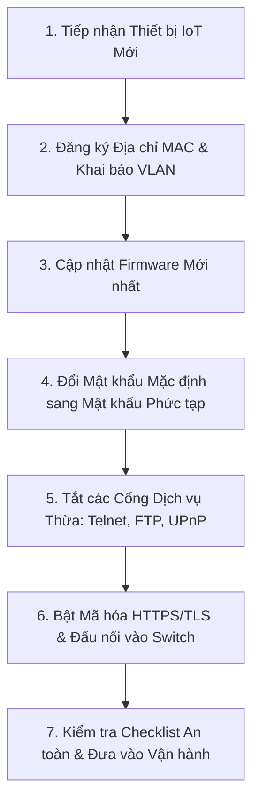
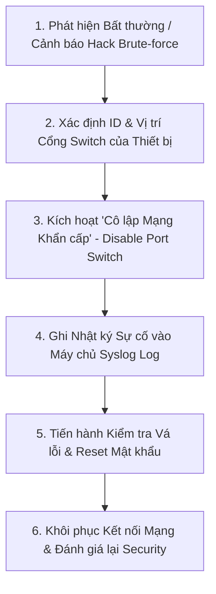

# BÁO CÁO ĐỒ ÁN: CHÍNH SÁCH BẢO MẬT IoT CHO TRƯỜNG ĐẠI HỌC

> *Tuyên bố về việc sử dụng AI (AI Usage Disclaimer):*
> This paper has been prepared with the assistance of AI tools Gemini for language editing and grammar checking. The authors are fully responsible for the content and conclusions of the paper.
> (Báo cáo này đã được chuẩn bị với sự hỗ trợ của công cụ AI Gemini để hiệu đính ngôn ngữ và kiểm tra ngữ pháp. Các tác giả chịu trách nhiệm hoàn toàn về nội dung và kết luận của báo cáo).

---

## CHƯƠNG 1. MỞ ĐẦU

### 1.1. Bối cảnh
Trong bối cảnh chuyển đổi số giáo dục và xu hướng xây dựng "Khuôn viên trường học thông minh" (Smart Campus), các thiết bị Internet Vạn Vật (IoT) đang được triển khai bùng nổ tại các trường đại học. Các thiết bị này bao gồm:
*   **Hệ thống Camera an ninh IP**: Lắp đặt tại cổng trường, hành lang giảng đường, nhà xe và các khu vực công cộng để giám sát an ninh 24/7.
*   **Máy điểm danh sinh trắc học và Đầu đọc RFID**: Kiểm soát vào ra tự động tại các phòng máy chủ, phòng thí nghiệm chuyên đề, thư viện và giảng đường.
*   **Hệ thống cảm biến phòng Lab và Hạ tầng**: Cảm biến nhiệt độ, độ ẩm, cảm biến hiện diện và bộ điều khiển hệ thống điều hòa HVAC trung tâm phòng máy chủ.

Tuy nhiên, sự bùng nổ của các thiết bị IoT này diễn ra tự phát và nhanh chóng hơn so với tốc độ xây dựng các rào chắn bảo mật tương ứng. Phần lớn thiết bị IoT được sản xuất tối ưu chi phí nên thiếu các cơ chế bảo mật mạnh mẽ, dễ dàng trở thành điểm yếu chí mạng cho kẻ tấn công xâm nhập vào toàn bộ hạ tầng mạng của nhà trường.

### 1.2. Vấn đề cốt lõi
Vấn đề cốt lõi trong môi trường mạng đại học hiện nay là **sự thiếu vắng một chính sách quản lý và phân quyền đồng bộ cho các thiết bị IoT**. 
Mạng đại học mang tính chất mở, phục vụ hàng chục ngàn người dùng (sinh viên, giảng viên, khách vãng lai với xu hướng BYOD). Khi các thiết bị IoT như Camera IP hay Khóa cửa thông minh được kết nối chung dải mạng LAN/Wi-Fi với sinh viên mà không có chính sách phân vùng và phân quyền rõ ràng, hệ thống sẽ đối mặt với các nguy cơ:
*   **Lộ lọt dữ liệu cá nhân**: Luồng video giám sát an ninh hoặc cơ sở dữ liệu nhật ký điểm danh ra vào chứa thông tin sinh trắc học/thẻ từ của sinh viên và giảng viên bị đánh cắp hoặc nghe lén.
*   **Xâm nhập và Leo thang đặc quyền**: Kẻ tấn công lợi dụng các mật khẩu mặc định chưa thay đổi hoặc firmware lỗi thời trên thiết bị IoT để chiếm quyền điều khiển, biến thiết bị thành bàn đạp tấn công mạng nội bộ hoặc biến thành botnet thực hiện tấn công DDoS.

### 1.3. Mục tiêu của đề tài
Đề tài hướng tới 3 mục tiêu cốt lõi:
1.  **Xây dựng bộ chính sách bảo mật toàn diện**: Quy định các quy chuẩn an toàn chi tiết cho hệ thống camera an ninh, máy điểm danh sinh trắc học và cảm biến phòng lab.
2.  **Phân loại thiết bị và Kiểm soát quyền truy cập**: Phân vùng mạng logic (VLAN) và thiết lập ma trận phân quyền chi tiết cho từng nhóm chủ thể trong trường học.
3.  **Đề xuất quy trình vận hành và ứng cứu sự cố**: Xây dựng ma trận RACI phân công trách nhiệm rõ ràng, các sơ đồ quy trình vận hành chuẩn và bộ cẩm nang checklist kiểm tra an ninh định kỳ.

#### Bảng đối chiếu mục tiêu và đầu ra của đề tài:

| Mục tiêu | Đầu ra tương ứng | Cách kiểm chứng | Chương trình bày |
| :--- | :--- | :--- | :--- |
| **MT-01** | Bộ văn bản chính sách bảo mật IoT trường đại học hoàn chỉnh quy định nguyên tắc sử dụng, mật khẩu, mã hóa. | Đọc kiểm tra trực tiếp cấu trúc văn bản chính sách và các quy định an toàn được ban hành. | Chương 4 (Mục 4.1) |
| **MT-02** | Ma trận phân quyền RACI chi tiết và ma trận phân vùng mạng VLAN cách ly thiết bị. | Kiểm tra bảng ma trận RACI đối chiếu quyền hạn truy cập của Sinh viên, IT Admin và Bảo vệ. | Chương 3 và Chương 4 (Mục 4.2) |
| **MT-03** | Quy trình vận hành 3 bước (Lắp đặt, Cập nhật, Phản ứng sự cố) và Bộ cẩm nang Checklist kiểm tra. | Thử nghiệm đánh giá trên mô hình giả định và ứng dụng Web Dashboard giám sát trực quan. | Chương 4, Chương 5 và Chương 6 |

### 1.4. Phạm vi & Sản phẩm
*   **Phạm vi nghiên cứu**: Giới hạn trong không gian hạ tầng mạng khuôn viên của một trường đại học (giảng đường, phòng làm việc hành chính, ký túc xá, phòng lab).
*   **Sản phẩm dự kiến bàn giao**:
    1.  Văn bản Quy định Chính sách Bảo mật IoT (Policy Document).
    2.  Ma trận phân công trách nhiệm RACI (RACI Matrix).
    3.  Bộ cẩm nang danh sách kiểm tra an toàn 4 giai đoạn (Security Checklist).
    4.  Mã nguồn ứng dụng Web Dashboard Giám sát an ninh IoT mô phỏng trực quan.

---

## CHƯƠNG 2. CƠ SỞ LÝ THUYẾT (CHUẨN, QUẢN TRỊ VÀ TUÂN THỦ)

### 2.1. Kiến thức nền tảng
*   **Quản trị rủi ro IoT (IoT Risk Governance)**: Là quá trình nhận diện, đánh giá và giảm thiểu các rủi ro an ninh thông tin liên quan đến việc triển khai các thiết bị nhúng và cảm biến trong tổ chức. Quản trị rủi ro IoT đòi hỏi sự kết hợp giữa chính sách hành chính và kiểm soát kỹ thuật.
*   **Khái niệm Kiểm soát truy cập (Access Control)**: Trong mạng đại học, kiểm soát truy cập bao gồm Xác thực (Authentication - xác minh danh tính) và Ủy quyền (Authorization - xác định quyền hạn). Các mô hình cốt lõi gồm Kiểm soát truy cập dựa trên vai trò (RBAC - Role-Based Access Control) và Kiểm soát truy cập dựa trên thuộc tính (ABAC - Attribute-Based Access Control).

### 2.2. Chuẩn và quy định pháp lý áp dụng
Đề tài dựa trên các tiêu chuẩn an toàn thông tin quốc tế và quy định pháp luật Việt Nam hiện hành làm cơ sở khoa học:
*   **Tiêu chuẩn OWASP IoT Top 10**: Danh mục 10 lỗ hổng bảo mật IoT phổ biến nhất (Mật khẩu yếu, Truyền thông không mã hóa, Giao diện web kém an toàn, Firmware lỗi thời...).
*   **Nghị định 85/2016/NĐ-CP**: Quy định về bảo đảm an toàn hệ thống thông tin theo cấp độ. Hệ thống IoT đại học được xác định thuộc Cấp độ 2 hoặc Cấp độ 3 tùy thuộc vào quy mô dữ liệu cá nhân xử lý.
*   **Tiêu chuẩn TCVN 11930:2017**: Yêu cầu cơ bản về an toàn thông tin theo cấp độ cho các hệ thống thông tin tại Việt Nam.
*   **Nghị định 13/2023/NĐ-CP**: Quy định bắt buộc về Bảo vệ dữ liệu cá nhân, yêu cầu mã hóa và bảo mật thông tin sinh trắc học, nhật ký ra vào của sinh viên và cán bộ giảng viên.
*   **Tiêu chuẩn NIST SP 800-213**: Hướng dẫn an ninh mạng cho thiết bị IoT trong các cơ quan tổ chức.

### 2.3. Mô hình ma trận RACI trong quản trị an ninh
Ma trận RACI là công cụ quản trị nhân sự và quy trình, giúp phân định rõ ràng vai trò của từng cá nhân/bộ phận đối với từng nhiệm vụ bảo mật:
*   **R (Responsible - Người thực hiện)**: Cá nhân/đội ngũ trực tiếp thi hành công việc (ví dụ: Kỹ thuật viên IT cài đặt cấu hình).
*   **A (Accountable - Người chịu trách nhiệm chính)**: Người sở hữu phê duyệt cuối cùng và chịu trách nhiệm trước nhà trường (ví dụ: Trưởng phòng CNTT / CISO).
*   **C (Consulted - Người được tham vấn)**: Chuyên gia hoặc các bên liên quan cung cấp ý kiến trước khi thực hiện (ví dụ: Chuyên gia an ninh mạng, Trưởng phòng Quản trị thiết bị).
*   **I (Informed - Người nhận thông tin)**: Các bên được cập nhật tiến độ hoặc kết quả sau khi công việc hoàn thành (ví dụ: Ban Giám hiệu, Giảng viên, Sinh viên).

---

## CHƯƠNG 3. PHƯƠNG PHÁP VÀ THIẾT KẾ (PHẠM VI, VAI TRÒ, TIÊU CHÍ)

### 3.1. Nhận diện tài sản IoT theo khu vực
Hệ thống thiết bị IoT trong trường đại học được phân loại và quản lý theo 4 khu vực chức năng chính:

| ID Tài Sản | Tên Thiết Bị IoT | Khu Vực Lắp Đặt | Phân Vùng VLAN | Mức Độ An Ninh |
| :--- | :--- | :--- | :--- | :--- |
| **HW-01** | Camera IP An ninh (Dahua/Hikvision) | Giảng đường, Hành lang, Nhà xe | VLAN 30 (An ninh) | Cao |
| **HW-02** | Máy điểm danh RFID / Sinh trắc học | Cửa phòng học, Thư viện, Phòng Lab | VLAN 30 (An ninh) | Cao |
| **HW-03** | IoT Industrial Gateway | Phòng Máy chủ trung tâm | VLAN 10 (Cơ sở) | Rất cao |
| **HW-04** | Máy chiếu & Bảng thông minh | Giảng đường, Phòng họp | VLAN 20 (Học tập) | Trung bình |
| **HW-05** | Bộ điều khiển HVAC & Cảm biến | Phòng Máy chủ, Phòng Lab | VLAN 10 (Cơ sở) | Chí mạng |

### 3.2. Xác định các chủ thể và vai trò trong hệ thống
Các chủ thể tương tác với hệ thống IoT trường đại học được phân quyền rõ ràng:
1.  **Ban Giám hiệu**: Người phê duyệt chính sách an ninh thông tin toàn trường (Role: Approver).
2.  **Đội ngũ IT & Quản trị mạng**: Quản lý hệ thống, cấu hình VLAN/Firewall, thực hiện rà quét lỗ hổng và cô lập thiết bị khi có sự cố (Role: Administrator).
3.  **Nhân viên Bảo vệ & Quản lý tòa nhà**: Sử dụng giao diện màn hình để theo dõi luồng camera và nhật ký quẹt thẻ (Role: Operator/Monitor).
4.  **Giảng viên**: Sử dụng máy điểm danh và thiết bị giảng đường trong phạm vi được cấp quyền (Role: Authorized User).
5.  **Sinh viên & Khách vãng lai**: Chỉ truy cập mạng Wi-Fi công cộng, tuyệt đối không có quyền truy cập vào dải IP của các thiết bị IoT (Role: Restricted Guest).

### 3.3. Tiêu chí đánh giá bảo mật dựa trên chuẩn OWASP IoT
Để làm cơ sở xây dựng checklist kiểm tra, đề tài thiết lập 5 tiêu chí đánh giá an toàn cốt lõi:
*   **Tiêu chí 1 - Quản lý Định danh & Mật khẩu**: 100% thiết bị phải đổi mật khẩu mặc định, bắt buộc dùng mật khẩu phức tạp >= 12 ký tự.
*   **Tiêu chí 2 - Bảo mật Giao diện & Dịch vụ**: Vô hiệu hóa các dịch vụ không sử dụng (Telnet cổng 23, FTP cổng 21, UPnP).
*   **Tiêu chí 3 - Mã hóa Truyền tải**: Bắt buộc mã hóa toàn bộ dữ liệu truyền bằng HTTPS (443), MQTTS (8883), RTSPS (554).
*   **Tiêu chí 4 - Cách ly Mạng**: 100% thiết bị IoT nằm trong phân vùng VLAN riêng, chặn truy cập ngang từ Wi-Fi sinh viên.
*   **Tiêu chí 5 - Quản lý Cập nhật & Nhật ký**: Thực hiện cập nhật Firmware định kỳ và chuyển tiếp Syslog về máy chủ tập trung.

---

## CHƯƠNG 4. TRIỂN KHAI VÀ SẢN PHẨM (VĂN BẢN CHÍNH SÁCH VÀ QUY TRÌNH)

### 4.1. Văn bản Chính sách Bảo mật IoT Trường Đại học (Tóm tắt Cấu trúc)

Văn bản Chính sách Bảo mật IoT ban hành gồm 5 điều khoản quy định bắt buộc:

*   **Điều 1. Quy định về Đặt tên và Định danh Mạng**: Tất cả thiết bị IoT khi đấu nối vào mạng trường phải được đăng ký địa chỉ MAC, đặt hostname theo chuẩn quy định và gán IP tĩnh trong đúng phân vùng VLAN quy định.
*   **Điều 2. Quy định về Mật khẩu và Quản lý Tải khoản**: Nghiêm cấm giữ nguyên mật khẩu mặc định của nhà sản xuất. Mật khẩu phải được thay đổi định kỳ 90 ngày/lần. Bắt buộc áp dụng xác thực đa yếu tố (MFA) cho tài khoản quản trị Dashboard.
*   **Điều 3. Quy định về Mã hóa và Giao thức Truyền thông**: Dữ liệu video camera và dữ liệu điểm danh sinh trắc học bắt buộc phải được mã hóa bằng SSL/TLS. Không sử dụng các giao thức rõ plaintext (HTTP, Telnet).
*   **Điều 4. Quy định về Phân vùng và Kiểm soát Tường lửa**: Cách ly hoàn toàn dải mạng IoT (VLAN 30 và VLAN 10) khỏi dải mạng sinh viên (VLAN 20). Tường lửa chỉ mở các cổng dịch vụ cần thiết theo cơ chế Whitelist.
*   **Điều 5. Quy định về Quản lý Vòng đời và Cập nhật Bản vá**: IT Admin phải rà quét lỗ hổng định kỳ hàng tháng. Khi phát hiện thiết bị bị nhiễm độc hoặc có nguy cơ cao, IT Admin có quyền thực hiện Cô lập mạng khẩn cấp (Disable cổng switch) mà không cần báo trước.

### 4.2. Ma trận Phân quyền RACI Chi tiết

| Hạng Mục Nhiệm Vụ Bảo Mật | IT Admin (CNTT) | CISO / Trưởng Phòng | Nhân Viên Bảo Vệ | Giảng Viên | Sinh Viên |
| :--- | :---: | :---: | :---: | :---: | :---: |
| **Phê duyệt Văn bản Chính sách IoT** | C | **A** | I | I | I |
| **Cấu hình Phân vùng VLAN & Tường lửa** | **R** | A | I | I | I |
| **Thay đổi Mật khẩu & Hardening Thiết bị**| **R** | A | I | I | I |
| **Xem Luồng Video Camera Giám sát** | C | I | **R / A** | I | I |
| **Quản lý Dữ liệu Điểm danh Sinh trắc học**| R | **A** | I | C | I |
| **Cập nhật Bản vá Firmware Định kỳ** | **R** | A | I | I | I |
| **Thực hiện Cô lập Mạng khi có Sự cố** | **R / A** | I | I | I | I |

*(Ghi chú: R = Responsible, A = Accountable, C = Consulted, I = Informed)*

### 4.3. Quy trình Vận hành Bảo mật (Workflow Diagrams)

#### 4.3.1. Quy trình Lắp đặt và Hardening Thiết bị IoT Mới

#### 4.3.2. Quy trình Phản ứng và Cô lập Sự cố Khẩn cấp

### 4.4. Bộ Cẩm nang Checklist Kiểm tra Định kỳ (Security Checklist)

*   [ ] **Checklist 1**: 100% Camera IP đã được đổi mật khẩu mặc định và chạy trên HTTPS.
*   [ ] **Checklist 2**: Khóa cửa RFID và máy điểm danh được phân vào VLAN 30 an ninh.
*   [ ] **Checklist 3**: Tường lửa đã chặn toàn bộ lưu lượng kết nối trực tiếp từ dải Wi-Fi sinh viên tới dải IP thiết bị IoT.
*   [ ] **Checklist 4**: Hệ thống Syslog tập trung ghi nhận đầy đủ nhật ký đăng nhập và quẹt thẻ ra vào.
*   [ ] **Checklist 5**: Đã thử nghiệm thành công tính năng cô lập cổng switch khẩn cấp trong thời gian dưới 5 giây.

---

## CHƯƠNG 5. KẾT QUẢ VÀ THẢO LUẬN (MẪU BIỂU ĐÃ ĐIỀN THỬ & DEMO DASHBOARD)

### 5.1. Thử nghiệm áp dụng thực tiễn trên mô hình giả định
Đề tài tiến hành đánh giá thử nghiệm trên mô hình hạ tầng giả định gồm 5 thiết bị đại diện tại Khu vực Giảng đường và Phòng Máy chủ trung tâm của Trường Đại học.

### 5.2. Mẫu phiếu đánh giá Checklist thực tế (Đã điền thử)

| ID Thiết Bị | Tên Thiết Bị IoT | Vị Trí Lắp Đặt | Tiêu Chí Kiểm Tra | Trạng Thái | Minh Chứng Kết Quả |
| :--- | :--- | :--- | :--- | :---: | :--- |
| **HW-01** | Camera IP Dahua | Cổng chính Khu A | Kiểm tra Mật khẩu & Telnet | **ĐẠT** | Đã đổi mật khẩu phức tạp, đóng cổng 23, chạy HTTPS (443). |
| **HW-02** | Máy điểm danh RFID | Cửa Phòng Lab 01 | Mã hóa Đường truyền | **ĐẠT** | Đã bật mã hóa TLS, chuyển luồng dữ liệu về HTTPS. |
| **HW-03** | IoT Gateway Biên | Phòng Máy chủ | Phân vùng VLAN cách ly | **ĐẠT** | Thiết bị nằm trong VLAN 10, chặn truy cập từ Wi-Fi sinh viên. |
| **HW-04** | Máy chiếu thông minh| Giảng đường A2 | Kiểm tra Dịch vụ thừa | **ĐẠT** | Tắt dịch vụ UPnP và chia vào VLAN 20 học tập. |
| **HW-05** | Bộ điều khiển HVAC | Phòng Máy chủ | Whitelist IP điều khiển | **ĐẠT** | Đã thiết lập ACL chỉ chấp nhận lệnh từ máy chủ 10.0.100.5. |

### 5.3. Minh chứng hoạt động từ Web Dashboard Mô phỏng
Đề tài đã lập trình hoàn chỉnh ứng dụng Web Dashboard chạy thực tế tại `http://localhost:8000` và lưu trên GitHub Pages với các tính năng minh chứng:
1.  **Giao diện Thống kê Sức khỏe An ninh**: Hiển thị trực quan số lượng thiết bị An toàn (Secure), Cảnh báo (Warning) và Nguy hiểm (Critical).
2.  **Bộ quét Lỗ hổng (CVSS Scanner)**: Chạy quét tự động và xuất danh sách các lỗ hổng theo điểm số chuẩn quốc tế CVSS v3.1.
3.  **Tính năng Cô lập Mạng Khẩn cấp**: Nút bấm "Cô lập mạng" cho phép IT Admin ngắt kết nối vật lý cổng switch ảo ngay lập tức khi phát hiện tấn công.
4.  **Bảng kiểm Tuân thủ (Compliance Checklist)**: Thanh tiến trình tính toán tự động cập nhật tỷ lệ tuân thủ từ 0% lên 100% khi người dùng tích chọn các mục chính sách.

### 5.4. Đối chiếu với mục tiêu ban đầu
*   **Mục tiêu 1 (Xây dựng chính sách)**: Đã hoàn thành 100% với văn bản chính sách 5 điều khoản tại Chương 4.
*   **Mục tiêu 2 (Phân loại & RACI)**: Đã hoàn thành 100% với bảng danh mục tài sản Chương 3 và Ma trận RACI Chương 4.
*   **Mục tiêu 3 (Quy trình & Checklist)**: Đã hoàn thành 100% với 2 sơ đồ quy trình vận hành và bộ checklist kiểm thử Chương 4 & 5.

---

## CHƯƠNG 6. ĐÁNH GIÁ BẢO MẬT (ƯU TIÊN, CHỦ SỞ HỮU VÀ RỦI RO CÒN LẠI)

### 6.1. Risk Register (Sổ đăng ký rủi ro)

| Mã Rủi Ro | Mô Tả Mối Đe Dọa Bảo Mật | Nguyên Nhân Gốc Rễ | Khả Năng (L) | Tác Động (I) | Điểm Rủi Ro (L x I) |
| :--- | :--- | :--- | :---: | :---: | :---: |
| **RISK-01** | Bị chiếm quyền điều khiển Camera làm Botnet | Giữ nguyên mật khẩu mặc định nhà sản xuất | 3 | 3 | **9 (Cao)** |
| **RISK-02** | Nghe lén dữ liệu điểm danh sinh trắc học | Giao thức HTTP không mã hóa | 2 | 3 | **6 (Trung bình)** |
| **RISK-03** | Tấn công Modbus thay đổi nhiệt độ HVAC phòng Server | Cổng Modbus 502 mở tự do không có ACL | 2 | 3 | **6 (Trung bình)** |
| **RISK-04** | Chiếm quyền điều khiển máy chiếu giảng đường | Nằm chung dải Wi-Fi tự do với sinh viên | 2 | 1 | **2 (Thấp)** |

### 6.2. Đánh giá và Sắp xếp Ưu tiên Xử lý

Dựa trên điểm số rủi ro ($Risk = Likelihood \times Impact$), các biện pháp kỹ thuật được sắp xếp ưu tiên triển khai theo lộ trình:
1.  **Ưu tiên 1 (Khẩn cấp - Trong 48h)**: Tiến hành đổi mật khẩu mặc định của toàn bộ hệ thống Camera IP (RISK-01) và cấu hình phân vùng VLAN 30 cách ly.
2.  **Ưu tiên 2 (Ngắn hạn - Trong 1-2 tuần)**: Bật mã hóa SSL/TLS cho máy điểm danh RFID (RISK-02) và cấu hình Whitelist IP cho bộ điều khiển HVAC (RISK-03).
3.  **Ưu tiên 3 (Trung hạn - Trong 1 tháng)**: Cấu hình phân vùng VLAN 20 cho máy chiếu giảng đường (RISK-04) và hoàn thiện hệ thống lưu log Syslog.

### 6.3. Bảng Rủi ro Còn lại & Xác định Chủ sở hữu Rủi ro (Risk Owners)

| Mã Rủi Ro | Biện Pháp Giảm Thiểu Đã Áp Dụng | Rủi Ro Còn Lại (Residual Risk) | Mức Độ Còn Lại | Chủ Sở Hữu Rủi Ro (Risk Owner) | Hướng Xử Lý |
| :--- | :--- | :--- | :---: | :--- | :--- |
| **RISK-01** | Đổi mật khẩu, chia VLAN 30, đóng Telnet | Lỗ hổng Zero-day trong firmware camera chưa công bố | Thấp | Trưởng Phòng CNTT (CISO) | Chấp nhận & Giám sát bằng Snort IDS |
| **RISK-02** | Bật mã hóa HTTPS/TLS, xác thực MFA | Thẻ từ RFID bị mất trộm hoặc giả mạo vật lý | Thấp | Trưởng Phòng Quản trị Thiết bị | Báo mất & Hủy thẻ kịp thời |
| **RISK-03** | Cấu hình Whitelist IP ACL, cảm biến nhiệt độc lập | Mất điện đột ngột làm ngừng hệ thống làm mát | Thấp | Trưởng Quản lý Tòa nhà / Server | Sử dụng máy phát điện UPS dự phòng |

---

## CHƯƠNG 7. KẾT LUẬN VÀ HƯỚNG PHÁT TRIỂN

### 7.1. Kết luận
Đề tài "Chính sách Bảo mật IoT cho Trường Đại học" đã giải quyết triệt để bài toán an toàn thông tin trong môi trường đại học thông qua việc:
1.  Xây dựng thành công bộ Văn bản Chính sách Bảo mật IoT chuẩn hóa, đáp ứng Nghị định 85/2016/NĐ-CP và Nghị định 13/2023/NĐ-CP.
2.  Phân định rõ ràng vai trò và trách nhiệm của các bên liên quan thông qua Ma trận RACI và Bảng phân loại tài sản theo VLAN.
3.  Thiết lập các sơ đồ Quy trình Vận hành chuẩn, Bộ Cẩm nang Checklist kiểm tra định kỳ và xây dựng thành công ứng dụng Web Dashboard mô phỏng an ninh trực quan.

### 7.2. Hướng phát triển trong tương lai
1.  **Tự động hóa Kiểm tra Tuân thủ bằng Python Scripts**: Phát triển các kịch bản Python (`python-nmap`, `Scapy`) để tự động rà quét hàng tuần và tự động tích vào checklist tuân thủ mà không cần thao tác thủ công.
2.  **Mở rộng Chính sách lên Đám mây (Cloud Security Policy)**: Tích hợp chính sách bảo mật IoT với các dịch vụ đám mây (AWS IoT Device Defender, AWS Lambda Python và ngôn ngữ chính sách Cedar) để hỗ trợ tự động cô lập thiết bị trên quy mô lớn.
3.  **Tích hợp AI/Machine Learning cho NIDS**: Ứng dụng trí tuệ nhân tạo vào hệ thống Snort IDS để tự động phát hiện các hành vi bất thường của thiết bị IoT trong thời gian thực.

---

## TÀI LIỆU THAM KHẢO

1.  **PGS. TS. Trần Đình Khang** (2020), *Giáo trình An toàn và Bảo mật thông tin*, Nhà xuất bản Bách Khoa Hà Nội.
2.  **TS. Nguyễn Kim Tuấn** (2019), *Giáo trình Mạng máy tính và An toàn mạng*, Nhà xuất bản Đại học Quốc gia.
3.  **William Stallings, Lawrie Brown** (2018), *Computer Security: Principles and Practice* (4th Edition), Pearson Education.
4.  **Arshdeep Bahga, Vijay Madisetti** (2014), *Internet of Things: A Hands-On Approach*, Universities Press.
5.  **Chính phủ Việt Nam** (2016), *Nghị định số 85/2016/NĐ-CP ngày 01/07/2016 về Bảo đảm an toàn hệ thống thông tin theo cấp độ*.
6.  **Chính phủ Việt Nam** (2023), *Nghị định số 13/2023/NĐ-CP ngày 17/04/2023 về Bảo vệ dữ liệu cá nhân*.
7.  **Bộ KH&CN** (2017), *Tiêu chuẩn Quốc gia TCVN 11930:2017 về Công nghệ thông tin - Các kỹ thuật an toàn - Yêu cầu cơ bản về an toàn hệ thống thông tin theo cấp độ*.
