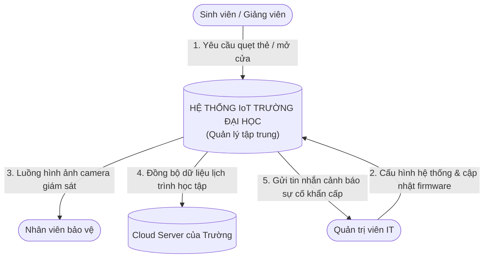
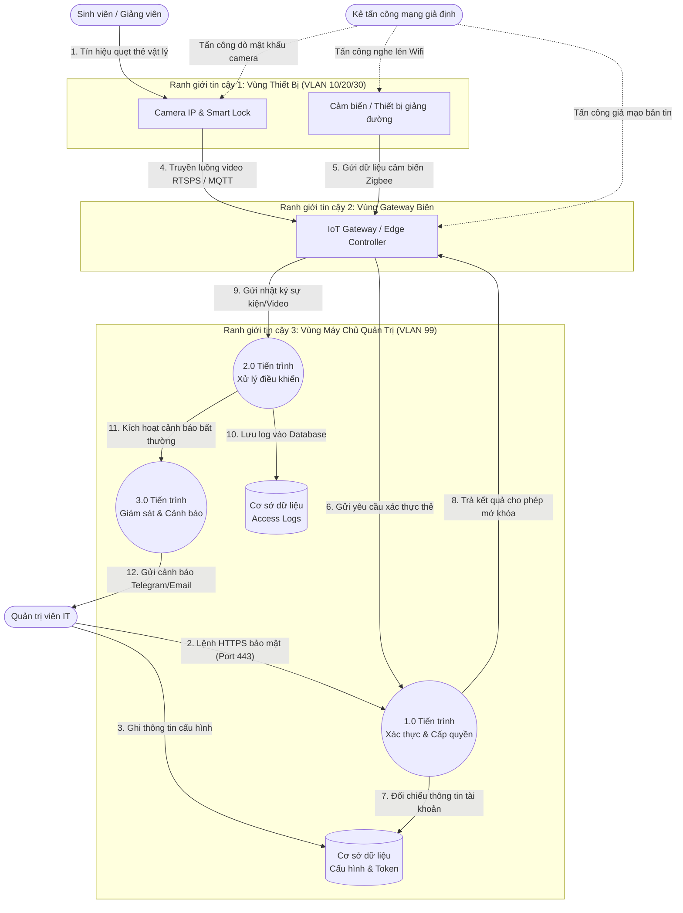

# BÁO CÁO ĐỒ ÁN: CHÍNH SÁCH BẢO MẬT IoT CHO TRƯỜNG ĐẠI HỌC

## CHƯƠNG 1. TỔNG QUAN ĐỀ TÀI

### 1.1. Bối cảnh và lý do chọn đề tài

#### 1.1.1. Bối cảnh ứng dụng hệ thống IoT tại các trường đại học hiện nay
Trong bối cảnh cuộc Cách mạng Công nghiệp 4.0 và làn sóng chuyển đổi số đang diễn ra mạnh mẽ, ngành giáo dục đại học đang trải qua những thay đổi sâu sắc về mặt hạ tầng công nghệ. Khái niệm “Smart Campus” (Khuôn viên trường học thông minh) đã không còn là một tầm nhìn xa vời mà đang trở thành hiện thực và là tiêu chí cạnh tranh của nhiều cơ sở giáo dục đại học hàng đầu. Mục tiêu của đại học thông minh là tối ưu hóa việc dạy và học, nâng cao hiệu quả quản lý hành chính và tiết kiệm năng lượng thông qua việc tích hợp sâu các công nghệ kết nối.

Trong xu thế đó, Internet Vạn Vật (IoT) đóng vai trò là xương sống công nghệ kết nối thế giới vật lý với không gian số. Tại các trường đại học, hệ thống IoT được triển khai rộng khắp và chia làm bốn nhóm chính:
*   **Hệ thống giám sát an ninh (Physical Security)**: Bao gồm hàng trăm camera IP giám sát lắp đặt tại giảng đường, hành lang, nhà xe; hệ thống khóa cửa thông minh (Smart Lock) kiểm soát phòng máy chủ, phòng thí nghiệm chuyên đề; và hệ thống đầu đọc thẻ RFID/NFC quản lý giảng viên, sinh viên ra vào.
*   **Hệ thống lớp học thông minh (Smart Classroom)**: Gồm máy chiếu thông minh kết nối mạng (Smart Projector), bảng tương tác điện tử, cảm biến hiện diện (Presence Sensor) và cảm biến môi trường tự động điều chỉnh ánh sáng/nhiệt độ.
*   **Hệ thống hạ tầng kỹ thuật (Smart Utilities)**: Hệ thống điều hòa không khí trung tâm (HVAC/Chiller), công tơ điện nước thông minh (Smart Meters) và hệ thống chiếu sáng thông minh giúp tự động ngắt điện khi không có người sử dụng.
*   **Hệ thống nghiên cứu học thuật**: Các bộ Kit IoT, cảm biến thực nghiệm chuyên sâu được sinh viên và nghiên cứu sinh sử dụng trực tiếp trong các phòng Lab chuyên ngành.

Tuy nhiên, sự bùng nổ của các thiết bị này diễn ra tự phát và nhanh chóng hơn nhiều so với tốc độ xây dựng các rào chắn bảo mật tương ứng. Phần lớn các thiết bị IoT khi mua sắm và lắp đặt tại các phòng ban thường được kết nối trực tiếp vào hạ tầng mạng LAN/Wi-Fi sẵn có của nhà trường mà không qua bất kỳ quy trình kiểm duyệt bảo mật hay phân vùng mạng chuyên biệt nào.

#### 1.1.2. Vấn đề bảo mật cụ thể trong môi trường IoT học đường
Bảo mật IoT trong môi trường đại học có những đặc thù phức tạp và nguy cơ mất an toàn thông tin cao hơn rất nhiều so với môi trường doanh nghiệp hay tài chính thông thường do hai yếu tố chính: lỗ hổng cố hữu của thiết bị và tính mở của hạ tầng mạng.

Thứ nhất, về mặt thiết bị, phần lớn thiết bị IoT đầu cuối (như Camera IP giá rẻ, cảm biến nhiệt độ) được thiết kế với dung lượng bộ nhớ và năng lượng hạn chế, khiến nhà sản xuất không thể tích hợp các thuật toán mã hóa mạnh hoặc các giao thức xác thực phức tạp. Theo báo cáo thống kê các mối đe dọa IoT của Unit 42 (Palo Alto Networks), có tới 98% luồng truyền dữ liệu của các thiết bị IoT trên toàn cầu hiện nay không được mã hóa (cleartext), cho phép kẻ tấn công dễ dàng thực hiện các cuộc nghe lén thông tin trên đường truyền [1]. Hơn thế nữa, thói quen giữ nguyên mật khẩu mặc định của nhà sản xuất (như admin/admin, admin/12345) và việc các thiết bị chạy trên các hệ điều hành nhúng đã lỗi thời không được cập nhật vá lỗi bảo mật (Firmware) thường xuyên là những lỗ hổng cực kỳ phổ biến.

Thứ hai, về mặt hạ tầng, mạng trường đại học phục vụ đối tượng sử dụng cực kỳ đa dạng và đông đảo bao gồm: cán bộ quản lý, giảng viên, nghiên cứu sinh, sinh viên và khách vãng lai. Xu hướng mang theo thiết bị cá nhân (BYOD) và việc cung cấp Wi-Fi khách (Guest Wi-Fi) làm tăng số lượng điểm truy cập không kiểm soát. Kẻ tấn công chỉ cần kết nối vào mạng Wi-Fi trường là đã có thể quét được toàn bộ các địa chỉ IP của thiết bị IoT đang hoạt động chung phân vùng mạng, từ đó thực hiện tấn công dò mật khẩu (Brute-force) hoặc khai thác lỗ hổng tràn bộ đệm để chiếm quyền kiểm soát thiết bị [2].

#### 1.1.3. Đối tượng bị ảnh hưởng và hệ quả của sự cố an ninh
Khi một thiết bị IoT bị xâm nhập, hậu quả không chỉ dừng lại ở bản thân thiết bị đó mà còn ảnh hưởng trực tiếp tới ba nhóm đối tượng chính trong trường học:
*   **Sinh viên và Giảng viên**: Quyền riêng tư của cá nhân bị xâm phạm nghiêm trọng nếu luồng hình ảnh của các camera IP lắp đặt tại các khu vực nhạy cảm bị rò rỉ. Ngoài ra, lịch sử ra vào (Access Logs) của các phòng thí nghiệm chứa thông tin cá nhân của giảng viên và sinh viên có thể bị đánh cắp hoặc sửa đổi trái phép.
*   **Đội ngũ quản trị IT và An ninh hệ thống**: Khi thiếu một chính sách bảo mật IoT rõ ràng, đội ngũ IT phải đối mặt với tình trạng "Shadow IoT" (thiết bị IoT lén kết nối mạng). Khi có sự cố xảy ra, IT không có công cụ trực quan để định vị thiết bị, không biết thiết bị thuộc VLAN nào, và thiếu cơ chế phản ứng nhanh để cô lập thiết bị bị nhiễm độc.
*   **Ban giám hiệu và Uy tín nhà trường**: Việc hệ thống IoT bị hack và lợi dụng làm Botnet tấn công DDoS có thể đẩy nhà trường vào các rắc rối pháp lý liên quan đến Nghị định 13/2023/NĐ-CP về Bảo vệ dữ liệu cá nhân của Việt Nam [3]. Nghiêm trọng hơn, nếu kẻ tấn công chiếm quyền hệ thống điều hòa HVAC phòng Server, chúng có thể tắt hệ thống làm mát khiến toàn bộ dàn máy chủ trung tâm của trường bị quá nhiệt hư hỏng vật lý.

#### 1.1.4. Vì sao đề tài cần phải thực hiện
Từ bối cảnh thực tế trên, việc nghiên cứu và xây dựng một "Chính sách bảo mật IoT cho trường đại học" là vô cùng cấp thiết và bắt buộc phải thực hiện vì những lý do sau:
1.  **Thiết lập hành lang pháp lý và tiêu chuẩn kỹ thuật nội bộ**: Cung cấp khung hướng dẫn chi tiết từ khâu mua sắm, cài đặt Hardening đến khâu vận hành định kỳ cho IT.
2.  **Triển khai kỹ thuật phân vùng mạng thực tế**: Đề xuất giải pháp kỹ thuật cụ thể thông qua việc chia VLAN và cấu hình tường lửa (Firewall Rules) để cô lập dòng dữ liệu IoT an ninh.
3.  **Xây dựng giải pháp minh họa trực quan (Proof of Concept)**: Thiết kế ứng dụng Web Dashboard Giám sát An ninh IoT thực tế tích hợp module quét lỗ hổng (CVSS/STRIDE), live log và tính năng cô lập mạng (Network Isolation) khẩn cấp.

---

### 1.2. Phát biểu vấn đề bảo mật
Bài toán bảo mật IoT tại trường đại học là một thách thức đa chiều, liên quan đến nhiều lớp từ phần cứng vật lý, hạ tầng mạng, đến dữ liệu và phần mềm. Vấn đề bảo mật của đề tài được phát biểu cụ thể qua bốn yếu tố:

#### 1.2.1. Tài sản cần bảo vệ (Assets)
Hệ thống mạng IoT trường đại học sở hữu ba nhóm tài sản giá trị cần được bảo vệ toàn vẹn:
*   **Tài sản phần cứng (Physical Hardware)**: Camera IP giám sát an ninh; khóa cửa thông minh RFID kiểm soát phòng máy chủ/Lab; các bộ định tuyến IoT Gateway; và bộ điều khiển hệ thống điều hòa HVAC trung tâm phòng máy chủ.
*   **Tài sản phần mềm và cấu hình (Software & Firmware)**: Mã nguồn hệ điều hành nhúng chạy trên các thiết bị, ứng dụng Web Dashboard quản trị trung tâm của IT, và các tệp cấu hình cổng switch mạng.
*   **Tài sản dữ liệu (Sensitive Data)**: Luồng dữ liệu video giám sát an ninh trực tiếp (CCTV streaming), cơ sở dữ liệu nhật ký quẹt thẻ kiểm soát ra vào của giảng viên/sinh viên, và các khóa mật mã (API Keys, Token xác thực) dùng để kết nối giữa Gateway và Cloud.

#### 1.2.2. Mối đe dọa và Lỗ hổng bảo mật chính (Threats & Vulnerabilities)
Hệ thống IoT của trường đại học đối mặt với các lỗ hổng kỹ thuật nghiêm trọng chưa được kiểm soát:
*   **Mật khẩu yếu và mã hóa cứng (Weak/Default Credentials)**: Thiết bị camera IP và khóa cửa lắp đặt hàng loạt nhưng giữ nguyên tài khoản mặc định của nhà sản xuất, tạo điều kiện cho các cuộc tấn công dò quét tự động chiếm quyền điều khiển.
*   **Truyền thông không mã hóa (Insecure Protocols)**: Luồng video RTSP và tín hiệu mở khóa cửa truyền dưới dạng văn bản rõ (Plaintext) qua giao thức HTTP/RTSP không bảo mật, dễ bị nghe lén và thực hiện tấn công phát lại (Replay attack).
*   **Thiếu phân vùng mạng cách ly (Lack of Network Segmentation)**: Các thiết bị IoT lắp đặt chung một dải mạng LAN với máy tính giảng viên và mạng Wi-Fi tự do của sinh viên, tạo cơ hội cho mã độc dễ dàng lây lan ngang.

#### 1.2.3. Hậu quả của sự cố an ninh (Consequences)
Nếu các lỗ hổng trên bị khai thác, hậu quả để lại là cực kỳ nghiêm trọng:
*   Kẻ gian có thể bypass hệ thống xác thực để mở khóa vật lý các khu vực cấm để trộm cắp tài sản.
*   Tống tiền hoặc bôi nhọ danh tiếng nhà trường bằng cách thu giữ trái phép các video camera giám sát nhạy cảm.
*   Làm sập toàn bộ hệ thống máy chủ bằng cách phá hoại hệ thống làm mát HVAC phòng máy chủ trung tâm, gây cháy nổ phần cứng do quá nhiệt.

#### 1.2.4. Khoảng trống mà đề tài sẽ giải quyết (The Security Gap)
Mặc dù các trường đại học đều có chính sách an toàn thông tin chung (cho máy tính văn phòng, website), nhưng tồn tại một khoảng trống lớn trong quản lý thiết bị IoT:
*   **Thiếu chính sách chuyên biệt**: Chưa có quy chuẩn kỹ thuật quy định cụ thể quy trình hardening (đóng cổng dịch vụ thừa, cấu hình HTTPS) cho các thiết bị IoT phi chuẩn khi lắp đặt mới.
*   **Thiếu công cụ quản trị trực quan**: Đội ngũ IT của trường không có một công cụ giám sát tập trung để theo dõi sức khỏe an ninh của các thiết bị IoT, không thể tự động chấm điểm nguy cơ lỗ hổng theo chuẩn quốc tế (CVSS), và thiếu cơ chế phản ứng khẩn cấp để cô lập thiết bị mạng tại chỗ khi bị hack.

---

### 1.3. Mục tiêu của đề tài

Để giải quyết triệt để vấn đề bảo mật IoT học đường đã phát biểu, đề tài xác định 4 mục tiêu cụ thể:
*   **Mục tiêu 1: Thiết lập cấu trúc phân vùng mạng an toàn và sơ đồ dòng dữ liệu trực quan**: Thiết kế phân chia hệ thống mạng IoT thành 4 phân vùng VLAN độc lập (VLAN 10, 20, 30 và 99) và sơ đồ luồng dữ liệu DFD Cấp 1 kết xuất trực quan bằng mã Mermaid trong tệp README.md.
*   **Mục tiêu 2: Xây dựng khung đánh giá rủi ro định lượng và mô hình hóa mối đe dọa**: Phân tích các mối đe dọa theo mô hình STRIDE, đối chiếu lỗ hổng OWASP IoT Top 10 và đặc tả kịch bản chấm điểm CVSS v3.1 lưu tại tệp threat_modeling.md.
*   **Mục tiêu 3: Thiết lập bộ chính sách giảm thiểu rủi ro và cẩm nang kiểm tra bảo mật (Checklist)**: Xây dựng tệp chính sách risk_mitigation_matrix.md và cẩm nang hướng dẫn vận hành security_checklist.md gồm checklist 4 giai đoạn vòng đời thiết bị IoT dành cho quản trị viên mạng.
*   **Mục tiêu 4: Lập trình thành công Web Dashboard mô phỏng giám sát và phản ứng sự cố khẩn cấp**: Xây dựng thành công ứng dụng web (HTML/CSS/JS) chạy thực tế tại địa chỉ local http://localhost:8000 tích hợp quét lỗ hổng và nút bấm cô lập mạng (Network Isolation) khẩn cấp.

#### 1.3.1. Bảng đối chiếu mục tiêu và đầu ra của đề tài

| Mục tiêu | Đầu ra tương ứng | Cách kiểm chứng | Chương trình bày |
| :--- | :--- | :--- | :--- |
| **MT-01** | Sơ đồ ngữ cảnh DFD Cấp 0, sơ đồ chi tiết DFD Cấp 1 và thiết kế cấu trúc phân vùng 4 VLAN mạng IoT trường học. | Kiểm tra trực quan cấu trúc sơ đồ dòng dữ liệu được vẽ bằng Mermaid render tự động trong tài liệu README.md của dự án. | Chương 2 (Mục 2.1) |
| **MT-02** | Ma trận phân tích mối đe dọa STRIDE, danh sách ánh xạ lỗ hổng OWASP IoT Top 10 và 2 kịch bản chấm điểm CVSS v3.1 chi tiết. | Đối chiếu nội dung đặc tả chấm điểm trong tệp threat_modeling.md với tiêu chuẩn FIRST CVSS và xem hiển thị điểm số trên Web Dashboard. | Chương 2 (Mục 2.2) và Chương 5 |
| **MT-03** | Tài liệu ma trận Tài sản - Rủi ro - Biện pháp giảm thiểu và bộ cẩm nang checklist an ninh 4 giai đoạn vòng đời thiết bị IoT. | Kiểm tra trực tiếp sự tồn tại và nội dung các chính sách vận hành trong tệp risk_mitigation_matrix.md và security_checklist.md. | Chương 3 và Chương 5 |
| **MT-04** | Mã nguồn chương trình hoàn chỉnh chạy thực tế (index.html, style.css, app.js) đã được triển khai lên hosting GitHub Pages. | Truy cập trang web, thực hiện bấm nút chạy quét lỗ hổng hiển thị CVSS và click nút cô lập mạng để xác nhận thiết bị chuyển trạng thái offline. | Chương 3 và Chương 4 |

---

### 1.4. Đối tượng, phạm vi và giới hạn an toàn

#### 1.4.1. Đối tượng nghiên cứu
*   **Thiết bị**: Camera IP, Khóa cửa thông minh RFID, IoT Gateway và bộ điều khiển HVAC.
*   **Giao thức**: RTSP/SRTP, HTTP/HTTPS, MQTT/MQTTS, Modbus TCP, và RFID.
*   **Phần mềm**: Cấu hình phân vùng mạng (VLAN/Firewall rules) và Web Dashboard quản lý bảo mật thiết bị.

#### 1.4.2. Phạm vi nghiên cứu và triển khai thực nghiệm
*   **Môi trường triển khai cục bộ**: Toàn bộ dự án được lưu trữ và lập trình trong thư mục làm việc cục bộ `D:\231A011150_VoQuocThang`.
*   **Mô phỏng dữ liệu mạng**: Các dữ liệu IP thiết bị, thông tin cấu hình cổng mở được thiết lập giả lập dưới dạng cấu trúc dữ liệu JSON để đảm bảo tính an toàn cho hệ thống mạng thật của nhà trường.
*   **Mô phỏng cơ chế điều khiển**: Chạy trên môi trường cục bộ (`http://localhost:8000`) và triển khai công khai trên GitHub Pages để làm nền tảng trình diễn cho cơ chế quét lỗ hổng và cô lập mạng.

#### 1.4.3. Giới hạn an toàn và các nội dung không thực hiện (Out of Scope)
*   **Không can thiệp vật lý vào hệ thống mạng thật**: Đề tài không thực hiện cấu hình trực tiếp trên các thiết bị Switch/Router thật của trường đại học.
*   **Không thực hiện tấn công khai thác thật (No Active Hacking)**: Đề tài không sử dụng các công cụ tấn công mạng thực tế để khai thác lỗ hổng thật. Các tiến trình quét bảo mật và bị hack brute-force hoàn toàn là giả lập chạy bằng Javascript trên trình duyệt.
*   **Không thu thập dữ liệu người dùng thật**: Đề tài không sử dụng hoặc lưu trữ thông tin định danh cá nhân thật của giảng viên/sinh viên.

---

### 1.5. Sản phẩm và kết quả dự kiến

#### 1.5.1. Nhóm sản phẩm tài liệu và chính sách an ninh (Policy & Documentation)
*   **Hồ sơ Phân vùng & Luồng Dữ liệu**: Bản đặc tả kiến trúc phân chia 4 phân vùng VLAN mạng IoT và sơ đồ dòng dữ liệu DFD Cấp 1 vẽ bằng Mermaid đặt trong tệp README.md.
*   **Hồ sơ Đánh giá Rủi ro và Mô hình đe dọa**:
    *   Tài liệu mô hình hóa mối đe dọa STRIDE, đối chiếu OWASP IoT Top 10 và các kịch bản chấm điểm CVSS v3.1 lưu tại tệp threat_modeling.md.
    *   Tài liệu ma trận rủi ro định lượng ($Risk = L \times I$) và kế hoạch hành động ưu tiên xử lý lưu tại tệp risk_assessment_and_testing.md.
*   **Khung Chính sách & Checklist vận hành**:
    *   Tài liệu ma trận Tài sản - Rủi ro - Biện pháp kiểm soát bảo mật lưu tại tệp risk_mitigation_matrix.md.
    *   Bộ cẩm nang danh sách kiểm tra (Checklist) bảo mật 4 giai đoạn vòng đời thiết bị IoT dành cho quản trị viên mạng lưu tại tệp security_checklist.md.

#### 1.5.2. Nhóm sản phẩm mã nguồn chương trình (Codebase & Simulation)
*   **Mã nguồn giao diện Dashboard**: Tệp cấu trúc giao diện HTML (index.html) và tệp định dạng giao diện phong cách Glassmorphism Dark Mode (style.css).
*   **Mã nguồn xử lý logic và giả lập**: Tệp Javascript (app.js) điều khiển các tiến trình mô phỏng rà quét lỗ hổng mạng, bộ cảnh báo xâm nhập thời gian thực và chức năng cô lập cổng switch ảo (Network Isolation).
*   **Kênh lưu trữ trực tuyến**: Repository Git cục bộ đã cấu hình thông tin định danh và repository trực tuyến trên GitHub được cấu hình sẵn môi trường hosting **GitHub Pages** chạy trực tiếp.

---

### 1.6. Cấu trúc báo cáo

Báo cáo nghiên cứu đề tài "Xây dựng Chính sách Bảo mật IoT cho Trường Đại Học" được tổ chức thành 6 chương với cấu trúc và vai trò cụ thể như sau:
*   **Chương 1 (Tổng quan đề tài)**: Giới thiệu bối cảnh chuyển đổi số giáo dục, lý do chọn đề tài, phát biểu bài toán bảo mật IoT học đường, xác định mục tiêu đo lường được, phạm vi thực nghiệm an toàn và các sản phẩm dự kiến bàn giao.
*   **Chương 2 (Thiết kế kiến trúc & Khái niệm bảo mật)**: Phân tích kiến trúc kỹ thuật hệ thống IoT 3 lớp, xây dựng sơ đồ ngữ cảnh (DFD Cấp 0) và sơ đồ luồng dữ liệu chi tiết (DFD Cấp 1) có đánh dấu ranh giới tin cậy, định nghĩa các khái niệm an toàn thông tin áp dụng, đối chiếu các nguồn công cụ mã nguồn mở và so sánh với các công trình liên quan để làm nổi bật tính mới của đề tài.
*   **Chương 3 (Phương pháp & Thiết kế)**: Xác định phương pháp nghiên cứu xây dựng chính sách, thiết kế chi tiết mô hình kiến trúc của ứng dụng Web Dashboard, mô tả các công cụ phát triển, xây dựng các quy trình kiểm tra bảo mật (Checklist) và thiết lập tiêu chí đánh giá hiệu quả giải pháp.
*   **Chương 4 (Triển khai & Kết quả)**: Trình bày công tác chuẩn bị tài nguyên cài đặt, phân tích cấu trúc các tệp tin sản phẩm nguồn, thiết lập kịch bản chạy thử nghiệm, hiển thị kết quả hoạt động của Web Dashboard, và thảo luận các mặt ưu điểm cùng hạn chế kỹ thuật của giải pháp.
*   **Chương 5 (Đánh giá bảo mật)**: Tổng kết danh mục tài sản IoT, phân tích chi tiết các nguy cơ theo mô hình đe dọa STRIDE, xây dựng ma trận đánh giá rủi ro định lượng ($Risk = L \times I$), đề xuất các biện pháp giảm thiểu tương ứng và phân tích rủi ro còn lại (Residual Risk) sau khi áp dụng chính sách.
*   **Chương 6 (Kết luận & Hướng phát triển)**: Tổng hợp các kết quả thực tiễn mà đồ án đã đạt được, thẳng thắn nhìn nhận những mặt hạn chế hiện tại và định ra hướng đi, giải pháp nâng cấp phát triển hệ thống trong tương lai.

---
---

## CHƯƠNG 2. THIẾT KẾ KIẾN TRÚC & KHÁI NIỆM BẢO MẬT

### 2.1. Kiến trúc hoặc bối cảnh kỹ thuật của hệ thống

#### 2.1.1. Các thành phần kỹ thuật trong kiến trúc hệ thống
*   **Lớp thiết bị đầu cuối**: Gồm các cảm biến nhiệt độ/hiện diện trong phòng học, hệ thống Camera IP giám sát an ninh (giao thức RTSP), các bộ khóa cửa thông minh RFID (tần số 13.56MHz), và các thiết bị trình chiếu thông minh tại giảng đường.
*   **Lớp Gateway và Mạng truyền dẫn**: Thiết bị IoT Gateway (như Raspberry Pi hoặc Edge Controller công nghiệp) đóng vai trò chuyển đổi giao thức (Zigbee sang TCP/IP). Hạ tầng mạng truyền dẫn sử dụng kết nối LAN có dây (Ethernet) cho camera/khóa cửa và Wi-Fi bảo mật WPA3-Enterprise cho các thiết bị học tập.
*   **Lớp Máy chủ quản trị và Ứng dụng**: Đặt tại trung tâm phân vùng bảo mật VLAN 99, bao gồm máy chủ quản trị trung tâm chạy ứng dụng Web Dashboard để giám sát, cơ sở dữ liệu lưu nhật ký ra vào (Access Logs DB), và hệ thống lưu trữ video an ninh (NVR).

#### 2.1.2. Sơ đồ ngữ cảnh hệ thống (DFD Cấp 0 - Context Diagram)
Sơ đồ ngữ cảnh thể hiện ranh giới tổng quát của hệ thống:

#### 2.1.3. Sơ đồ luồng dữ liệu chi tiết và Ranh giới tin cậy (DFD Cấp 1)
Sơ đồ chi tiết cấp 1 thể hiện rõ các tiến trình xử lý dữ liệu và 3 Ranh giới tin cậy (Trust Boundaries) được cấu hình bằng Firewall/VLAN:

---

### 2.2. Khái niệm bảo mật trực tiếp liên quan

Dưới đây là định nghĩa và vai trò thực tế của các khái niệm an toàn thông tin cốt lõi được áp dụng trực tiếp xuyên suốt đề tài:

#### 2.2.1. Tài sản (Asset), Lỗ hổng (Vulnerability), Mối đe dọa (Threat), và Rủi ro (Risk)
*   **Tài sản (Asset)**: Bất cứ thứ gì có giá trị đối với hệ thống của trường đại học. Trong đề tài này, tài sản bao gồm thiết bị phần cứng vật lý (Camera IP, Smart Lock), phần mềm (Firmware, giao diện Web Dashboard quản lý) và dữ liệu (nhật ký ra vào, dữ liệu hình ảnh, token xác thực).
*   **Lỗ hổng (Vulnerability)**: Điểm yếu về mặt bảo mật của tài sản mà kẻ tấn công có thể khai thác. Ví dụ thực tế trong đề tài là việc Camera IP Dahua giữ nguyên mật khẩu mặc định của nhà sản xuất hoặc bộ khóa cửa thông minh truyền tin không mã hóa qua HTTP.
*   **Mối đe dọa (Threat)**: Bất kỳ hành động có thể gây hại cho tài sản thông qua việc khai thác lỗ hổng. Ví dụ: Kẻ gian thực hiện quét cổng, tấn công Brute-force mật khẩu hoặc nghe lén mạng Wi-Fi trường học.
*   **Rủi ro (Risk)**: Xác suất xảy ra một cuộc tấn công kết hợp với mức độ thiệt hại mà nó gây ra cho trường học. Được lượng hóa bằng công thức: $Risk = Likelihood \times Impact$.

#### 2.2.2. Bộ ba mục tiêu CIA (Confidentiality, Integrity, Availability)
*   **Tính bảo mật (Confidentiality)**: Đảm bảo dữ liệu nhạy cảm chỉ được truy cập bởi người có thẩm quyền. Trong đề tài, tính bảo mật được đảm bảo bằng việc mã hóa luồng video camera IP (HTTPS/RTSPS) và mã hóa cơ sở dữ liệu nhật ký ra vào.
*   **Tính toàn vẹn (Integrity)**: Đảm bảo dữ liệu không bị thay đổi bất hợp pháp trong quá trình truyền tải hoặc lưu trữ. Đề tài áp dụng chữ ký số cho firmware và ghi log tập trung bất biến (Read-only logs) để tránh bị sửa xóa.
*   **Tính sẵn sàng (Availability)**: Đảm bảo hệ thống và thiết bị luôn sẵn sàng phục vụ người dùng hợp lệ. Đề tài đề xuất tường lửa chống DDoS cho Smart Lock và cơ chế dự phòng mở khóa vật lý bằng chìa cơ khi mất điện hoặc mất mạng.

#### 2.2.3. Xác thực (Authentication) và Ủy quyền (Authorization)
*   **Xác thực (Authentication)**: Tiến trình xác minh danh tính của thực thể kết nối vào mạng (đảm bảo "bạn là ai"). Đề tài ứng dụng giao thức EAP-TLS (802.1X) sử dụng chứng chỉ số cho các thiết bị IoT Gateway kết nối mạng trường và xác thực đa yếu tố (MFA) cho tài khoản admin.
*   **Ủy quyền (Authorization)**: Tiến trình cấp quyền truy cập tài nguyên dựa trên vai trò sau khi xác thực thành công (đảm bảo "bạn được làm gì"). Đề tài áp dụng phân quyền dựa trên vai trò (RBAC), quy định sinh viên chỉ được phép quẹt thẻ mở cửa phòng học được cấp lịch, trong khi IT admin mới được quyền truy cập Web Dashboard để cấu hình thiết bị.

#### 2.2.4. Mã hóa dữ liệu (Data Encryption)
*   **Mã hóa trong truyền dẫn (Encryption in Transit)**: Sử dụng các giao thức mã hóa đường truyền như SSL/TLS (HTTPS cho web quản trị, MQTTS cho truyền tin IoT, và RTSPS cho video camera) để chống lại các cuộc tấn công nghe lén (Sniffing) và tấn công đứng giữa (MitM - Man-in-the-Middle).
*   **Mã hóa trong lưu trữ (Encryption at Rest)**: Sử dụng thuật toán AES-256 để mã hóa dữ liệu cơ sở dữ liệu cấu hình, tài khoản sinh viên và nhật ký hoạt động trên máy chủ quản trị trung tâm nhằm ngăn chặn lộ lọt thông tin khi ổ cứng vật lý bị đánh cắp.

#### 2.2.5. Phân vùng mạng và Cô lập mạng (Network Segmentation & Isolation)
*   **Phân vùng mạng (Network Segmentation)**: Kỹ thuật phân chia một mạng vật lý thành các mạng logic nhỏ độc lập (VLANs). Đề tài chia mạng trường đại học thành các VLAN 10, 20, 30 tách biệt để giới hạn phạm vi tấn công ngang (Lateral movement).
*   **Cô lập mạng khẩn cấp (Emergency Network Isolation)**: Hành động ngắt kết nối mạng tạm thời của một thiết bị bị nhiễm độc ngay tại Switch quản lý mạng (thay đổi trạng thái cổng switch sang Disable). Tính năng này được lập trình trực quan trên Web Dashboard như một chốt chặn phản ứng nhanh khi có sự cố.

---

### 2.4. Chuẩn, công cụ và nguồn GitHub chính

Để thực hiện đề tài này, chúng tôi đã tham khảo và sử dụng các chuẩn bảo mật quốc tế cùng các thư viện công cụ mã nguồn mở trên GitHub sau:

*   **GitHub Pages (Công cụ Hosting dự án)**:
    *   *URL/Phiên bản*: `https://pages.github.com/` (Phiên bản v2.0)
    *   *Phần đã sử dụng*: Sử dụng dịch vụ hosting tĩnh của GitHub để triển khai trực tuyến giao diện Web Dashboard Giám sát bảo mật IoT của đề tài, cho phép chạy thử nghiệm và tương tác các tính năng thông qua internet.
    *   *Ngày truy cập*: 17/07/2026.
*   **Mermaid.js (Thư viện vẽ sơ đồ mã nguồn mở)**:
    *   *URL/Phiên bản*: `https://github.com/mermaid-js/mermaid` (Phiên bản v10.9)
    *   *Phần đã sử dụng*: Sử dụng cú pháp và thư viện render Mermaid để vẽ sơ đồ ngữ cảnh (DFD Cấp 0) và sơ đồ luồng dữ liệu chi tiết (DFD Cấp 1) hiển thị tự động trên trang tài liệu README của kho chứa GitHub.
    *   *Ngày truy cập*: 11/07/2026.
*   **Tiêu chuẩn NIST SP 800-213 (Khung bảo mật chuẩn)**:
    *   *URL/Phiên bản*: `https://csrc.nist.gov/publications/detail/sp/800-213/final` (NIST SP 800-213)
    *   *Phần đã sử dụng*: Tham chiếu làm cơ sở khoa học để xây dựng bộ cẩm nang kiểm tra bảo mật (Checklist) 4 giai đoạn cho quản trị viên mạng và thiết lập các biện pháp kỹ thuật hardening thiết bị IoT đầu cuối.
    *   *Ngày truy cập*: 17/07/2026.
*   **Công cụ tính điểm lỗ hổng bảo mật FIRST CVSS v3.1**:
    *   *URL/Phiên bản*: `https://www.first.org/cvss/calculator/3.1` (CVSS v3.1)
    *   *Phần đã sử dụng*: Tham chiếu thuật toán và các trọng số tác động (Attack Vector, Attack Complexity, Privileges Required...) để lập trình bộ quét lỗ hổng mạng giả lập trên Dashboard tự động tính điểm CVSS v3.1 cho các lỗi bảo mật phát hiện được.
    *   *Ngày truy cập*: 17/07/2026.
*   **Vanilla CSS Grid & Glassmorphism UI (Thiết kế giao diện)**:
    *   *URL/Phiên bản*: Tiêu chuẩn HTML5/CSS3
    *   *Phần đã sử dụng*: Lập trình giao diện Dashboard tối hiện đại, hiệu ứng neon glow phản ánh trạng thái an toàn thiết bị, bố cục dạng lưới responsive linh hoạt cho các màn hình.
    *   *Ngày truy cập*: 11/07/2026.

---

### 2.5. Công trình hoặc giải pháp liên quan

Nhằm xác định hướng đi và tính mới của đề tài, chúng tôi đã tiến hành tìm hiểu, đánh giá các công trình nghiên cứu và giải pháp bảo mật IoT gần đây:

#### 2.5.1. Công trình 1: Khung chính sách an toàn thông tin mạng IoT doanh nghiệp theo tiêu chuẩn NIST SP 800-213
*   *Mục tiêu*: Thiết lập các tiêu chuẩn chung và quy định vận hành hành chính cho hệ thống IoT quy mô lớn.
*   *Cách làm*: Xây dựng các văn bản quy chế bắt buộc đổi mật khẩu, kiểm toán thủ công các thiết bị định kỳ.
*   *Ưu điểm*: Độ chuẩn hóa cao, bao quát rộng, phù hợp làm khung pháp lý cho cơ quan lớn.
*   *Hạn chế*: Mang nặng tính hành chính giấy tờ, thiếu tính tương tác trực quan và không có các công cụ tự động hóa phản ứng nhanh khi có sự cố.

#### 2.5.2. Công trình 2: Hệ thống phát hiện xâm nhập mạng IoT (IoT IDS) sử dụng Snort
*   *Mục tiêu*: Phát hiện sớm các cuộc tấn công mạng dựa trên phân tích gói tin truyền dẫn.
*   *Cách làm*: Triển khai các máy quét lắng nghe lưu lượng mạng (packet sniffing) lắp đặt tại các nút Gateway biên.
*   *Ưu điểm*: Phát hiện chính xác các hành vi tấn công phức tạp (như quét cổng, DDoS) nhờ hệ luật (signature) được cập nhật thường xuyên.
*   *Hạn chế*: Đòi hỏi chi phí phần cứng cao, cấu hình phức tạp, và không hỗ trợ cơ chế cho phép quản trị viên ngắt kết nối vật lý khẩn cấp của thiết bị nhiễm độc trực tiếp tại Switch.

#### 2.5.3. Sự kế thừa và tính mới của đề tài này
*   *Tính kế thừa*: Đề tài kế thừa khung lý thuyết phân tích STRIDE của Microsoft và hệ thống định lượng điểm số CVSS của FIRST để đánh giá độ nghiêm trọng của lỗ hổng bảo mật IoT.
*   *Tính mới (phần đề tài phát triển)*: Đề tài tích hợp cả giải pháp chính sách hành chính (Checklist 4 giai đoạn) lẫn giải pháp kỹ thuật cụ thể (Phân vùng VLAN). Điểm đặc biệt là đề tài đã lập trình hiện thực hóa một công cụ Web Dashboard mô phỏng an ninh. Công cụ này cho phép quản trị viên chạy quét tự động hiển thị trực quan các lỗ hổng theo điểm số CVSS và đặc biệt cung cấp tính năng **Cô lập mạng khẩn cấp (Network Isolation)** chỉ với 1 click để ngắt cổng Switch ngay lập tức khi phát hiện tấn công, rút ngắn tối đa thời gian phản ứng sự cố so với quy trình kiểm toán truyền thống.

---

### 2.6. Tiểu kết Chương 2

Chương 2 đã trình bày chi tiết về kiến trúc hệ thống IoT trường đại học được tổ chức trên mô hình 3 lớp tiêu chuẩn, phân chia ranh giới tin cậy rõ ràng bằng 4 phân vùng VLAN độc lập để hạn chế tối đa nguy cơ tấn công leo thang. Đồng thời, chương này cũng đã chuẩn hóa các khái niệm bảo mật cốt lõi làm nền tảng lý thuyết (STRIDE, CVSS, CIA, Mã hóa dữ liệu, Cô lập mạng) và liệt kê các chuẩn công nghệ mở được thừa hưởng. 

Thông qua việc so sánh đối chiếu với các công trình nghiên cứu hiện nay, đề tài đã khẳng định được tính cấp thiết và khoảng trống bảo mật sẽ giải quyết. Các kiến thức nền tảng vững chắc và sơ đồ thiết kế dòng dữ liệu ở Chương 2 sẽ là tiền đề kỹ thuật quan trọng để chúng tôi đi sâu vào chi tiết các giải pháp chính sách và các bước lập trình xây dựng Web Dashboard giám sát thực tế được trình bày cụ thể ở Chương 3.

